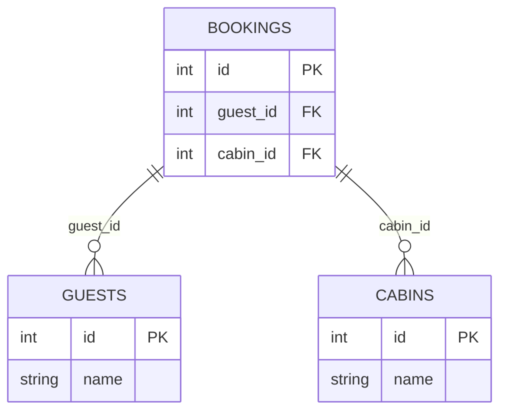

## Mô hình hoá trạng thái ứng dụng (Application State)

### Xác định các bảng cần tạo trong Supabase

Để xác định các **bảng (tables)** cần tạo trong database Supabase, trước tiên cần suy nghĩ về **trạng thái ứng dụng (application state)**.

Trong một ứng dụng lớn, việc mô hình hoá state khác với ứng dụng nhỏ:

- Không lập kế hoạch state ở **cấp độ component**.
- Thay vào đó, suy nghĩ về **state categories** (danh mục state) hoặc **state slices** (phần state) ở **cấp độ trang (page)** và **cấp độ tính năng (feature)**.

### Phân tích tính năng và state tương ứng

Dựa trên các **feature categories** (danh mục tính năng) của ứng dụng, xác định state cần thiết:

- **Bookings feature** (tính năng đặt phòng): Cần **bookings state**.
- **Cabins feature** (tính năng quản lý cabin): Cần **cabins state**.
- **Guests feature** (tính năng quản lý khách): Cần **guests state**.
- **Dashboard**: Sử dụng **bookings state** để hiển thị thống kê về các booking gần đây.
- **Check-in và Check-out features**: Cũng sử dụng **bookings state** để cập nhật trạng thái booking từ "checked out" sang "checked in" và ngược lại.
- **Application Settings** (cài đặt ứng dụng): Cần **settings state** riêng.
- **Authentication** (xác thực): Cần **users state** để quản lý người dùng.

### Loại state và cách quản lý

Tất cả các state này là **global remote state** (state toàn cục từ xa):

- Được lưu trữ trong **Supabase**.
- Được quản lý ở frontend bằng **[[React Query]]**.
- Mỗi **state slice** tương ứng với **một bảng** trong database Supabase.

### Danh sách các bảng dữ liệu (Data Tables)

Từ giờ, gọi chúng là **data tables** thay vì state slices (phù hợp hơn với thiết kế database):

- **Bookings table**
- **Cabins table**
- **Guests table**
- **Settings table**
- **Users table**

### Mô hình hoá bảng Bookings

Bảng **Bookings** là bảng đặc biệt cần phân tích kỹ hơn.

#### Bookings là gì?

Một **booking** (đặt phòng) về bản chất là:

- Một **guest** (khách) thuê một **cabin** (cabin).
- Booking cần thông tin về **khách nào** đang đặt **cabin nào**.
- Tạo booking mới = **kết nối một cabin với một guest**.

#### Kết nối các bảng bằng Foreign Keys

Supabase sử dụng **PostgreSQL**, một **relational database** (cơ sở dữ liệu quan hệ) dựa trên **SQL**. Để kết nối các bảng, sử dụng **foreign keys** (khóa ngoại).

**Giải thích sơ đồ:**

- Mỗi **booking** cần biết **guest nào** đang đặt phòng → Lưu **guest's ID** vào trường **`guest_id`** trong bảng Bookings.
- Mỗi **booking** cần biết **cabin nào** được đặt → Lưu **cabin's ID** vào trường **`cabin_id`** trong bảng Bookings.
- **`guest_id`** và **`cabin_id`** là các **foreign keys** trong bảng Bookings.

#### Cách kết nối hoạt động

- Kết nối booking với cabin: Lưu **primary key** (khóa chính) của cabin (cabin's ID) vào **foreign key** `cabin_id` của booking.
- Kết nối booking với guest: Lưu **primary key** của guest (guest's ID) vào **foreign key** `guest_id` của booking.

### Bước tiếp theo

- Tạo các bảng đơn giản trước (Cabins, Guests, Settings, Users).
- Sau đó tạo bảng **Bookings** và thiết lập các kết nối thông qua foreign keys.

***

**Liên kết:** [[Application State]], [[State Slices]], [[Remote State]], [[React Query]], [[Supabase]], [[Database]], [[PostgreSQL]], [[Relational Database]], [[Foreign Key]], [[Primary Key]], [[Bookings]], [[Cabins]], [[Guests]], [[Settings]], [[Users]], [[SQL]]

