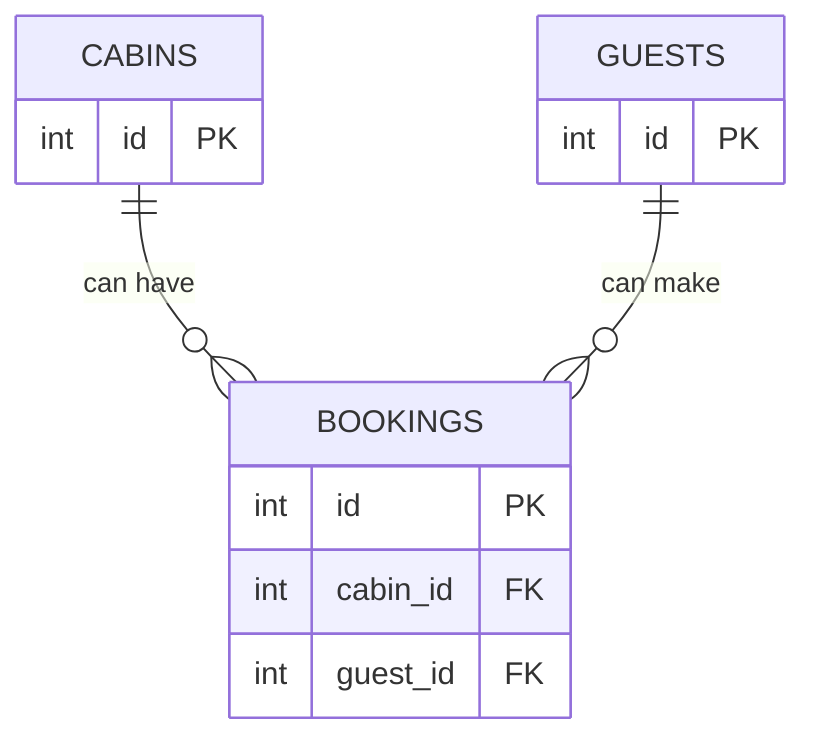

## Tạo bảng Bookings và Thiết lập Quan hệ

### Các Trường Dữ liệu Cơ bản

Bảng bookings (đặt chỗ) cần các trường sau:

- **start_date** và **end_date**: Lưu thời gian nhận và trả phòng, kiểu dữ liệu timestamp trong Postgres
- **num_nights**: Số đêm lưu trú (tự động tính toán trong ứng dụng nhưng vẫn lưu trữ), kiểu integer
- **num_guests**: Số lượng khách, kiểu integer
- **cabin_price**: Giá thuê phòng, kiểu float
- **extras_price**: Giá các dịch vụ bổ sung (ăn sáng, v.v.), kiểu float
- **total_price**: Tổng giá (cabin_price + extras_price), kiểu float
- **status**: Trạng thái đặt phòng (checked in, checked out, unconfirmed), kiểu text
- **has_breakfast**: Khách có đặt ăn sáng không, kiểu boolean
- **is_paid**: Đã thanh toán chưa (vì khách có thể thanh toán tại khách sạn), kiểu boolean
- **observations**: Ghi chú về đặt phòng (ví dụ: giờ đến dự kiến), kiểu text

### Thiết lập Quan hệ với Bảng Khác

Để kết nối bảng bookings với các bảng cabins và guests, cần thêm hai foreign key (khóa ngoại):

- **cabin_id**: Tham chiếu đến cột ID trong bảng cabins
- **guest_id**: Tham chiếu đến cột ID trong bảng guests

**Cách thiết lập:**

- Nhấp vào biểu tượng chỉnh sửa foreign key relation
- Chọn bảng cần tham chiếu (cabins hoặc guests)
- Chọn cột ID làm điểm kết nối

### Ví dụ Tạo Bản Ghi Mẫu

Thêm một đặt phòng mới với các thông tin:

- Ngày nhận phòng: Thứ Hai tuần sau
- Ngày trả phòng: Thứ Sáu (4 đêm)
- Số khách: 2
- Giá phòng: \$300
- Giá ăn sáng: \$120 (2 khách × \$15/người/ngày × 4 ngày)
- Tổng giá: \$420
- Trạng thái: unconfirmed
- Có ăn sáng: true
- Đã thanh toán: true
- Ghi chú: "Sẽ đến lúc 10:00 PM"
- Chọn phòng: Cabin \#1
- Chọn khách: Guest ID 1

Khi lưu, các giá trị cabin_id và guest_id sẽ tự động được lưu trữ.

### Quan hệ Một-Nhiều (One-to-Many)

Mô hình quan hệ giữa các bảng:

**Giải thích sơ đồ:**

- Một phòng (cabin) có thể có nhiều đặt chỗ (bookings) theo thời gian (ví dụ: 100 lần đặt)
- Một khách (guest) có thể tạo nhiều đặt chỗ
- Mỗi đặt chỗ chỉ liên quan đến **đúng một** phòng và **đúng một** khách

**Nguyên tắc đặt Foreign Key:**

Đặt foreign key ở bảng có thể tham chiếu đến **chỉ một** bản ghi từ bảng khác. Đó là lý do cabin_id và guest_id được đặt trong bảng bookings, vì mỗi đặt phòng chỉ có thể cho một phòng cụ thể và một khách cụ thể.

***

**Liên kết:** [[Foreign Key]], [[One-to-Many Relationship]], [[Postgres]], [[Timestamp]], [[Boolean]], [[Database Schema]]

