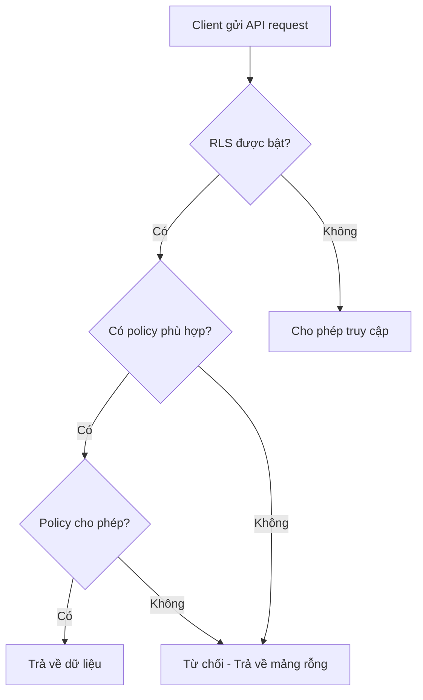

## Truy cập dữ liệu từ Supabase và Row-Level Security

### Tài liệu API tự động

Supabase tự động tạo tài liệu API (API documentation) hoàn chỉnh cho tất cả các bảng trong cơ sở dữ liệu. Điều này giúp việc tích hợp dữ liệu trở nên dễ dàng và tiện lợi hơn.

Có hai cách chính để truy cập dữ liệu:

- Sử dụng thư viện JavaScript của Supabase
- Sử dụng RESTful API trực tiếp thông qua HTTP requests


### Cấu trúc URL API

URL API của Supabase có cấu trúc như sau:

- Phần đầu: URL của project
- Tiếp theo: Tên bảng (table name)
- Cuối cùng: Các cột muốn truy vấn

Để xác thực, cần cung cấp:

- API key trong header
- Authorization key


### API Key và bảo mật

Supabase cung cấp hai loại key:

- **anon key** (public key): Dùng cho front-end, có thể công khai
- **service_role key**: Dùng cho backend, cần giữ bí mật tuyệt đối

Trong tài liệu API, mặc định API key bị ẩn. Cần chọn hiển thị anon key để sao chép và sử dụng.

### Kiểm tra API với curl

Có thể kiểm tra API ngay trong terminal bằng lệnh curl:

```bash
curl '[your-project-url]/rest/v1/cabins?select=*' \
-H "apikey: [your-anon-key]" \
-H "Authorization: Bearer [your-anon-key]"
```

Lần chạy đầu tiên sẽ trả về mảng rỗng `[]` do Row-Level Security chưa được cấu hình.

### Row-Level Security (RLS)

**Row-Level Security** là tính năng bảo mật quan trọng của Supabase, hoạt động như một lớp phòng thủ để:

- Ngăn chặn truy cập trái phép vào database
- Bảo vệ dữ liệu khỏi bị xóa hoặc chỉnh sửa bởi người không có quyền
- Kiểm soát các thao tác được phép thực hiện trên từng bảng

Nếu không có RLS, bất kỳ ai có API key đều có thể:

- Xóa toàn bộ database
- Chỉnh sửa bất kỳ dữ liệu nào
- Thực hiện các thao tác nguy hiểm khác


### Luồng xử lý yêu cầu API với RLS



**Giải thích sơ đồ:** Khi một request được gửi đến, Supabase sẽ kiểm tra xem RLS có được bật hay không. Nếu có, hệ thống sẽ tìm policy phù hợp và đánh giá xem request có đáp ứng điều kiện của policy không. Chỉ khi tất cả các điều kiện được thỏa mãn, dữ liệu mới được trả về.

### Tạo RLS Policies

Các bước tạo policy trong Supabase:

1. Vào mục **Authentication** → **Policies**
2. Chọn bảng cần cấu hình (ví dụ: cabins)
3. Nhấn **New Policy**
4. Chọn **Get started quickly** để dùng template có sẵn

**Các loại policy phổ biến:**

- **Enable read access for all users**: Cho phép mọi người đọc dữ liệu
- **Enable read access for authenticated users only**: Chỉ cho phép người dùng đã đăng nhập đọc dữ liệu
- **Enable insert/update/delete**: Cho phép các thao tác ghi dữ liệu


### Quy trình thực hành

Ban đầu, tạo policy cho phép read access cho tất cả người dùng:

- Chọn template "Enable read access for all users"
- Nhấn **Review and Save**

Sau khi tạo policy, chạy lại lệnh curl trong terminal sẽ thấy dữ liệu được trả về thành công.

Về sau, có thể thay đổi policy để:

- Chỉ cho phép authenticated users (người dùng đã xác thực)
- Giới hạn quyền truy cập theo vai trò cụ thể
- Áp dụng các điều kiện phức tạp hơn


### Quản lý quyền truy cập cho các bảng khác

Cần tạo policy tương tự cho các bảng khác trong database:

- Bảng settings
- Bảng bookings
- Các bảng khác theo nhu cầu

Lưu ý: Bảng users cho authentication không cần tạo thủ công vì Supabase sẽ tự động xử lý khi sử dụng tính năng authentication.

### Tích hợp vào ứng dụng React

Sau khi cấu hình RLS policies xong, có thể:

- Sử dụng Supabase JavaScript client trong React app
- Gọi API trực tiếp từ components
- Xử lý dữ liệu real-time nếu cần

Code trong tài liệu API có thể sao chép trực tiếp vào ứng dụng để sử dụng.

***

**Liên kết:** [[Supabase]], [[Row-Level Security]], [[RLS Policies]], [[API Authentication]], [[RESTful API]], [[anon key]], [[curl]], [[Authentication]]

