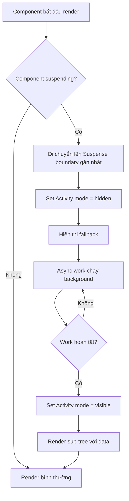

## Suspense - Xử Lý Bất Đồng Bộ Trong React

### Khái niệm Suspense

[[Suspense]] là một built-in component (component tích hợp sẵn) của React, cho phép "bắt" hoặc cô lập các component chưa sẵn sàng để render vì đang thực hiện công việc bất đồng bộ (asynchronous work). Các component này được gọi là đang "suspending" (tạm dừng).

**Ẩn dụ**: Suspense hoạt động giống như khối `catch` trong câu lệnh `try-catch`, nhưng thay vì bắt lỗi (errors), nó bắt các component đang suspending.

### Nguyên nhân Component Suspending

Component có thể suspending do hai lý do chính:

- **Data fetching**: Fetch dữ liệu sử dụng thư viện hỗ trợ Suspense (React Query, Next.js)
- **Code splitting**: Tải code bổ sung sử dụng `React.lazy()`


### Cách sử dụng Suspense

**Ví dụ cơ bản**: Trong ứng dụng e-commerce với Next.js

```jsx
import { Suspense } from 'react';

function ProductsPage() {
  return (
    <Suspense fallback={<Spinner />}>
      <Products />
      <Filter />
    </Suspense>
  );
}
```

**Cách hoạt động**:

- Component `Products` fetch dữ liệu và sẽ suspending
- Bọc sub-tree trong `Suspense` component
- Khi suspending, React hiển thị `fallback` (Spinner)
- Khi dữ liệu sẵn sàng, render component thực tế


### Ưu điểm của Suspense

**Cách tiếp cận declarative (khai báo)**:

- Không cần state `isLoading`
- Không cần logic render với ternary operators
- Component đơn giản và sạch hơn
- Tách biệt logic loading khỏi component

**So sánh**:

```jsx
// Trước đây (imperative)
function Products() {
  const [isLoading, setIsLoading] = useState(true);
  
  if (isLoading) return <Spinner />;
  return <ProductList />;
}

// Với Suspense (declarative)
function Products() {
  const products = fetchProducts(); // Suspends automatically
  return <ProductList products={products} />;
}
```


### Suspense Boundary (Ranh giới Suspense)

**Khái niệm**: Suspense boundary là điểm phân chia giữa sub-tree đang suspending và phần còn lại của app.

**Quy trình xử lý**:

- React tìm thấy component suspending trong quá trình render
- Di chuyển lên parent Suspense gần nhất
- Loại bỏ các children đã render
- Hiển thị fallback thay thế
- Khi async work hoàn tất, render lại sub-tree với dữ liệu đã fetch


### Yêu cầu thư viện hỗ trợ

Component **không tự động suspending** chỉ vì có async operation bên trong. Cần sử dụng thư viện/framework hỗ trợ:

- [[React Query]]
- [[Next.js]]
- Remix
- `React.lazy()` cho code splitting


### Hoạt động Behind the Scenes

#### Fiber Tree và Activity Component

React sử dụng [[Fiber Tree]] - cấu trúc dữ liệu mutable (có thể thay đổi) để lưu trữ state, hooks và hỗ trợ concurrent features (tính năng đồng thời).

**Cơ chế nội bộ**:

- Sub-tree bên dưới Suspense boundary được di chuyển vào component `<Activity>` (built-in, không hiển thị trong DevTools)
- Fallback được đặt làm sibling của Activity
- Activity có mode: `visible` hoặc `hidden`

**Quy trình**:

```
Initial: Activity mode = "visible" → Hiển thị children
Suspending: Activity mode = "hidden" → Hiển thị fallback
Done: Activity mode = "visible" → Hiển thị children với data
```

**Lợi ích**: State trong sub-tree được bảo toàn (preserved) trong fiber tree khi suspending/unsuspending.

### Transitions và Fallback Behavior

**Đặc điểm quan trọng**: Fallback sẽ **không hiển thị lại** nếu function trigger Suspense được bọc trong `startTransition()`.

**Ứng dụng trong Next.js**:

- Tất cả page navigations được wrap trong transitions
- Khi component re-fetch data do navigation, fallback không render lại
- Có thể gây nhầm lẫn và không phải lúc nào cũng mong muốn

**Giải pháp**: Sử dụng unique `key` prop để reset Suspense boundary

```jsx
<Suspense key={uniqueKey} fallback={<Spinner />}>
  <Products />
</Suspense>
```


### Cơ chế thông báo Suspending

**Câu hỏi**: Suspense boundary biết child component đang suspending như thế nào?

**Cơ chế**: Component đánh dấu mình đang suspending bằng cách **throw một promise** (không phải throw error như thông thường).

```javascript
// Behind the scenes (đơn giản hóa)
function fetchData() {
  if (!dataReady) {
    throw fetchPromise; // Notify Suspense boundary
  }
  return data;
}
```

Promise được throw sẽ trigger Suspense boundary gần nhất render fallback. Đây là cơ chế phức tạp nên cần được tích hợp vào thư viện như React Query hoặc Next.js.

### Sơ đồ luồng xử lý Suspense



**Giải thích sơ đồ**:

- Khi component bắt đầu render, React kiểm tra xem có suspending không
- Nếu suspending, di chuyển lên Suspense boundary và ẩn children
- Hiển thị fallback trong khi async work chạy background
- Sau khi hoàn tất, hiển thị lại children với dữ liệu đã fetch
- State được bảo toàn trong fiber tree suốt quá trình


### Ghi chú thêm

- Suspense là tính năng concurrent của React, yêu cầu React 18+
- Không phù hợp cho tất cả trường hợp - cân nhắc khi cần control chi tiết
- Với multiple Suspense boundaries, có thể tạo loading experience phân tầng
- Kết hợp với Error Boundaries để xử lý cả loading và errors

**Liên kết:** [[Suspense]], [[Fiber Tree]], [[React Query]], [[Next.js]], [[Concurrent Features]], [[Error Boundaries]], [[React.lazy]], [[startTransition]]

