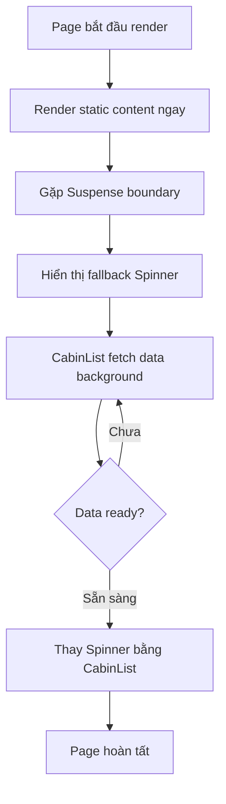

## Suspense Trong Thực Tế - Streaming UI Chi Tiết

### Vấn đề với Loading.js Global

File `loading.js` tạo loading indicator cho toàn bộ route segment, nhưng điều này gây ra **blocking UI** (giao diện bị chặn):

**Ví dụ trang cabins**:

- Heading và text tĩnh không phụ thuộc vào data
- Chỉ cabin list cần fetch data từ API
- Nhưng toàn bộ page bị ẩn khi loading

→ Cần chiến lược streaming chi tiết hơn (granular streaming strategy)

### Triển khai Suspense Boundary

#### Bước 1: Tách Data Fetching Thành Component Riêng

Di chuyển logic fetch data ra component độc lập:

```javascript
// components/CabinList.js
async function CabinList() {
  // Data fetching ở đây
  const cabins = await getCabins();
  
  if (!cabins.length) return null;
  
  return (
    <div>
      {cabins.map(cabin => (
        <CabinCard cabin={cabin} key={cabin.id} />
      ))}
    </div>
  );
}

export default CabinList;
```

**Lý do**: Suspense cần được đặt **bên ngoài** component thực hiện async work, không thể wrap toàn bộ JSX của page.

#### Bước 2: Wrap Component Trong Suspense

```javascript
// app/cabins/page.js
import { Suspense } from 'react';
import Spinner from '@/components/Spinner';
import CabinList from '@/components/CabinList';

function Page() {
  return (
    <div>
      <h1>Our Luxury Cabins</h1>
      <p>Welcome to paradise</p>
      
      <Suspense fallback={<Spinner />}>
        <CabinList />
      </Suspense>
    </div>
  );
}

export default Page;
```

**Kết quả**:

- Heading và text hiển thị ngay lập tức
- Chỉ vị trí cabin list hiển thị Spinner
- Sau khi data sẵn sàng, CabinList được render


### Slow Down Data Fetching (Testing)

Để quan sát loading state rõ hơn trong development:

```javascript
async function getCabins() {
  await new Promise(resolve => setTimeout(resolve, 2000)); // Delay 2s
  
  const { data, error } = await supabase
    .from('cabins')
    .select('*');
    
  return data;
}
```


### So sánh 2 Phương pháp Streaming

#### Option 1: Global Loading với loading.js

**Cách hoạt động**:

- File `loading.js` ở route folder
- Stream và thay thế toàn bộ page content
- Blocking UI - tất cả nội dung bị ẩn

**Khi nào sử dụng**:

- Toàn bộ page phụ thuộc vào data
- Không có UI tĩnh cần hiển thị sớm
- Approach đơn giản, nhanh chóng

```javascript
// app/cabins/loading.js
export default function Loading() {
  return <Spinner />;
}
```


#### Option 2: Granular Streaming với Suspense

**Cách hoạt động**:

- Suspense boundary bao quanh component cụ thể
- Chỉ component đang fetch data bị thay thế
- UI khác render ngay lập tức

**Khi nào sử dụng**:

- Page có cả UI tĩnh và dynamic
- Muốn progressive loading (tải dần)
- Tối ưu UX với partial rendering

```javascript
// app/cabins/page.js
<div>
  <StaticContent />  {/* Render ngay */}
  <Suspense fallback={<Spinner />}>
    <DynamicContent />  {/* Stream sau */}
  </Suspense>
</div>
```


### Luồng xử lý Suspense trong Next.js



**Giải thích sơ đồ**:

- Static content (heading, text) render ngay không cần chờ
- Khi gặp Suspense boundary, hiển thị fallback trong khi fetch data
- CabinList fetch data ở background
- Sau khi data sẵn sàng, Spinner được thay thế bằng danh sách cabins thực tế
- Toàn bộ page hoàn tất với better UX


### Best Practices

**Nguyên tắc vàng**: Giữ data fetching càng gần component cần data càng tốt

**Lợi ích**:

- Dễ implement granular streaming strategy
- Component tự quản lý data dependencies
- Tái sử dụng component dễ dàng hơn
- Tối ưu performance và UX

**Cấu trúc nên theo**:

```javascript
// ❌ Tránh: Data fetching ở page level
async function Page() {
  const cabins = await getCabins();
  return <CabinList cabins={cabins} />;
}

// ✅ Nên: Data fetching trong component
function Page() {
  return (
    <Suspense fallback={<Spinner />}>
      <CabinList />  {/* Tự fetch data bên trong */}
    </Suspense>
  );
}
```


### Ghi chú quan trọng

**Async function trong page**:

- Sau khi tách data fetching, page component không còn async
- Loại bỏ keyword `async` nếu không còn await

```javascript
// Trước khi tách
async function Page() {
  const data = await fetchData();
  return <div>...</div>;
}

// Sau khi tách
function Page() {  // Không còn async
  return (
    <Suspense fallback={<Spinner />}>
      <DataComponent />
    </Suspense>
  );
}
```

**Suspense overrides loading.js**:

- Khi sử dụng Suspense trong page, nó sẽ override loading.js file
- Loading.js vẫn áp dụng cho các routes khác không có Suspense
- Có thể kết hợp cả hai cho different pages


### Multiple Suspense Boundaries

Có thể sử dụng nhiều Suspense boundaries cho progressive loading:

```javascript
function Page() {
  return (
    <div>
      <h1>Dashboard</h1>
      
      <Suspense fallback={<Spinner />}>
        <UserProfile />
      </Suspense>
      
      <Suspense fallback={<Spinner />}>
        <RecentActivity />
      </Suspense>
      
      <Suspense fallback={<Spinner />}>
        <Statistics />
      </Suspense>
    </div>
  );
}
```

**Kết quả**: Mỗi component load độc lập, không chặn nhau.

### Lưu ý về Performance

**Streaming benefits**:

- Faster Time to First Byte (TTFB)
- Improved First Contentful Paint (FCP)
- Better perceived performance
- Progressive rendering cho users

**Trade-offs**:

- Yêu cầu JavaScript enabled
- Phức tạp hơn trong debugging
- Cần cân nhắc loading states

**Liên kết:** [[Suspense]], [[Streaming]], [[Loading.js]], [[Server Components]], [[Data Fetching]], [[User Experience]], [[Progressive Rendering]], [[Next.js Best Practices]]

