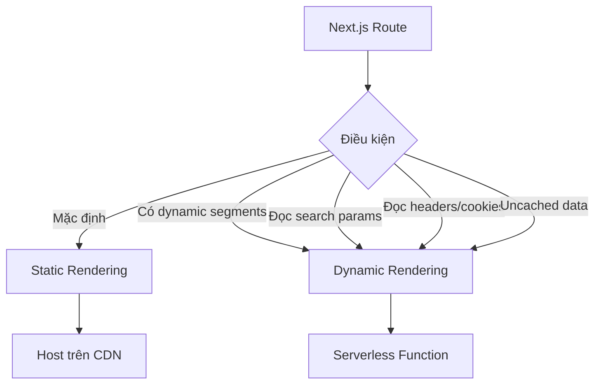

## Static và Dynamic Rendering trong Next.js

### Tổng quan về Server-Side Rendering

Next.js sử dụng React để thực hiện công việc render theo quy tắc của [[React Server Components]]. Một số điểm quan trọng:

- Cả [[Server Components]] và [[Client Components]] đều được render trên server khi trang được load lần đầu
- Next.js sử dụng thư viện `react` và `react-dom` để render từng route một cách độc lập
- Ứng dụng được chia nhỏ theo route, mỗi route có thể được render theo cách khác nhau
- Mỗi route có thể là static (pre-rendered) hoặc dynamic, không phải toàn bộ app


### Static Rendering (Pre-rendering)

Static rendering là phương thức render HTML cho route tại **thời điểm build** (khi chạy lệnh build).

**Đặc điểm:**

- HTML được tạo sẵn một lần khi developer chạy build command
- Phù hợp khi dữ liệu không thay đổi thường xuyên
- Dữ liệu không phụ thuộc vào từng user cụ thể
- Mặc định, tất cả routes trong Next.js đều được render static

**Ưu điểm:**

- Tốc độ nhanh hơn vì đã được pre-generate sẵn
- Không cần rebuild cho mỗi request
- Có thể dễ dàng host trên [[CDN]] (Content Delivery Network)
- Khi deploy lên Vercel, các static routes tự động được host trên CDN toàn cầu

**Ví dụ:** Trang sản phẩm (product page) trong website thương mại điện tử - nội dung không thay đổi theo user.

### Incremental Static Regeneration (ISR)

ISR là một dạng đặc biệt của static rendering cho phép:

- Re-render lại route định kỳ trong background
- Refetch dữ liệu của route theo khoảng thời gian cài đặt
- Cập nhật nội dung của static page mà user không nhận ra
- Thực hiện sau khi website đã được build và deploy


### Dynamic Rendering

Dynamic rendering tạo HTML tại **thời điểm có request** từ user.

**Đặc điểm:**

- Server render lại trang mới cho mỗi request
- User là người kích hoạt quá trình rendering
- Phù hợp khi dữ liệu thay đổi liên tục
- Dữ liệu được cá nhân hóa cho từng user

**Ví dụ:** Trang giỏ hàng (shopping cart) - mỗi user có giỏ hàng khác nhau.

**Khi deploy:**

- Mỗi dynamic route trên Vercel sẽ trở thành một [[Serverless Function]]
- Server chỉ hoạt động trong thời gian function đang chạy
- Vercel tự động quản lý và scale resources khi cần


### Khi nào Next.js chuyển sang Dynamic Rendering

Next.js tự động chuyển từ static sang dynamic rendering trong các trường hợp:

**1. Route chứa dynamic segments**

- Page component sử dụng `params` prop
- Dynamic segments chỉ được biết tại thời điểm request

**2. Đọc search params (query params) từ URL**

```javascript
// Ví dụ: ?quantity=23
```

**3. Server component đọc headers hoặc cookies**

- Headers và cookies không thể biết trước tại build time
- Phụ thuộc vào incoming request

**4. Uncached data request trong server components**

- Có thể force dynamic rendering bằng cách manipulate cache behavior

**Các cách tắt cache để force dynamic rendering:**

- Sử dụng `cache: 'no-store'` trong fetch options
- Sử dụng `revalidate: 0`
- Đặt `export const dynamic = 'force-dynamic'`
- Sử dụng các Next.js APIs như `cookies()` hoặc `headers()`


### Sơ đồ phân loại Rendering Strategies




### Static Site Generation (SSG)

Trong trường hợp đặc biệt:

- Không có dữ liệu cá nhân hóa user
- Tất cả routes đều static
- Toàn bộ app có thể export thành static site


### Các thuật ngữ quan trọng

**Content Delivery Network (CDN)**

- Mạng lưới các server phân tán trên toàn cầu
- Cache và lưu trữ static content (HTML, CSS, JS, images)
- Phân phối content từ server gần user nhất
- Giảm thời gian truyền tải dữ liệu
- Hosting providers như Vercel, Netlify, Render.com tự động sử dụng CDN

**Serverless Function**

- Chạy code ứng dụng (thường là backend) mà không cần quản lý server
- Server chỉ active khi function đang chạy
- Khác với Node.js app truyền thống (server luôn chạy)
- Mỗi dynamic route trên Vercel = 1 serverless function
- Vercel tự động scale resources khi traffic tăng

**Edge Computing**

- Xử lý diễn ra gần user nhất có thể
- CDN là một phần của edge network
- Serverless edge computing: chạy function trên mạng phân tán toàn cầu
- Giống CDN nhưng cho việc chạy code thay vì phục vụ files
- Trên Vercel, có thể chọn dynamic routes chạy trên edge để tăng tốc độ

**Incremental Static Regeneration (ISR)**

- Tính năng của Next.js
- Refetch và update nội dung static page trong background
- Xảy ra sau khi website đã build và deploy
- Re-fetch data theo interval cài đặt trong code
- User không nhận biết được quá trình update


### So sánh Static vs Dynamic Rendering

| Tiêu chí | Static Rendering | Dynamic Rendering |
| :-- | :-- | :-- |
| Thời điểm render | Build time | Request time |
| Ai trigger | Developer | User |
| Tốc độ | Nhanh hơn | Chậm hơn |
| Hosting | CDN | Serverless Function |
| Phù hợp | Data ít thay đổi | Data thay đổi thường xuyên |
| Personalization | Không | Có |

### Ghi chú quan trọng

- Next.js không phải là một Node.js app lớn chạy trên server, mà là tập hợp các serverless functions
- Mỗi route được xử lý độc lập
- Partial Pre-rendering là strategy thứ ba kết hợp cả static và dynamic (sẽ học sau)
- Developer thường không trực tiếp chọn rendering strategy, Next.js tự động quyết định dựa trên các điều kiện
- Khi deploy production, cần hiểu rõ route nào static/dynamic để tối ưu performance

***

**Liên kết:** [[Next.js]], [[Server Components]], [[Client Components]], [[React Server Components]], [[CDN]], [[Serverless Function]], [[Edge Computing]], [[ISR]], [[Static Site Generation]], [[Dynamic Segments]], [[Caching]], [[Vercel]]

