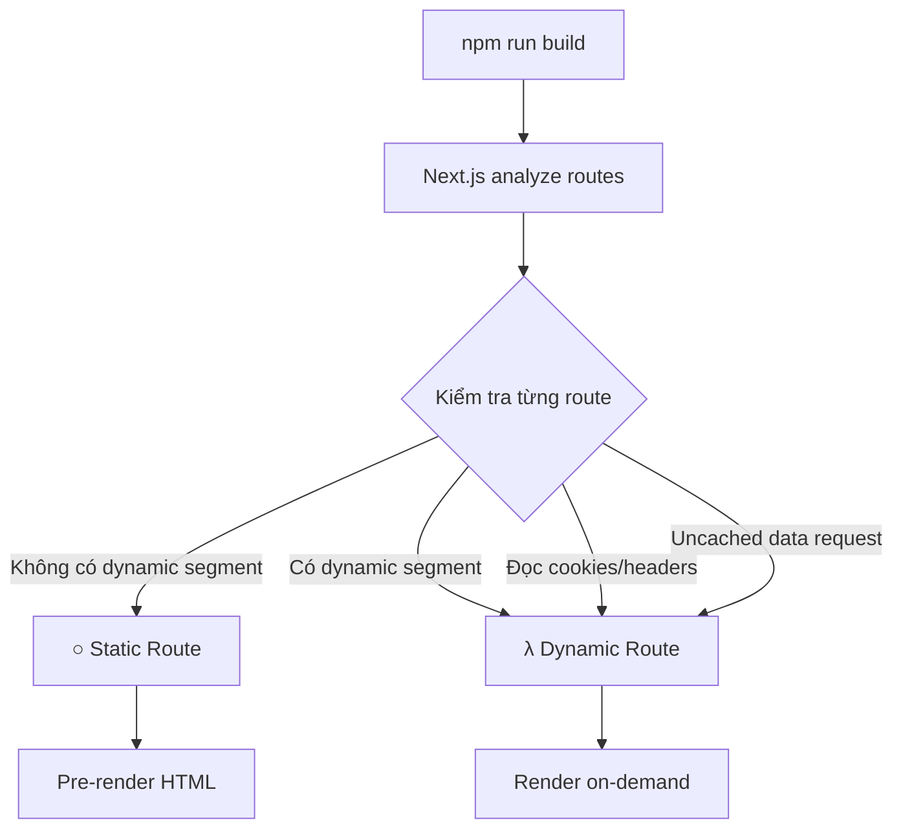

## Phân tích Static và Dynamic Rendering trong Thực tế

### Kiểm tra cách Next.js render các routes

Next.js tự động quyết định cách render từng route (static hay dynamic). Để xem chính xác cách mỗi route được render, chúng ta cần build ứng dụng bằng lệnh build command.

### Chạy Build Command

Trong file `package.json`, bên cạnh lệnh `dev` thường dùng, còn có lệnh `build`:

```bash
npm run build
```

Lệnh này sẽ:

- Compile toàn bộ ứng dụng
- Hiển thị danh sách tất cả routes
- Cho biết từng route được render theo cách nào
- Có thể hiển thị các ESLint warnings


### Đọc kết quả Build

Sau khi chạy lệnh build, Next.js hiển thị danh sách routes với các biểu tượng:

**Biểu tượng ○ (Circle)**

- Đại diện cho [[Static Route]]
- Route được pre-render tại build time
- Nội dung tĩnh đã được tạo sẵn

**Biểu tượng λ (Lambda)**

- Đại diện cho [[Dynamic Route]]
- Route được server-side render theo yêu cầu (on-demand)
- Render lại cho mỗi request


### Ví dụ phân tích Routes

Trong ứng dụng mẫu, hầu hết routes đều static, ngoại trừ route có dynamic segment:

```
/cabins/[cabinId]
```

**Tại sao route này là dynamic?**

- Chứa [[Dynamic Segment]] `[cabinId]`
- Next.js không thể biết trước tất cả các ID có thể có tại build time
- Không có cách nào để Next.js biết user sẽ truy cập ID nào
- Do đó, không thể pre-render tất cả các page variations


### Sơ đồ quy trình Build và phân loại Routes




### Các yếu tố khiến Route trở thành Dynamic

Hiện tại trong ứng dụng, chỉ có route với dynamic segment là dynamic. Các yếu tố khác chưa được sử dụng:

- Đọc [[Cookies]]
- Đọc [[Headers]]
- Đọc [[Search Params]]
- Uncached data requests

Khi sử dụng các tính năng này sau, có thể chạy lại `npm run build` để xem routes có thay đổi cách render không.

### Thông báo về Dynamic Segments

Next.js không thể pre-render route `/cabins/[cabinId]` vì:

- Không biết tất cả possible IDs
- Không biết nên thay thế `[cabinId]` bằng giá trị nào
- Không có thông tin về các cabin IDs tồn tại trong database

**Giải pháp:** Có một cách để "nói" với Next.js về tất cả possible IDs, cho phép pre-render các routes này. Kỹ thuật này sẽ được học ở lecture tiếp theo.

### Lưu ý khi Deploy

Khi deploy ứng dụng lên [[Vercel]]:

- Tất cả quá trình phân tích và rendering diễn ra tự động
- Không cần lo lắng chi tiết về static/dynamic routing
- Vercel tự động tối ưu hóa từng route
- Static routes được host trên CDN
- Dynamic routes trở thành serverless functions

Developer không cần can thiệp thủ công - mọi thứ "just work" behind the scenes.

### Bài tập thực hành

Trước khi chạy `npm run build`, hãy thử:

- Phân tích từng route trong ứng dụng
- Dự đoán route nào sẽ static, route nào sẽ dynamic
- Giải thích lý do cho dự đoán của bạn
- So sánh kết quả dự đoán với kết quả thực tế từ build command

Đây là cách tốt để ôn tập và hiểu sâu hơn về static vs dynamic rendering.

### Các bước kiểm tra Routes

1. Mở terminal
2. Dừng development server nếu đang chạy (`Ctrl + C`)
3. Chạy `npm run build`
4. Đợi quá trình build hoàn tất
5. Xem output với danh sách routes
6. Xác định biểu tượng ○ (static) hoặc λ (dynamic)
7. Phân tích lý do tại sao mỗi route có rendering strategy đó

### Ghi chú quan trọng

- Build command khác với dev command - nó compile production-ready code
- ESLint warnings có thể xuất hiện nhưng không ảnh hưởng đến build
- Có thể convert images sang Next.js Image component để tối ưu
- Trong production, việc phân loại routes rất quan trọng cho performance
- Static routes nhanh hơn và rẻ hơn về chi phí hosting

***

**Liên kết:** [[Next.js]], [[Static Route]], [[Dynamic Route]], [[Dynamic Segment]], [[Build Command]], [[Pre-rendering]], [[Server-Side Rendering]], [[Vercel]], [[Cookies]], [[Headers]], [[Search Params]], [[CDN]], [[Serverless Function]]

