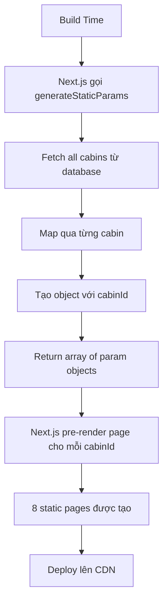

## Pre-render Dynamic Routes với generateStaticParams

### Vấn đề với Dynamic Routes

Mặc định, Next.js render các routes có [[Dynamic Segment]] theo cách dynamic vì không biết trước các giá trị có thể có tại build time. Ví dụ với route `/cabins/[cabinId]`:

- Next.js không biết có bao nhiêu cabin IDs tồn tại
- Không thể pre-render các pages này thành static
- Mỗi request đến `/cabins/89`, `/cabins/90`... sẽ trigger server-side rendering mới

Tuy nhiên, trong nhiều trường hợp, developer biết trước tập hợp giới hạn các giá trị (ví dụ: chỉ có 8 cabins với IDs từ 89-96).

### Giải pháp: generateStaticParams Function

`generateStaticParams` là function đặc biệt của Next.js cho phép:

- Thông báo cho Next.js về tất cả possible values của dynamic segment
- Pre-render các dynamic routes thành [[Static Pages]]
- Chuyển toàn bộ app thành static site nếu tất cả routes đều static


### Cách triển khai

**Bước 1: Export function generateStaticParams**

Trong page component có dynamic segment, export async function với tên chính xác là `generateStaticParams`:

```javascript
export async function generateStaticParams() {
  // Fetch all cabins
  const cabins = await getCabins();
  
  // Return array of param objects
  const ids = cabins.map((cabin) => ({
    cabinId: String(cabin.id)
  }));
  
  return ids;
}
```

**Bước 2: Hiểu cấu trúc return value**

Function phải return một array of objects, mỗi object chứa:

- Property name trùng với tên của dynamic segment folder
- Ví dụ: folder là `[cabinId]` → property là `cabinId`
- Value phải là **string** (không phải number)

```javascript
// Kết quả return phải có dạng:
[
  { cabinId: "89" },
  { cabinId: "90" },
  { cabinId: "91" },
  // ... tổng cộng 8 objects cho 8 cabins
]
```

**Bước 3: Xử lý dữ liệu dynamic**

Thay vì hardcode IDs, fetch từ data source:

```javascript
export async function generateStaticParams() {
  const cabins = await getCabins(); // Fetch tất cả cabins
  
  return cabins.map((cabin) => ({
    cabinId: String(cabin.id) // Convert number sang string
  }));
}
```


### Lỗi thường gặp và cách khắc phục

**Lỗi: Required parameter was not provided as a string**

- Nguyên nhân: ID là number chứ không phải string
- Giải pháp: Sử dụng `String(cabin.id)` để convert

**Lỗi: Function không return gì**

- Nguyên nhân: Quên keyword `return`
- Giải pháp: Đảm bảo `return` array of objects


### Kiểm tra kết quả

Sau khi implement, chạy build command để verify:

```bash
npm run build
```

**Kết quả mong đợi:**

- Số lượng pages tăng lên (từ 10 lên 18 trong ví dụ)
- Route với dynamic segment hiển thị biểu tượng ○ (circle) thay vì λ (lambda)
- Mô tả: "pre-rendered as static HTML"
- Tất cả routes đều static, không còn dynamic routes


### Sơ đồ hoạt động generateStaticParams




### Lợi ích của Static Pre-rendering

**Performance:**

- Pages load nhanh hơn vì đã được pre-generate
- Không cần render lại cho mỗi request
- Giảm tải cho server

**Hosting:**

- Có thể export toàn bộ site thành [[Static Site]]
- Deploy dễ dàng lên bất kỳ static hosting provider nào
- Chi phí hosting thấp hơn (không cần serverless functions)

**SEO:**

- HTML đã có sẵn, tốt cho search engines
- Không phụ thuộc vào JavaScript để render content


### Best Practices

**Khi nào nên dùng generateStaticParams:**

- Có tập hợp giới hạn các giá trị cho dynamic segment
- Dữ liệu không thay đổi thường xuyên
- Muốn tối ưu performance tối đa

**Khi nào không nên dùng:**

- Có hàng ngàn hoặc hàng triệu possible values
- Dữ liệu thay đổi liên tục theo thời gian thực
- Nội dung phụ thuộc vào user authentication

**Lưu ý về scalability:**

- Nếu có 8 cabins → 8 static pages (OK)
- Nếu sau này có 20 cabins → 20 static pages (vẫn OK)
- Nếu có 10,000+ items → cân nhắc [[Incremental Static Regeneration]] hoặc dynamic rendering


### Ví dụ đầy đủ

```javascript
// app/cabins/[cabinId]/page.js

// Function để pre-render static pages
export async function generateStaticParams() {
  const cabins = await getCabins();
  
  return cabins.map((cabin) => ({
    cabinId: String(cabin.id)
  }));
}

// Page component nhận params từ generateStaticParams
export default async function Page({ params }) {
  const { cabinId } = params;
  const cabin = await getCabin(cabinId);
  
  return <div>{/* Render cabin details */}</div>;
}
```


### Static Site Generation (SSG)

Khi tất cả routes đều static:

- Có thể export toàn bộ app
- Không cần server runtime
- Pure HTML/CSS/JS files
- Host trên Netlify, GitHub Pages, Vercel, v.v.

Command để export:

```bash
npm run build
# Sau đó có thể export static files
```


### So sánh trước và sau generateStaticParams

| Tiêu chí | Trước | Sau |
| :-- | :-- | :-- |
| Route type | λ Dynamic | ○ Static |
| Rendering | Request time | Build time |
| Số pages | 10 | 18 |
| Performance | Chậm hơn | Nhanh hơn |
| Hosting | Serverless function | CDN |

### Ghi chú quan trọng

- Tên function phải chính xác là `generateStaticParams` (Next.js recognize tên này)
- Property name trong return object phải match với tên dynamic segment folder
- Luôn return string values, không phải numbers
- Function này chạy tại build time, không phải runtime
- Có thể combine với [[Incremental Static Regeneration]] để update định kỳ
- Next.js cache kết quả của generateStaticParams


### Debug Tips

**Để kiểm tra output của generateStaticParams:**

```javascript
export async function generateStaticParams() {
  const cabins = await getCabins();
  const ids = cabins.map((cabin) => ({
    cabinId: String(cabin.id)
  }));
  
  console.log('Generated params:', ids); // Log để debug
  return ids;
}
```

Output trong console khi build sẽ hiển thị array of objects, giúp verify structure đúng.

***

**Liên kết:** [[Next.js]], [[Dynamic Segment]], [[Static Pages]], [[Static Site Generation]], [[Pre-rendering]], [[Build Time]], [[Incremental Static Regeneration]], [[CDN]], [[Performance Optimization]], [[generateStaticParams]]

