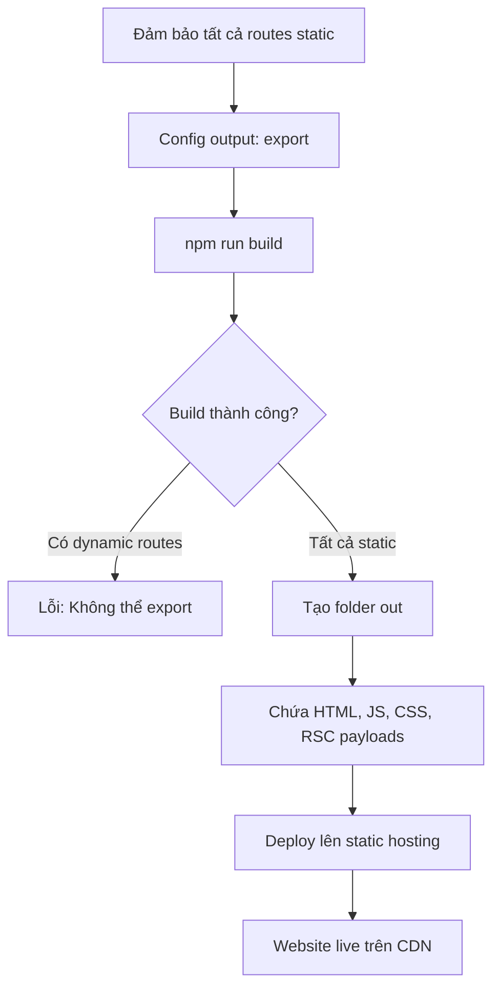

## Export Static Site với Static Site Generation (SSG)

### Điều kiện để thực hiện SSG

Khi toàn bộ website đã là static (tất cả routes có biểu tượng ○), có thể export thành [[Static Site]] để deploy dễ dàng lên bất kỳ hosting provider nào.

**Yêu cầu:**

- Tất cả routes phải được render static
- Không có dynamic routes (trừ khi đã dùng [[generateStaticParams]])
- Không sử dụng cookies, headers hay các tính năng yêu cầu server runtime


### Cấu hình Export Static Site

**Bước 1: Chỉnh sửa next.config file**

Thêm output mode vào config:

```javascript
// next.config.js
module.exports = {
  output: 'export'
}
```

Option này báo cho Next.js export toàn bộ site thành static assets.

**Bước 2: Tùy chỉnh output folder (optional)**

Mặc định, Next.js tạo folder `out`. Có thể đổi tên nếu muốn:

```javascript
// next.config.js
module.exports = {
  output: 'export',
  distDir: 'dist' // Thay vì 'out'
}
```

Tuy nhiên, `out` cũng hoạt động tốt và là convention của Next.js.

### Chạy Build Command

Sau khi config, chạy lệnh build như bình thường:

```bash
npm run build
```

**Kết quả:**

- Tạo folder `out` (hoặc `dist` nếu đã config)
- Folder này chứa toàn bộ static assets
- Tất cả pages được confirm là static
- Không có dynamic routes trong output

**Lưu ý về lỗi:** Nếu có bất kỳ route nào vẫn còn dynamic (chưa dùng generateStaticParams hoặc đang dùng cookies/headers), build sẽ **báo lỗi** và không thể export.

### Cấu trúc thư mục Out

Sau khi build, folder `out` chứa:

**HTML files:**

- `index.html` cho mỗi route
- Pre-rendered static HTML content

**Text files (.txt):**

- [[RSC Payload]] (React Server Components payload) cho mỗi page
- Chứa data dạng JSON-like structure
- Cần thiết cho client-side navigation

**_next folder:**

- JavaScript bundles
- CSS files
- Client-side code từ Next.js
- Chunks cho code splitting

**Static assets:**

- Images, fonts, icons
- Public folder contents


### Deploy Static Site

Folder `out` có thể deploy trực tiếp lên bất kỳ static hosting provider:

**Các nền tảng phổ biến:**

- GitHub Pages
- Netlify
- Render.com
- Vercel (dù không tận dụng được tính năng đặc biệt)
- Cloudflare Pages
- AWS S3 + CloudFront

**Cách deploy:**

- Drag and drop folder `out` vào hosting dashboard
- Hoặc connect Git repository và config build command
- Không cần server-side code vì tất cả đã là static

**Ưu điểm của static deployment:**

- Đơn giản hơn nhiều so với deploy full Next.js app
- Không cần cấu hình phức tạp
- Chi phí rất thấp hoặc miễn phí
- Performance tốt vì serve từ CDN


### Test Static Site Locally

**Không thể double-click index.html:**

- Mở trực tiếp file HTML sẽ không hoạt động đúng
- Client-side routing và assets không load được

**Sử dụng Live Server extension:**

1. Install extension "Live Server" trong VS Code
2. Mở folder `out` trong VS Code
3. Right-click vào `index.html`
4. Chọn "Open with Live Server" hoặc click "Go Live"
5. Browser sẽ mở static site với local server

**Kết quả khi test:**

- Tất cả pages vẫn hoạt động
- Links navigation hoạt động mượt mà
- Vẫn có [[Single Page Application]] (SPA) feeling
- Client-side transitions giữa các pages


### Cơ chế hoạt động của Client-Side Navigation

Mặc dù là static site, vẫn có navigation mượt mà nhờ:

**RSC Payload files (.txt):**

- Chứa React Server Components data
- Format giống React elements
- Include links đến JavaScript chunks
- Cần thiết cho client-side routing

**Ví dụ nội dung RSC payload:**

```
// Example structure in .txt file
["$","div",null,{"children":...}]
// Links to chunks
/_next/static/chunks/[id].js
// Serialized component data
```

**Next.js client code:**

- JavaScript trong folder `_next`
- Xử lý navigation không reload page
- Fetch RSC payload khi chuyển route
- Update UI mượt mà như SPA


### Vấn đề với Image Optimization

**Hiện tượng:** Images sử dụng Next.js [[Image Component]] không hiển thị trong static export.

**Nguyên nhân:**

- Next.js Image component tối ưu hóa images động trên server
- Vercel cung cấp Image Optimization API
- API này chạy trên Vercel servers, không khả dụng trong static export
- Static site không có server để xử lý optimization

**Hình ảnh bị ảnh hưởng:**

- Chỉ images dùng `<Image>` component của Next.js
- Images thường (`` tag) vẫn hoạt động bình thường


### Giải pháp cho Image Optimization

**Option 1: Không optimize images**

Quay lại sử dụng HTML `` tag thông thường:

```javascript
// Thay vì:
<Image src="/cabin.jpg" width={500} height={300} alt="Cabin" />

// Dùng:

```

**Nhược điểm:**

- Mất tính năng tự động optimize
- Không có lazy loading
- Không có responsive images
- Performance kém hơn

**Option 2: Sử dụng Custom Loader**

Tích hợp dịch vụ image optimization bên thứ ba như [[Cloudinary]]:

```javascript
// next.config.js
module.exports = {
  output: 'export',
  images: {
    loader: 'custom',
    loaderFile: './image-loader.js'
  }
}
```

```javascript
// image-loader.js
export default function cloudinaryLoader({ src, width, quality }) {
  const params = ['f_auto', 'c_limit', `w_${width}`, `q_${quality || 'auto'}`]
  return `https://res.cloudinary.com/your-cloud-name/image/upload/${params.join(',')}${src}`
}
```

**Các dịch vụ image optimization:**

- Cloudinary
- Imgix
- Akamai Image Manager
- Fastly IO

**Tài liệu tham khảo:**

- Search "next.js static export" trong documentation
- Phần "Image Optimization" trong App Router docs
- Example với Cloudinary loader


### Sơ đồ quy trình Static Site Generation




### So sánh Deploy Methods

| Tiêu chí | Static Export | Full Next.js App |
| :-- | :-- | :-- |
| Complexity | Rất đơn giản | Phức tạp hơn |
| Hosting options | Mọi provider | Vercel, specialized platforms |
| Cost | Rất thấp/free | Cao hơn |
| Image optimization | Cần custom loader | Built-in với Vercel |
| Dynamic routes | Phải pre-render | Có thể on-demand |
| Server functions | Không | Có |

### Best Practices cho Static Export

**Khi nào nên dùng:**

- Content-driven websites (blogs, portfolios, docs)
- Không cần real-time data
- Không cần user authentication phức tạp
- Muốn chi phí hosting thấp nhất
- Cần performance tối đa

**Khi nào không nên dùng:**

- Cần personalized content cho mỗi user
- Real-time features (chat, live updates)
- Nhiều dynamic routes không thể pre-render
- Phụ thuộc nặng vào server-side logic


### Checklist trước khi Export

- [ ] Tất cả routes đã dùng generateStaticParams nếu có dynamic segments
- [ ] Không sử dụng cookies() hoặc headers() APIs
- [ ] Không có uncached data fetches
- [ ] Config `output: 'export'` trong next.config.js
- [ ] Quyết định strategy cho image optimization
- [ ] Test local với Live Server
- [ ] Verify tất cả pages hoạt động
- [ ] Check client-side navigation


### Ghi chú quan trọng

**Về RSC Payloads:**

- Đây là lần đầu xem real React Server Components payload
- Format dạng serialized React elements
- Chứa data và metadata cần thiết cho hydration
- So sánh với kiến thức đã học về RSC architecture

**Về deployment:**

- Static export đơn giản hơn nhiều so với full Next.js deployment
- Không cần lo về serverless functions, edge runtime, etc.
- Chỉ cần upload static files
- Nhưng mất một số tính năng động của Next.js

**Về performance:**

- Static sites cực kỳ nhanh
- Serve trực tiếp từ CDN
- Không có server processing time
- Tuy nhiên, cần cân nhắc trade-off với dynamic features


### Resources và Documentation

**Official Next.js docs:**

- Search: "next.js static export"
- App Router section về static exports
- Image optimization với custom loaders

**Image optimization services:**

- Cloudinary documentation
- Imgix guides
- Comparison của các services

**Deployment guides:**

- GitHub Pages với Next.js static export
- Netlify deployment guide
- Vercel static hosting (dù không optimal cho Next.js)


### Các bước tiếp theo

Sau khi hoàn thành static site generation, course sẽ tiếp tục với:

- [[Partial Prerendering]] (PPR) - hybrid rendering strategy
- Mix static và dynamic content trong cùng một route
- Advanced rendering patterns

***

**Liên kết:** [[Next.js]], [[Static Site Generation]], [[Static Site]], [[Static Export]], [[generateStaticParams]], [[Image Component]], [[RSC Payload]], [[Single Page Application]], [[Cloudinary]], [[CDN]], [[Live Server]], [[Client-Side Navigation]], [[Partial Prerendering]]

