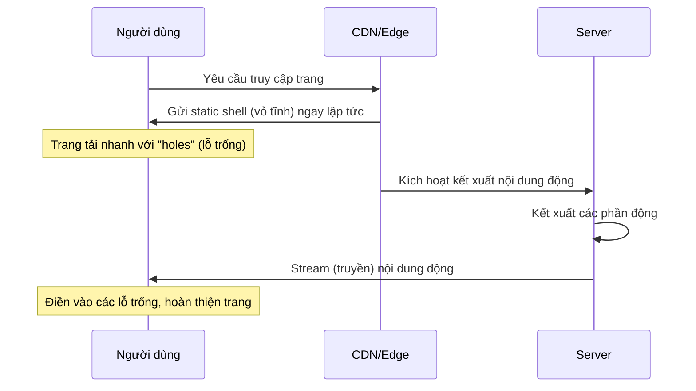

## Partial Pre-Rendering (PPR) - Chiến Lược Kết Xuất Mới trong Next.js

### Vấn Đề Cần Giải Quyết

Trong Next.js hiện tại, mỗi route (tuyến đường) phải được kết xuất hoàn toàn tĩnh (static) hoặc hoàn toàn động (dynamic). Điều này dẫn đến tình trạng lãng phí:

- Nếu một trang web có 95% nội dung tĩnh nhưng chỉ có 5% nội dung động (ví dụ: hiển thị tên người dùng đang đăng nhập), toàn bộ trang sẽ bị kết xuất động
- Điều này làm mất đi lợi thế của việc phân phối nội dung tĩnh qua CDN (Content Delivery Network), khiến trang web chậm hơn không cần thiết


### Khái Niệm Partial Pre-Rendering

Partial Pre-Rendering (PPR) là chiến lược kết xuất mới kết hợp ưu điểm của cả kết xuất tĩnh và kết xuất động trong cùng một route:

- **Partial** (một phần): chỉ có một phần trang được pre-render (kết xuất trước)
- **Pre-rendering** (kết xuất trước): về bản chất giống với kết xuất tĩnh, nhưng chỉ áp dụng cho một phần nội dung
- Là giải pháp trung gian giữa trang hoàn toàn tĩnh và trang hoàn toàn động


### Cách Hoạt Động của PPR



**Quy trình chi tiết:**

- **Bước 1:** Khi người dùng truy cập, một trang tĩnh hoàn chỉnh (static shell) được phục vụ ngay lập tức từ CDN. Trang này có các "lỗ trống" (holes) dành cho nội dung động
- **Bước 2:** Đồng thời, server bắt đầu kết xuất các phần nội dung động (mất nhiều thời gian hơn)
- **Bước 3:** Ngay khi có kết quả kết xuất, server bắt đầu streaming (truyền) các phần động về client để điền vào các lỗ trống
- **Kết quả:** Trang web tải nhanh hơn vì phần lớn nội dung được phân phối từ edge/CDN, chỉ có phần nhỏ cần kết xuất động


### Lợi Ích của PPR

- Trang web không còn bị ép buộc kết xuất hoàn toàn động chỉ vì một phần nhỏ phụ thuộc vào request hoặc dữ liệu không được cache
- Ví dụ: Một trang có 80% nội dung tĩnh và 20% nội dung động vẫn có thể tận dụng tối đa tốc độ của CDN
- Cải thiện đáng kể hiệu suất tổng thể của ứng dụng


### Cách Triển Khai PPR

**⚠️ Lưu ý quan trọng:** Tính năng này chưa chính thức có sẵn trong Next.js tại thời điểm ghi chú này (Next.js 14), và không nên sử dụng trong môi trường production.

**Khi PPR chính thức ra mắt:**

**1. Bật PPR trong file cấu hình**

PPR là tính năng opt-in (tự chọn bật), cần được kích hoạt trong file `next.config.js`

**2. Sử dụng Suspense Boundary**

PPR tận dụng React Suspense API mà chúng ta đã biết - không cần học API mới:

```jsx
import { Suspense } from 'react';
import DynamicComponent from './DynamicComponent';
import StaticFallback from './StaticFallback';

export default function Page() {
  return (
    <div>
      {/* Phần nội dung tĩnh */}
      <h1>Nội dung tĩnh</h1>
      
      {/* Phần nội dung động được bọc trong Suspense */}
      <Suspense fallback={<StaticFallback />}>
        <DynamicComponent />
      </Suspense>
    </div>
  );
}
```

**Cách hoạt động:**

- Đặt các component động (sử dụng cookies, headers, hoặc non-cached fetch) vào trong `<Suspense>`
- Suspense boundary (ranh giới) định nghĩa các "lỗ trống" trong static shell
- Suspense boundary ngăn phần động lan rộng ra toàn bộ route, giữ phần còn lại vẫn được kết xuất tĩnh
- Prop `fallback` trong Suspense cung cấp nội dung tĩnh hiển thị ngay lập tức
- Khi kết xuất hoàn tất, phần động sẽ thay thế fallback


### Nguyên Lý Hoạt Động

- Next.js mặc định vẫn cố gắng kết xuất tĩnh càng nhiều càng tốt khi PPR được bật
- Các phần tĩnh trở thành static shell
- Các component sử dụng tính năng động (như `cookies()`, `headers()`) được đặt trong Suspense sẽ được kết xuất động
- Suspense boundary cô lập (isolate) các component hoặc cây con động, ngăn chúng ảnh hưởng đến toàn bộ route


### Ghi Chú Thêm

- Đây là tính năng đơn giản để sử dụng - chỉ cần đặt component động vào Suspense
- Sẽ cải thiện hiệu suất đáng kể khi ra mắt chính thức
- Theo dõi tài liệu Next.js để biết khi nào tính năng này stable và cách sử dụng chi tiết trong thực tế

***

**Liên kết:** [[Next.js]], [[Static Rendering]], [[Dynamic Rendering]], [[Suspense]], [[React]], [[CDN]], [[Streaming]], [[Edge Computing]], [[Server Components]]

