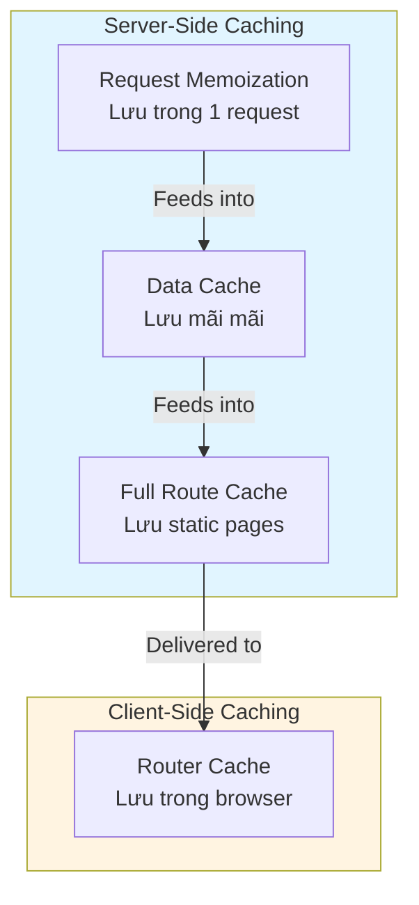
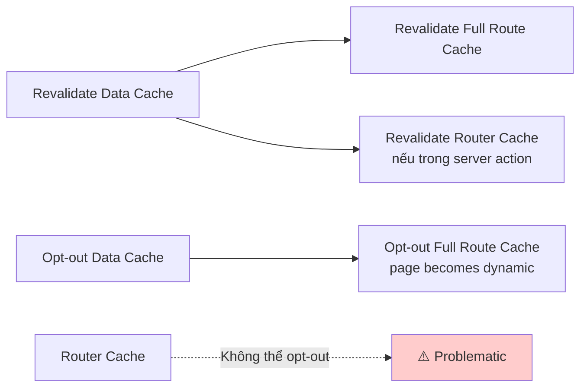

## Caching trong Next.js - Hệ Thống Bộ Nhớ Đệm

### Khái Niệm Caching

Caching (bộ nhớ đệm) là kỹ thuật lưu trữ dữ liệu đã được fetch hoặc tính toán vào một vị trí tạm thời để sử dụng lại trong tương lai. Thay vì fetch hoặc tính toán lại mỗi lần cần, chúng ta chỉ cần lấy từ cache.

**Lợi ích:**

- Tăng hiệu suất với tốc độ tải trang nhanh hơn
- Tiết kiệm chi phí tính toán và truy cập dữ liệu
- Giảm số lần gọi API đến nguồn dữ liệu (ví dụ: CMS)

**Vấn đề:**

- Next.js áp dụng caching rất mạnh mẽ (aggressive) - mọi thứ có thể cache đều được cache mặc định
- Có thể dẫn đến hiển thị dữ liệu cũ (stale data) trên client
- Một số cache không thể tắt được
- Đây là khía cạnh bị chỉ trích nhiều nhất của Next.js

**Revalidation (tái xác thực):** Xóa toàn bộ dữ liệu trong cache và cập nhật với dữ liệu mới từ nguồn gốc.

### Bốn Loại Cache trong Next.js



**Phân loại:**

- **Ba cache trên server:** Request Memoization, Data Cache, Full Route Cache
- **Một cache trên client:** Router Cache (Client-side Cache)


### 1. Request Memoization

**Định nghĩa:** Kỹ thuật cache dữ liệu được fetch với các GET request giống nhau trong suốt vòng đời của một request từ một người dùng.

**Đặc điểm:**

- Dữ liệu được cache và tái sử dụng chỉ trong **một lần render trang**
- Hoạt động như bộ nhớ ngắn hạn cho dữ liệu đã fetch
- Chỉ hoạt động với hàm `fetch()` native của JavaScript
- Các request phải hoàn toàn giống nhau (cùng URL và options)
- Là tính năng của React, chỉ hoạt động trong component tree (không hoạt động trong route handlers hoặc server actions)

**Ví dụ:**
Nếu fetch dữ liệu `products` ở 5 component khác nhau, Next.js chỉ thực hiện 1 network request thực sự, không phải 5 lần.

**Lợi ích:**

- Không cần fetch dữ liệu ở component cao nhất rồi truyền xuống bằng props
- Có thể fetch ở bất kỳ đâu cần dữ liệu mà không lo về multiple requests
- Tăng tốc độ trang và tiết kiệm chi phí

**Cách kiểm soát:**


| Hành động | Cách thực hiện | Ghi chú |
| :-- | :-- | :-- |
| Revalidate | Không áp dụng | Cache chỉ tồn tại trong 1 render |
| Opt-out | Sử dụng AbortController với fetch | Hiếm khi cần thiết |

### 2. Data Cache

**Định nghĩa:** Lưu trữ toàn bộ dữ liệu đã được fetch trong một route cụ thể hoặc từ một fetch request đơn lẻ.

**Đặc điểm:**

- Dữ liệu **tồn tại mãi mãi** trừ khi được revalidate
- Dữ liệu có sẵn qua nhiều request từ nhiều người dùng khác nhau
- Tồn tại ngay cả khi app được redeploy
- Cache quan trọng và có thể cấu hình nhiều nhất
- Là nguồn dữ liệu cho các trang tĩnh (static pages)

**Ví dụ:**
Nếu có 1 triệu người dùng request cùng dữ liệu, Next.js chỉ thực hiện 1 fetch request. Mọi người dùng đều nhận cùng dữ liệu.

**Mối quan hệ với ISR:**
Khi Data Cache được revalidate, trang tĩnh tương ứng sẽ được tái tạo (regenerate). Đây chính là cơ chế của ISR (Incremental Static Regeneration).

**Cách kiểm soát:**

**Time-based Revalidation (Tái xác thực theo thời gian):**

```javascript
// Toàn bộ trang - trong page.js
export const revalidate = 3600; // Revalidate sau 3600 giây (1 giờ)

// Một fetch request cụ thể
fetch('https://api.example.com/data', {
  next: { revalidate: 3600 }
});
```

**On-demand Revalidation (Tái xác thực theo yêu cầu):**

```javascript
import { revalidatePath, revalidateTag } from 'next/cache';

// Revalidate theo path
revalidatePath('/products');

// Revalidate theo tag
revalidateTag('products-data');
```

**Opt-out (Tắt cache):**

```javascript
// Toàn bộ trang
export const revalidate = 0; // Revalidate sau 0 giây = tắt cache

// Hoặc force dynamic
export const dynamic = 'force-dynamic';

// Một fetch request cụ thể
fetch('https://api.example.com/data', {
  cache: 'no-store'
});

// Trong một server component
import { unstable_noStore as noStore } from 'next/cache';

export default function Component() {
  noStore(); // Tắt cache cho component này
  // ...
}
```

**⚠️ Lưu ý:** Sử dụng các API trên sẽ ép toàn bộ trang trở thành dynamic (trừ khi dùng Partial Pre-rendering).

### 3. Full Route Cache

**Định nghĩa:** Lưu trữ toàn bộ trang tĩnh dưới dạng HTML và RSC payload tại thời điểm build.

**Đặc điểm:**

- Lưu trữ các static routes để phục vụ nhiều người dùng
- Là cơ chế cho phép static pages hoạt động
- Được duy trì (persist) cho đến khi Data Cache bị invalidate
- Không tồn tại qua các lần redeploy (bị xóa khi deploy version mới)

**Mối quan hệ với Data Cache:**

- Nếu dữ liệu trong Data Cache thay đổi → Full Route Cache cũng cần regenerate để phản ánh dữ liệu mới
- Revalidate Data Cache → tự động revalidate Full Route Cache

**Cách kiểm soát:**


| Hành động | Cách thực hiện |
| :-- | :-- |
| Revalidate | Revalidate Data Cache (tự động revalidate Full Route Cache) |
| Opt-out | Tắt Data Cache hoặc force page thành dynamic |

### 4. Router Cache (Client-side Cache)

**Định nghĩa:** Lưu trữ ngay trong browser tất cả các trang đã được prefetch và trang người dùng đã ghé thăm.

**Đặc điểm:**

- Áp dụng cho cả static và dynamic routes
- Browser không quan tâm route được tạo như thế nào
- Cho phép điều hướng gần như tức thì, tạo trải nghiệm SPA
- **Vấn đề lớn:** Trang không được request lại từ server khi người dùng quay lại, dẫn đến stale data

**Thời gian lưu cache:**

- **Dynamic pages:** 30 giây
- **Static pages:** 5 phút
- **Không có cách revalidate trực tiếp**

**Cách làm mới cache:**

- User thực hiện hard reload
- User đóng và mở lại tab
- Revalidate Data Cache trong server action
- Sử dụng `router.refresh()`
- Set hoặc delete cookie trong server action

**⚠️ Vấn đề nghiêm trọng:**

- **Không thể tắt cache này**
- Nếu dữ liệu được cập nhật bởi nguồn bên ngoài (không qua revalidation), app sẽ hiển thị dữ liệu cũ trong 30 giây (dynamic) hoặc 5 phút (static)
- Gây khó khăn cho việc xây dựng trải nghiệm thực sự động

**Ví dụ vấn đề:**
Nếu dữ liệu Wild Oasis được cập nhật bởi app Vanilla React, app Next.js sẽ không biết về thay đổi này và tiếp tục hiển thị dữ liệu cũ trong thời gian cache.

### Tổng Hợp Cách Kiểm Soát Cache




### Bảng Tóm Tắt Nhanh

| Cache | Vị trí | Thời gian tồn tại | Có thể opt-out? | Revalidation |
| :-- | :-- | :-- | :-- | :-- |
| Request Memoization | Server | 1 render | ✓ (hiếm cần) | Không áp dụng |
| Data Cache | Server | Mãi mãi | ✓ | Time-based / On-demand |
| Full Route Cache | Server | Đến khi Data Cache invalidate | ✓ | Theo Data Cache |
| Router Cache | Client | 30s (dynamic) / 5min (static) | ✗ | Limited options |

### Lưu Ý Về Development vs Production

**Development mode:**

- Gần như không có caching
- Luôn thấy dữ liệu mới để thuận tiện phát triển

**Production mode:**

- Toàn bộ hệ thống caching hoạt động như mô tả ở trên
- Cần test kỹ để tránh vấn đề stale data


### Ghi Chú Thêm

- Đây là khía cạnh phức tạp và gây tranh cãi nhất của Next.js
- Không cần nhớ tất cả syntax ngay, chỉ cần biết các khả năng tồn tại
- Quay lại ghi chú này hoặc documentation khi cần chi tiết cụ thể
- Documentation chính thức có nhiều sơ đồ hữu ích để hiểu sâu hơn
- Router Cache không thể tắt là vấn đề lớn, có thể thay đổi trong tương lai

***

**Liên kết:** [[Next.js]], [[Server Components]], [[Static Rendering]], [[Dynamic Rendering]], [[ISR]], [[Revalidation]], [[Fetch API]], [[React]], [[CDN]], [[Server Actions]], [[Route Handlers]]

