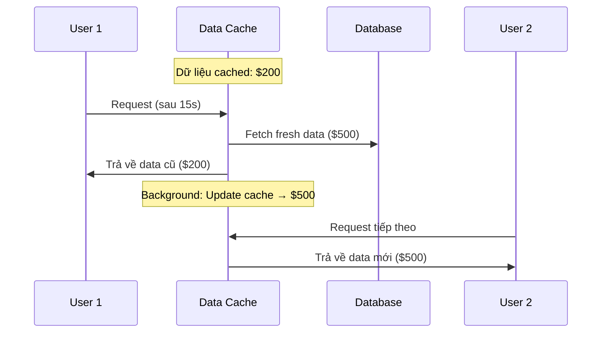

## Thực Hành Caching APIs và ISR trong Next.js

### Chuẩn Bị Môi Trường Production

**Sửa lỗi Image Optimization:**

Nếu gặp lỗi image optimization không tương thích với export option, hãy tắt export trong `next.config.js` và reload lại.

**Tại sao cần production mode:**

Caching không hoạt động như mong đợi trong development mode (cơ bản là bị tắt hoàn toàn). Do đó, cần mô phỏng môi trường production để test caching.

**Tạo script production:**

```json
// package.json
{
  "scripts": {
    "prod": "next build && next start"
  }
}
```

Script này kết hợp hai bước:

- `next build`: Build ứng dụng
- `next start`: Khởi động production server

**Chạy production mode:**

```bash
npm run prod
```

**⚠️ Lưu ý:** Production mode không tự động reload khi code thay đổi. Mỗi lần thay đổi code, cần thoát process và chạy lại.

### Hiện Tượng Data Cache

**Kịch bản thử nghiệm:**

- Trang `/cabins` được render tĩnh (static) - ký hiệu bằng dấu tròn trong build output
- Thay đổi giá cabin từ 250 → 350 trong Supabase
- Reload trang nhiều lần → giá vẫn là 250

**Nguyên nhân:**

Đây không phải do browser cache, mà do Data Cache và Full Route Cache. Trang đã được tạo tĩnh với dữ liệu tại thời điểm build, và dữ liệu này được "đóng băng" cho đến khi được revalidate.

**Phù hợp cho:** Blog, marketing pages, nội dung thực sự tĩnh.

**Không phù hợp cho:** Ứng dụng data-intensive với dữ liệu thay đổi thường xuyên.

### Opt-out Data Cache - Force Dynamic Rendering

**Cách 1: Revalidate = 0 (Được khuyến nghị)**

```javascript
// app/cabins/page.js
export const revalidate = 0; // Luôn revalidate = tắt cache
```

**Cách 2: Force Dynamic**

```javascript
export const dynamic = 'force-dynamic';
```

**⚠️ Quan trọng:** Giá trị `revalidate` phải là hằng số, không thể tính toán:

```javascript
// ❌ Sai
const time = 5 * 12;
export const revalidate = time;

// ✓ Đúng
export const revalidate = 60;
```

**Kết quả:**

Sau khi chạy `npm run prod`, trang `/cabins` hiện được render động (dynamically). Mỗi lần thay đổi dữ liệu trong Supabase, trang sẽ phản ánh ngay lập tức khi reload.

**Nhược điểm:** Mỗi request đều phải query database → không tối ưu nếu dữ liệu ít thay đổi.

### Incremental Static Regeneration (ISR)

ISR là giải pháp trung gian giữa static và dynamic rendering, tự động refetch dữ liệu và tái tạo trang tĩnh sau một khoảng thời gian nhất định.

**Khi nào cần ISR:**

- Dữ liệu thay đổi theo chu kỳ (ví dụ: giá cabin thay đổi mỗi ngày)
- Không cần cập nhật real-time cho mọi request
- Muốn tận dụng lợi ích của static rendering (CDN, tốc độ)

**Cách triển khai:**

```javascript
// app/cabins/page.js
export const revalidate = 3600; // 1 giờ = 60 * 60 giây
```

**Ví dụ thực tế:**

Giả sử giá cabin thay đổi mỗi ngày:

- Có thể refetch mỗi giờ (3600 giây) để đảm bảo dữ liệu tương đối mới
- Có thể refetch mỗi phút (60 giây) nếu muốn chính xác hơn
- Trang overview có thể refetch ít hơn, trang chi tiết refetch nhiều hơn

**Demo với 15 giây:**

```javascript
export const revalidate = 15; // Chỉ để test
```

**Cách hoạt động:**



**Điểm quan trọng:**

- User đầu tiên sau khi hết thời gian revalidate sẽ trigger việc regenerate
- User đầu tiên vẫn nhận dữ liệu cũ
- User tiếp theo nhận dữ liệu mới
- Trong thời gian chờ revalidate, tất cả traffic được phục vụ từ cache (không query DB)

**Lợi ích:**

- Giảm tải database
- Tăng tốc độ phản hồi
- Tận dụng CDN/edge caching
- Phù hợp với dữ liệu thay đổi theo chu kỳ


### Revalidation ở Component Level

**Khi nào cần:**

Khi chỉ một phần component cần opt-out cache, không phải toàn bộ route.

**Sử dụng `noStore()` function:**

```javascript
// components/CabinList.js
import { unstable_noStore as noStore } from 'next/cache';

export default async function CabinList() {
  noStore(); // Opt-out caching cho component này
  
  const cabins = await getCabins();
  
  return (
    // JSX
  );
}
```

**Hiện tại vs Tương lai:**

**Hiện tại (không có PPR):**

- Gọi `noStore()` trong một component → toàn bộ route trở thành dynamic
- Giống như setting `revalidate = 0` ở route level

**Tương lai (với Partial Pre-rendering):**

- Chỉ component được bọc trong `<Suspense>` trở thành dynamic hole
- Phần còn lại của trang vẫn là static shell
- Component này được render động và stream vào sau

**Ví dụ với PPR:**

```javascript
// app/cabins/page.js
export default function Page() {
  return (
    <div>
      <Header /> {/* Static */}
      <Suspense fallback={<Spinner />}>
        <CabinList /> {/* Dynamic - có noStore() */}
      </Suspense>
      <Footer /> {/* Static */}
    </div>
  );
}
```

Với setup này và PPR:

- Header và Footer: static shell
- CabinList: dynamic hole, render động và stream vào


### On-Demand Revalidation

**Hai function chính:**

```javascript
import { revalidatePath, revalidateTag } from 'next/cache';

// Revalidate theo path
revalidatePath('/cabins');

// Revalidate theo tag
revalidateTag('cabins-data');
```

**Khi nào sử dụng:**

Các function này chỉ có ý nghĩa trong Server Actions (sẽ học sau). Cho phép revalidate cache thủ công khi có sự kiện cụ thể (ví dụ: user submit form, admin cập nhật data).

### Script Production Hoàn Chỉnh

```json
{
  "scripts": {
    "dev": "next dev",
    "build": "next build",
    "start": "next start",
    "prod": "next build && next start"
  }
}
```


### Kiểm Tra Route Static/Dynamic

Sau khi chạy `next build`, output sẽ hiển thị:

```
Route (app)                    Size     First Load JS
┌ ○ /                         142 B          87.2 kB
├ ○ /about                    142 B          87.2 kB
├ ● /cabins                   142 B          87.2 kB
```

**Ký hiệu:**

- `○` (tròn): Static route (prerendered)
- `●` (tròn đen): Dynamic route
- `λ` (lambda): Server-rendered on demand


### Ghi Chú Quan Trọng

**Caching là chủ đề khó nhất trong Next.js:**

- Caching và static/dynamic rendering liên kết chặt chẽ
- Cần thời gian thực hành và xây dựng nhiều ứng dụng để nắm vững
- Thử nghiệm với nhiều scenario khác nhau
- Tham khảo lại lecture lý thuyết và rewatch khi cần

**Best practices:**

- Ưu tiên sử dụng static rendering với ISR cho hầu hết các trang
- Chỉ force dynamic khi thực sự cần dữ liệu real-time
- Chọn thời gian revalidate phù hợp với tần suất thay đổi dữ liệu
- Chuẩn bị sẵn cho Partial Pre-rendering bằng cách tổ chức component hợp lý

**Debugging tips:**

- Luôn test trong production mode khi kiểm tra caching behavior
- Kiểm tra build output để xác nhận route static/dynamic
- Thay đổi dữ liệu trong database để verify caching hoạt động đúng
- Sử dụng Network tab trong DevTools để xem request patterns

**Tương lai với PPR:**

Tư duy về cách tổ chức component sẵn sàng cho PPR:

- Các phần tĩnh tách riêng
- Các phần động bọc trong Suspense
- Sử dụng `noStore()` cho component cần data fresh

***

**Liên kết:** [[Next.js]], [[Caching]], [[ISR]], [[Static Rendering]], [[Dynamic Rendering]], [[Partial Pre-rendering]], [[Data Cache]], [[Full Route Cache]], [[Revalidation]], [[Server Actions]], [[Suspense]], [[Production Build]]

