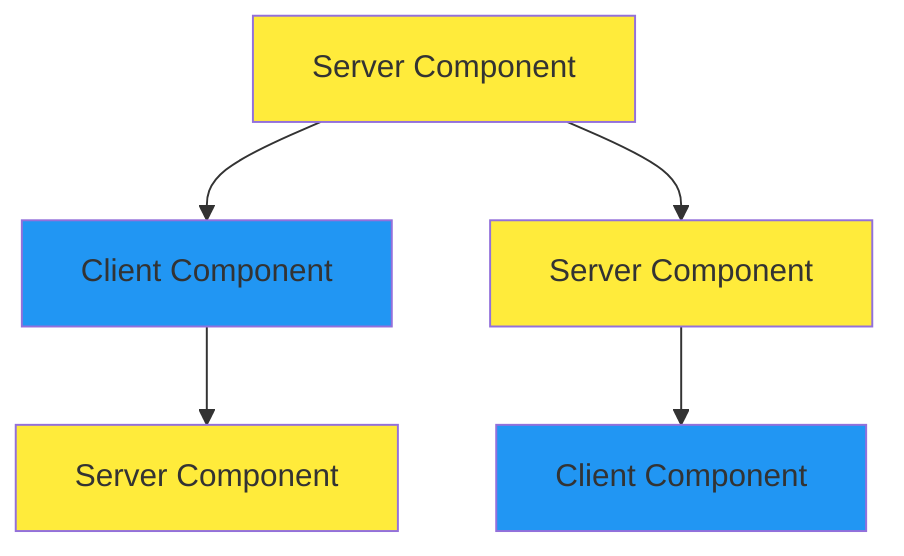
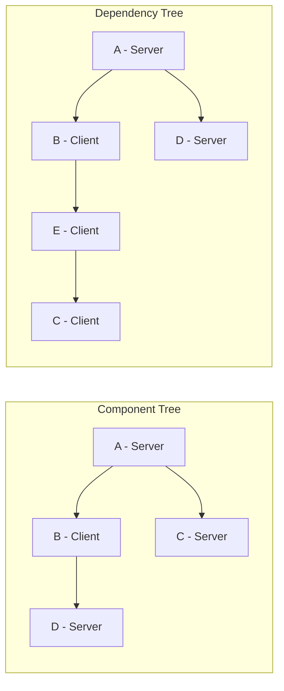

## Kiến trúc React Server Components: Ranh giới giữa Server và Client

### Giới thiệu

Phần này khám phá cách các thành phần server và client trong kiến trúc [[React Server Components]] (RSC) tương tác với nhau, và cách kiến trúc mới này làm mờ ranh giới giữa khái niệm truyền thống về server và client.

### Mô hình truyền thống vs Mô hình RSC

#### Mô hình truyền thống

Trong mô hình truyền thống, có sự tách biệt rõ ràng:

- **Back-end (Server)**: Chạy API Node.js, xử lý logic phía server
- **Front-end (Client)**: Chạy ứng dụng React trên trình duyệt của người dùng
- Hai phần thường có codebase riêng biệt và có thể được host trên các nền tảng khác nhau
- Giao tiếp thông qua API: front-end thực hiện GET request để lấy dữ liệu JSON, và POST/PUT/DELETE request để thay đổi dữ liệu


#### Mô hình RSC trong NextJS

Trong mô hình RSC, ranh giới giữa front-end và back-end trở nên linh hoạt và động:

- [[Server Components]] (màu vàng) và [[Client Components]] (màu xanh) được phân bố xen kẽ trong cây component (component tree)
- Không có sự tách biệt rõ ràng giữa front-end và back-end
- Code server và client được "đan xen" (knitting) với nhau trong cùng một cây component
- Có thể chuyển đổi linh hoạt giữa server và client tại bất kỳ điểm nào trong cây



**Giải thích sơ đồ**: Sơ đồ minh họa cách Server Components (màu vàng) và Client Components (màu xanh) được đan xen trong cây component. Lưu ý component D là Server Component nhưng lại được render bên trong Client Component B.

### Ưu điểm của kiến trúc RSC

#### Không cần API trung gian

Trong nhiều trường hợp, không còn cần xây dựng API để làm cầu nối giữa back-end và front-end:

- **Fetch dữ liệu**: Lấy dữ liệu trực tiếp từ database trong Server Component, sau đó render hoặc truyền xuống Client Component qua props
- **Mutate dữ liệu**: Sử dụng [[Server Actions]] để thay đổi dữ liệu trên server trực tiếp từ Client Component, thay thế các POST/PUT/DELETE request truyền thống


#### Tương tự như Component Model của React

Giống như React đã phá vỡ sự tách biệt giữa HTML, CSS và JavaScript bằng component model, RSC làm mờ ranh giới giữa server và client để tạo ra ứng dụng full-stack trong một codebase duy nhất.

### Component Tree vs Dependency Tree

#### Component Tree (Cây Component)

- Thể hiện quan hệ cha-con giữa các component khi render
- Đường kẻ nối nghĩa là component cha đang render component con
- Ví dụ: Component A render component B và D


#### Dependency Tree (Cây phụ thuộc)

- Thể hiện các module import lẫn nhau
- Đường kẻ nối nghĩa là module cha đang import module con
- **Quan trọng**: Ranh giới client-server được thiết lập tại dependency tree, không phải component tree



**Giải thích sơ đồ**: Component Tree cho thấy cách các component được render, trong khi Dependency Tree cho thấy cách các module được import. Lưu ý component D được import bởi A nhưng lại render bên trong B.

### Quy tắc Import và Render

#### Quy tắc cơ bản

- **Client Components không thể import Server Components**: Không thể vượt qua ranh giới client-server để import từ phía server
- **Client Components chỉ có thể import Client Components khác**
- **Server Components có thể import và render tất cả các loại component**


#### Render Server Component trong Client Component

Có thể render Server Component bên trong Client Component bằng cách **truyền Server Component như một prop** (thường là `children` prop):

**Ví dụ minh họa**:

```jsx
// Component A - Server Component
import B from './B' // Client Component
import D from './D' // Server Component

export default function A() {
  return (
    <B>
      <D />  // Truyền D như children prop
    </B>
  )
}
```

**Cơ chế hoạt động**:

- Component A import cả B (Client) và D (Server)
- Server Component D được thực thi trên server trước
- Instance của D được tạo và truyền xuống Client Component B như prop
- Ranh giới client-server không bị vi phạm vì D đã được xử lý trên server trước khi chuyển sang client


### Component Instance: Server hoặc Client?

Một component có thể tạo ra cả server instance và client instance tùy thuộc vào ngữ cảnh sử dụng:

- **Component là blueprint (bản thiết kế)**: Định nghĩa component chỉ là khuôn mẫu
- **Instance được tạo khi sử dụng**: Mỗi lần sử dụng component sẽ tạo một instance
- **Loại instance phụ thuộc vào nơi import**:
    - Nếu component không có directive `use client` và được import bởi Server Component → tạo server instance
    - Nếu được import bởi Client Component → tạo client instance (vì component con của Client Component tự động trở thành Client Component)

**Ví dụ**: Component C trong cây có thể:

- Là server instance khi được import bởi Server Component E
- Là client instance khi được import bởi Client Component E (nếu E có `use client` directive)


### Ghi chú quan trọng

Việc hiểu rõ sự khác biệt giữa mô hình truyền thống và RSC là nền tảng để làm việc hiệu quả với NextJS. Mặc dù ban đầu có thể khó làm quen với việc "đan xen" server và client code, đây là hướng đi tương lai của việc xây dựng ứng dụng full-stack.

**Liên kết:** [[NextJS]], [[React Server Components]], [[Client Components]], [[Server Components]], [[Server Actions]], [[Component Tree]], [[Dependency Tree]], [[Use Client Directive]], [[Props]], [[Full-stack Architecture]]

