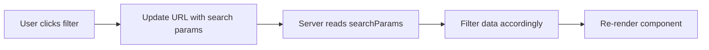

## Chia sẻ State giữa Client và Server trong Next.js

### Vấn đề cần giải quyết

Làm thế nào để chia sẻ state (trạng thái) giữa client và server? Chúng ta đã biết cách truyền dữ liệu từ server xuống client thông qua props, nhưng làm sao để truyền dữ liệu từ client ngược lên server?

Bài học này sẽ giải quyết câu hỏi trên bằng cách xây dựng một filter component (component lọc dữ liệu) cho phép người dùng lọc cabin theo số lượng khách.

### Giải pháp: Sử dụng URL làm nơi lưu trữ State

Cách tốt nhất để chia sẻ state giữa client và server là **lưu trữ state trực tiếp trong URL**.

**Luồng hoạt động:**



**Ưu điểm:**

- Dễ dàng chia sẻ và bookmark (đánh dấu) trang
- URL có thể được chia sẻ với người khác
- Dữ liệu lọc được lưu trữ trong URL parameters


### Phần 1: Đọc dữ liệu từ URL trên Server

Trong page component, sử dụng prop `searchParams` để đọc dữ liệu từ URL:

```javascript
// app/cabins/page.js
export default function Page({ searchParams }) {
  // Đọc filter từ URL, mặc định là 'all'
  const filter = searchParams?.capacity ?? 'all';
  
  // Truyền filter xuống component con
  return <CabinList filter={filter} />;
}
```

**Lưu ý quan trọng:** Khi sử dụng `searchParams`, page sẽ chuyển từ static rendering (render tĩnh) sang dynamic rendering (render động). Điều này có nghĩa là page sẽ được tạo lại cho mỗi request, không còn được cache nữa.

### Phần 2: Xử lý Filter Logic trên Server Component

```javascript
// CabinList.js (Server Component)
export default async function CabinList({ filter }) {
  const cabins = await getCabins();
  
  let displayedCabins;
  
  if (filter === 'all') {
    displayedCabins = cabins;
  } else if (filter === 'small') {
    displayedCabins = cabins.filter(cabin => cabin.maxCapacity <= 3);
  } else if (filter === 'medium') {
    displayedCabins = cabins.filter(
      cabin => cabin.maxCapacity >= 4 && cabin.maxCapacity <= 7
    );
  } else if (filter === 'large') {
    displayedCabins = cabins.filter(cabin => cabin.maxCapacity >= 8);
  }
  
  return (
    <div>
      {displayedCabins.map(cabin => (
        <CabinCard key={cabin.id} cabin={cabin} />
      ))}
    </div>
  );
}
```


### Phần 3: Cập nhật URL từ Client Component

Tạo Filter component với directive `'use client'`:

```javascript
// Filter.js
'use client';

import { useRouter, useSearchParams, usePathname } from 'next/navigation';

export default function Filter() {
  const searchParams = useSearchParams();
  const router = useRouter();
  const pathname = usePathname();
  const activeFilter = searchParams.get('capacity') ?? 'all';
  
  function handleFilter(filter) {
    // 1. Tạo URL params mới
    const params = new URLSearchParams(searchParams);
    params.set('capacity', filter);
    
    // 2. Navigate đến URL mới
    router.replace(`${pathname}?${params.toString()}`, { scroll: false });
  }
  
  return (
    <div className="border border-primary-800 flex">
      <Button 
        filter="all" 
        handleFilter={handleFilter}
        activeFilter={activeFilter}
      >
        All cabins
      </Button>
      <Button 
        filter="small" 
        handleFilter={handleFilter}
        activeFilter={activeFilter}
      >
        1-3 guests
      </Button>
      <Button 
        filter="medium" 
        handleFilter={handleFilter}
        activeFilter={activeFilter}
      >
        4-7 guests
      </Button>
      <Button 
        filter="large" 
        handleFilter={handleFilter}
        activeFilter={activeFilter}
      >
        8-12 guests
      </Button>
    </div>
  );
}
```


### Các Custom Hooks quan trọng

**useSearchParams():**

- Đọc search parameters từ URL trên client
- Trả về object chứa các query parameters

**useRouter():**

- Cho phép navigation theo lập trình (programmatic navigation)
- Phương thức `replace()` để thay đổi URL mà không reload trang

**usePathname():**

- Lấy pathname hiện tại của URL
- Cần thiết để xây dựng URL đầy đủ


### URLSearchParams Web API

```javascript
const params = new URLSearchParams(searchParams);
params.set('capacity', 'small');     // Thêm/cập nhật parameter
params.delete('capacity');            // Xóa parameter
params.toString();                    // Chuyển thành string
```

Đây là Web API chuẩn, không phải của Next.js, giúp thao tác dễ dàng với URL query parameters.

### Xử lý Loading State với Suspense

Khi filter thay đổi, cần hiển thị loading spinner. Sử dụng `key` prop trong Suspense:

```javascript
<Suspense key={filter} fallback={<Spinner />}>
  <CabinList filter={filter} />
</Suspense>
```

**Tại sao cần key prop?**

- Mặc định, Next.js wrap tất cả navigation trong React transitions
- Trong transition, Suspense không hiển thị lại fallback cho content đã render
- Thêm unique `key` buộc Suspense render lại fallback khi key thay đổi


### Component Button với Conditional Styling

```javascript
function Button({ filter, handleFilter, activeFilter, children }) {
  return (
    <button
      onClick={() => handleFilter(filter)}
      className={`px-5 py-2 hover:bg-primary-700 ${
        filter === activeFilter 
          ? 'bg-primary-700 text-primary-50' 
          : ''
      }`}
    >
      {children}
    </button>
  );
}
```


### Cơ chế Re-rendering trong Next.js

**Điều quan trọng cần hiểu:**

1. Khi URL thay đổi → Xảy ra navigation
2. Navigation → Server component re-render
3. Server component re-render → Toàn bộ component tree con cũng re-render
4. CabinList re-render → Fetch lại dữ liệu
5. Dữ liệu mới → Hiển thị kết quả đã filter

Đây là lý do tại sao chúng ta thấy loading spinner mỗi khi click filter.

### Recipe Pattern - Công thức luôn áp dụng

Đây là pattern chuẩn để chia sẻ state qua URL:

```javascript
// Client Component
const searchParams = useSearchParams();
const router = useRouter();
const pathname = usePathname();

function updateURL(key, value) {
  const params = new URLSearchParams(searchParams);
  params.set(key, value);
  router.replace(`${pathname}?${params.toString()}`, { scroll: false });
}

// Server Component (Page)
export default function Page({ searchParams }) {
  const value = searchParams?.key ?? 'default';
  return <ChildComponent value={value} />;
}
```


### Các điểm cần ghi nhớ

- `searchParams` chỉ có sẵn trong page component, không có trong server component thông thường
- Sử dụng URL parameters làm cho page trở thành dynamic, không còn static
- Import hooks từ `next/navigation`, không phải `next/router`
- Prop `scroll: false` ngăn page scroll về đầu khi navigation
- Thêm unique key vào Suspense để hiển thị loading state đúng cách

**Liên kết:** [[Next.js]], [[Server Components]], [[Client Components]], [[URL Parameters]], [[Suspense]], [[Dynamic Rendering]], [[useRouter]], [[useSearchParams]], [[URLSearchParams]]

