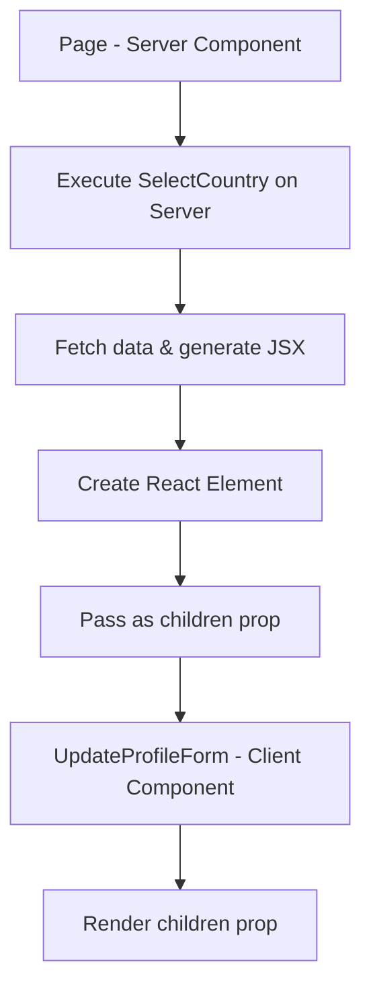
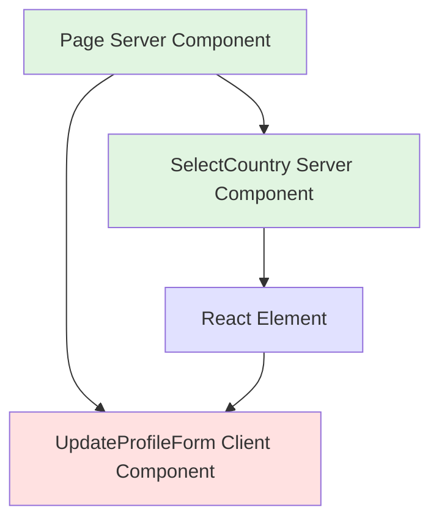
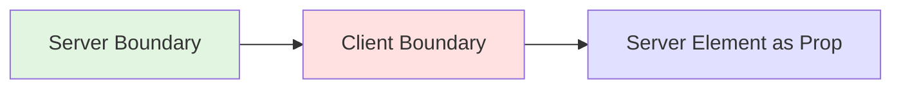

## Render Server Components trong Client Components

### Vấn đề đặt ra

Chúng ta đã quen với việc render Client Components bên trong Server Components, nhưng có thể làm ngược lại không? Câu trả lời là **có**, nhưng cách thực hiện phức tạp và phản trực quan hơn nhiều.

**Kịch bản thực tế:**

- Có một form cần state (phải là Client Component)
- Form chứa SelectCountry component fetch dữ liệu từ API (phải là Server Component)
- Làm sao để kết hợp cả hai?


### Vấn đề khi Import trực tiếp

**Code bị lỗi:**

```javascript
// UpdateProfileForm.js
'use client';

import { useState } from 'react';
import SelectCountry from './SelectCountry'; // ❌ Lỗi!

export default function UpdateProfileForm() {
  const [count, setCount] = useState(0);
  
  return (
    <form>
      <SelectCountry />
    </form>
  );
}
```

**Server Component:**

```javascript
// SelectCountry.js
export default async function SelectCountry() {
  const countries = await getCountries(); // Fetch từ API
  
  return (
    <select>
      {countries.map(country => (
        <option key={country.name} value={country.name}>
          {country.flag} {country.name}
        </option>
      ))}
    </select>
  );
}
```

**Tại sao lỗi?**

- Client Component cố gắng import Server Component
- Code fetch data chạy trên client thay vì server
- Environment variables không khả dụng trên browser
- Async/await không hoạt động đúng trong client context


### Giải pháp: Composition Pattern với Props

Cách duy nhất để render Server Component trong Client Component là **truyền nó như một prop** (thường là `children`).

**Luồng hoạt động:**




### Cách thực hiện đúng

**Bước 1: Client Component nhận children**

```javascript
// UpdateProfileForm.js
'use client';

import { useState } from 'react';

export default function UpdateProfileForm({ children }) {
  const [count, setCount] = useState(0);
  
  return (
    <form>
      <h2>Update Your Profile</h2>
      {children}
      <button type="submit">Update</button>
    </form>
  );
}
```

**Bước 2: Server Component (Page) kết hợp**

```javascript
// app/account/profile/page.js
import UpdateProfileForm from '@/components/UpdateProfileForm';
import SelectCountry from '@/components/SelectCountry';

export default function Page() {
  return (
    <div>
      <h1>Profile Settings</h1>
      
      <UpdateProfileForm>
        <SelectCountry />
      </UpdateProfileForm>
    </div>
  );
}
```


### Tại sao cách này hoạt động?

**Thứ tự thực thi:**

1. **Server Component (Page) chạy trước** → Import và execute `SelectCountry`
2. **SelectCountry fetch data** → Tạo React element hoàn chỉnh
3. **React element được truyền** → Như một prop vào `UpdateProfileForm`
4. **Client Component nhận React element** → Không cần thực thi lại, chỉ render
5. **Hydration xảy ra** → Client Component có interactivity, Server Component giữ nguyên

**Sơ đồ component tree:**




### So sánh hai cách render

**Server trong Client (Composition):**

```javascript
// ✅ Đúng - Server Component truyền qua prop
<ClientComponent>
  <ServerComponent />
</ClientComponent>
```

**Client trong Server (Import trực tiếp):**

```javascript
// ✅ Đúng - Import và render trực tiếp
import ClientComponent from './ClientComponent';

<ServerComponent>
  <ClientComponent />
</ServerComponent>
```


### Ví dụ thực tế khác

**Trường hợp: Modal với dynamic content**

```javascript
// Modal.js - Client Component
'use client';

import { useState } from 'react';

export default function Modal({ trigger, content }) {
  const [isOpen, setIsOpen] = useState(false);
  
  return (
    <>
      <button onClick={() => setIsOpen(true)}>
        {trigger}
      </button>
      
      {isOpen && (
        <div className="modal">
          {content}
          <button onClick={() => setIsOpen(false)}>Close</button>
        </div>
      )}
    </>
  );
}
```

**Sử dụng với Server Component:**

```javascript
// Page.js - Server Component
import Modal from './Modal';
import UserData from './UserData'; // Server Component fetch user data

export default async function Page() {
  return (
    <Modal 
      trigger={<span>View Details</span>}
      content={<UserData userId={123} />}
    />
  );
}
```


### Kiểm tra Component Tree

Khi inspect component tree trong React DevTools:

- **Client Components** → Hiển thị trong tree
- **Server Components được truyền qua props** → Không hiển thị (đã là React elements)

```javascript
// Trong DevTools, bạn sẽ thấy:
UpdateProfileForm
  └─ children: Symbol(react.element) // SelectCountry không xuất hiện
```


### Các lưu ý quan trọng

**Khi nào dùng pattern này:**

- Form cần state nhưng chứa components fetch data
- Modal/Dialog với dynamic server-rendered content
- Layout components với interactivity chứa static content
- Tabs/Accordion với server-fetched data

**Hạn chế:**

- Không thể pass props trực tiếp từ Client Component vào Server Component
- Server Component không thể re-render dựa trên client state
- Phức tạp hơn để debug và maintain

**Best practices:**

- Ưu tiên render Client Components trong Server Components (cách thông thường)
- Chỉ dùng composition pattern khi thực sự cần thiết
- Document rõ ràng lý do sử dụng pattern này
- Tránh nest quá nhiều layers


### Server Client Boundary



**Quy tắc vàng:**

- Server Component có thể import và render Client Component
- Client Component **không thể import** Server Component
- Client Component **có thể nhận** Server Component qua props


### Key Takeaways

- Composition pattern là cách duy nhất để render Server Component trong Client Component
- Server Component được execute trước, tạo React element, rồi pass vào Client Component
- Pattern này ít gặp nhưng rất hữu ích trong một số trường hợp đặc biệt
- Hiểu rõ pattern này giúp bạn trở thành Next.js developer giỏi hơn
- Luôn ưu tiên cách thông thường (Client trong Server) trừ khi có lý do chính đáng

**Liên kết:** [[Next.js]], [[Server Components]], [[Client Components]], [[Composition Pattern]], [[Component Boundary]], [[React Props]], [[Server-Client Architecture]], [[Component Tree]]

