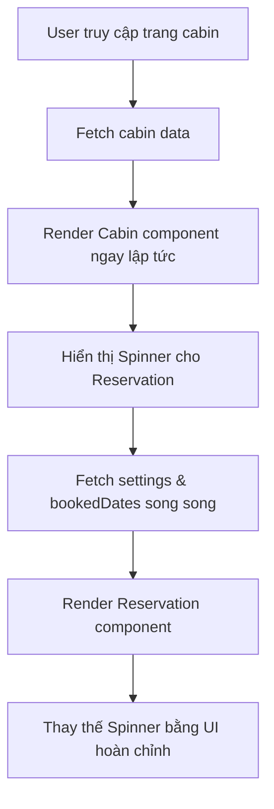

## Chiến Lược Fetch Dữ Liệu Trong NextJS - Phần Reservation

### Giới Thiệu Bài Học

Bài học này tập trung vào việc triển khai tính năng đặt phòng (reservation section) trên trang chi tiết cabin. Điểm quan trọng là cách fetch nhiều loại dữ liệu khác nhau và lựa chọn chiến lược phù hợp để tối ưu trải nghiệm người dùng.

### Thiết Lập Component Cơ Bản

#### Cấu Trúc Component

Bài học sử dụng hai component chính cho phần đặt phòng:

- `DateSelector`: Component chọn ngày đặt phòng (calendar picker)
- `ReservationForm`: Form nhập thông tin đặt phòng (số khách, chi tiết khác)


#### Cài Đặt Dependencies

Component `DateSelector` yêu cầu package bên ngoài:

```bash
npm install react-day-picker
```

Lưu ý: `DateSelector` phải là [[Client Component]] vì sử dụng `createContext` của React:

```jsx
'use client'
// Component code...
```


#### Styling với Tailwind CSS

```jsx
<div className="grid grid-cols-2 border border-primary-800 min-h-[400px] mb-10">
  <DateSelector />
  <ReservationForm />
</div>
```


### Phân Tích Yêu Cầu Dữ Liệu

#### Dữ Liệu Cần Thiết Cho DateSelector

- **Settings** (cài đặt): Độ dài booking tối thiểu và tối đa từ Supabase
- **Booked dates** (ngày đã đặt): Danh sách ngày đã được đặt trước của cabin
- **Cabin info** (thông tin cabin): Giá phòng để hiển thị


#### Dữ Liệu Cần Thiết Cho ReservationForm

- **Cabin info**: Sức chứa tối đa (`maxCapacity`) để giới hạn số khách


### Chiến Lược 1: Fetch Tuần Tự (Sequential Fetching)

#### Vấn Đề: Blocking Waterfall

Khi fetch dữ liệu tuần tự trong một [[Server Component]]:

```jsx
const cabin = await getCabin(params.cabinId)
const settings = await getSettings()
const bookedDates = await getBookedDatesByCabinId(params.cabinId)
```

**Vấn đề phát sinh:**

- Mỗi request chờ request trước hoàn thành
- Nếu mỗi request mất 2 giây → tổng thời gian: 6 giây
- Tạo ra [[blocking waterfall]] - các request không phụ thuộc nhau nhưng vẫn block lẫn nhau


### Chiến Lược 2: Fetch Song Song Với Promise.all

#### Cải Thiện Hiệu Suất

Sử dụng `Promise.all()` để fetch dữ liệu song song:

```jsx
const [cabin, settings, bookedDates] = await Promise.all([
  getCabin(params.cabinId),
  getSettings(),
  getBookedDatesByCabinId(params.cabinId)
])
```

**Ưu điểm:**

- Các request chạy đồng thời
- Thời gian tổng = thời gian của request chậm nhất
- Giảm từ 6 giây xuống còn 2 giây (nếu request chậm nhất là 2 giây)

**Hạn chế:**

- Vẫn block toàn bộ UI cho đến khi tất cả request hoàn thành
- Nếu một request mất 5 giây → toàn bộ trang phải chờ 5 giây


### Chiến Lược 3: Component-Level Fetching với Streaming

#### Tạo Component Reservation Riêng Biệt

Tách dữ liệu reservation vào component riêng:

```jsx
// Reservation.js
async function Reservation({ cabin }) {
  const settings = await getSettings()
  const bookedDates = await getBookedDatesByCabinId(cabin.id)
  
  return (
    <div className="grid grid-cols-2 border border-primary-800 min-h-[400px]">
      <DateSelector 
        settings={settings}
        cabin={cabin}
        bookedDates={bookedDates}
      />
      <ReservationForm 
        cabin={cabin}
      />
    </div>
  )
}
```


#### Sử Dụng Suspense Cho Streaming

Trong page chính, wrap component với [[Suspense]]:

```jsx
// page.js
import { Suspense } from 'react'

export default async function Page({ params }) {
  const cabin = await getCabin(params.cabinId)
  
  return (
    <>
      <Cabin cabin={cabin} />
      
      <Suspense fallback={<Spinner />}>
        <Reservation cabin={cabin} />
      </Suspense>
    </>
  )
}
```

**Lợi ích của cách tiếp cận này:**

- UI không bị block hoàn toàn
- Phần thông tin cabin hiển thị ngay lập tức
- Phần reservation được [[streaming]] khi dữ liệu sẵn sàng
- Người dùng có thể đọc thông tin cabin trong khi chờ phần đặt phòng load


### Luồng Xử Lý Dữ Liệu



**Giải thích luồng:**

1. Người dùng truy cập trang, fetch dữ liệu cabin trước
2. Component `Cabin` được render ngay với thông tin có sẵn
3. Component `Reservation` trong trạng thái [[Suspense]], hiển thị spinner
4. Fetch dữ liệu settings và bookedDates song song (không block UI chính)
5. Khi dữ liệu đầy đủ, render component `Reservation` hoàn chỉnh
6. Thay thế spinner bằng giao diện đặt phòng thực tế

### Tối Ưu Hóa Component Structure

#### Tách Component Cabin

Để code sạch hơn, tách phần hiển thị cabin:

```jsx
// Cabin.js
export default function Cabin({ cabin }) {
  return (
    <div>
      <h2>{cabin.name}</h2>
      <Image src={cabin.image} alt={cabin.name} />
      {/* Các thông tin khác */}
    </div>
  )
}
```


#### Truyền Props Hợp Lý

**Nguyên tắc với Client Components:**

- Chỉ truyền dữ liệu cần thiết tối thiểu
- Nếu cần 3-4 thuộc tính → có thể truyền cả object
- Nếu chỉ cần 1-2 thuộc tính → nên truyền riêng lẻ

```jsx
// Ví dụ: Nếu chỉ cần capacity và price
<ReservationForm 
  capacity={cabin.maxCapacity}
  price={cabin.regularPrice}
/>

// Nhưng nếu cần nhiều thuộc tính → truyền cả object
<ReservationForm cabin={cabin} />
```


### Request Memoization

#### Khi Nào Cần Fetch Ở Nhiều Nơi?

Trong trường hợp dữ liệu cabin cần ở:

- Page component (để hiển thị tiêu đề)
- Cabin component (hiển thị chi tiết)
- Reservation component (giá, sức chứa)

**Hai cách xử lý:**

1. **Fetch một lần và truyền props** (được sử dụng trong bài):
    - Phù hợp khi component tree không sâu
    - Đơn giản, dễ theo dõi luồng dữ liệu
2. **Fetch ở nhiều nơi với [[Request Memoization]]**:
    - NextJS tự động de-duplicate các request giống nhau
    - Phù hợp với component tree sâu nhiều cấp

### Destructuring Props Trong Component

#### DateSelector Component

```jsx
export default function DateSelector({ settings, cabin, bookedDates }) {
  const { minBookingLength, maxBookingLength } = settings
  const { regularPrice, discount } = cabin
  
  // Sử dụng các giá trị này trong component
}
```


#### ReservationForm Component

```jsx
export default function ReservationForm({ cabin }) {
  const { maxCapacity } = cabin
  
  return (
    <select>
      {Array.from({ length: maxCapacity }, (_, i) => i + 1).map(x => (
        <option key={x}>{x} guests</option>
      ))}
    </select>
  )
}
```


### Ghi Chú Quan Trọng

- [[Server Components]] fetch dữ liệu trên server, không tăng bundle size
- [[Client Components]] nên nhận dữ liệu qua props thay vì fetch trực tiếp
- Sử dụng [[Suspense]] để tạo trải nghiệm loading chi tiết (granular)
- [[Promise.all]] cải thiện hiệu suất nhưng vẫn có thể block UI
- Component-level fetching + Suspense = trải nghiệm tốt nhất cho người dùng
- Luôn cân nhắc giữa độ phức tạp code và trải nghiệm người dùng


### Bước Tiếp Theo

Các tính năng cần hoàn thiện:

- Cấu hình DateSelector để chọn khoảng ngày
- Xử lý submit form đặt phòng
- Tích hợp authentication để lấy thông tin user
- Validate số lượng khách dựa trên maxCapacity

**Liên kết:** [[Server Components]], [[Client Components]], [[Suspense]], [[Streaming]], [[Promise.all]], [[Request Memoization]], [[React Context]], [[Blocking Waterfall]], [[NextJS]], [[Supabase]], [[Tailwind CSS]]

