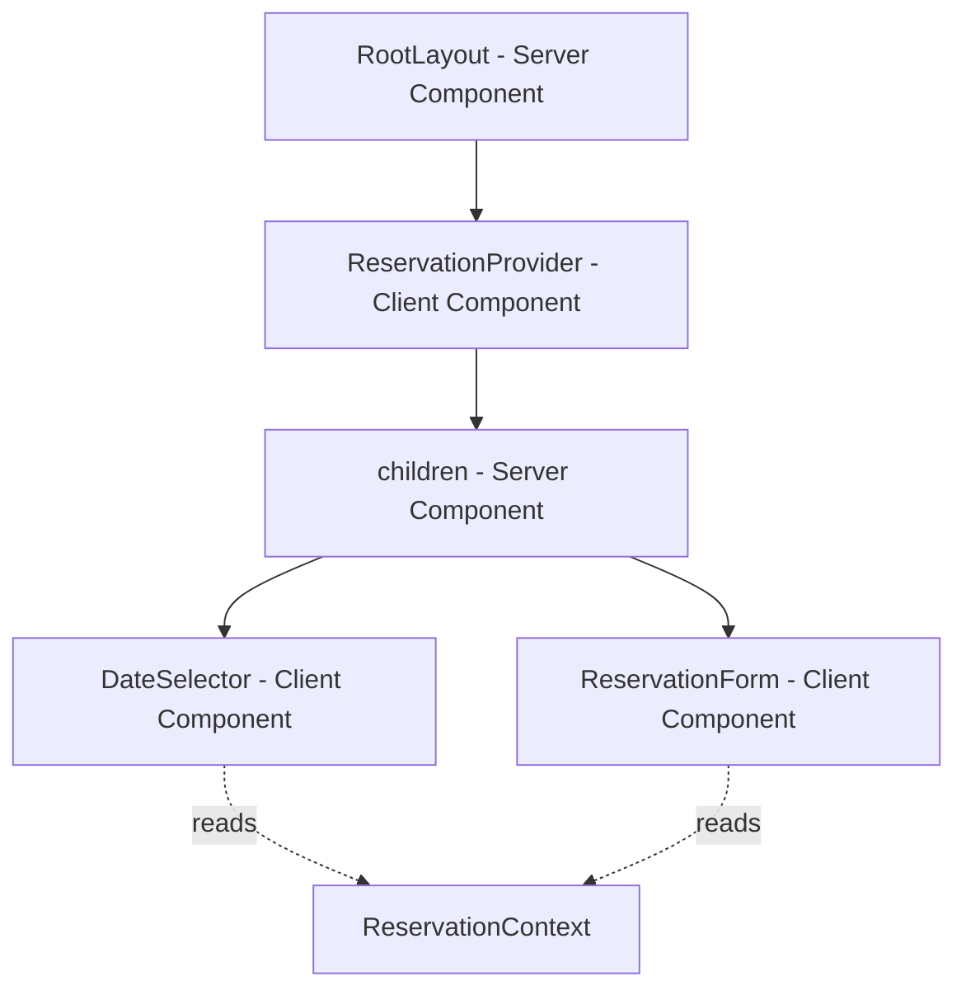
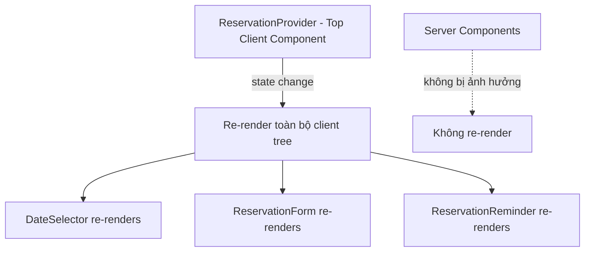

## Sử Dụng React Context API Trong NextJS

### Cấu Hình Date Picker Component

Bài học bắt đầu với việc làm cho component date picker hoạt động được. Component này sử dụng chế độ range (phạm vi) để người dùng có thể chọn ngày bắt đầu và ngày kết thúc.

#### Các Props Cơ Bản Của Day Picker

```jsx
<DayPicker
  mode="range"
  min={minBookingLength}
  max={maxBookingLength}
  fromMonth={new Date()}
  toMonth={addMonths(new Date(), 60)} // 5 năm
  numberOfMonths={2}
  onSelect={handleSelect}
  selected={range}
/>
```

**Các props quan trọng:**

- `mode="range"`: Cho phép chọn khoảng thời gian thay vì một ngày đơn lẻ
- `fromMonth`: Tháng đầu tiên có thể chọn (các tháng trước sẽ bị disabled)
- `numberOfMonths`: Số lượng tháng hiển thị cùng lúc
- `onSelect`: Callback function nhận range đã chọn
- `selected`: State hiện tại của range đã chọn


#### Quản Lý State Với useState

```jsx
const initialState = { from: undefined, to: undefined }
const [range, setRange] = useState(initialState)
```

Khi người dùng click vào ngày, callback `onSelect` nhận được object:

- Lần click đầu: `{ from: Date, to: undefined }`
- Lần click thứ hai: `{ from: Date, to: Date }`


### Vấn Đề: Chia Sẻ State Giữa Các Component

State `range` cần được sử dụng ở hai nơi:

- **DateSelector**: Hiển thị và cập nhật ngày đã chọn
- **ReservationForm**: Lấy thông tin ngày để tạo booking

Cả hai đều là [[Client Component]] (có directive `'use client'`).

### Ba Phương Án Chia Sẻ State

#### Phương Án 1: Lưu Vào URL

**Cách hoạt động:**

```jsx
// Mỗi lần chọn ngày → update URL
router.push(`?from=${from}&to=${to}`)
```

**Ưu điểm:**

- Trang có thể share được (shareable URL)
- State persist khi reload

**Nhược điểm (lý do không dùng):**

- Mỗi lần click → tạo navigation mới
- Navigation → re-render [[Server Component]]
- Re-render server component → re-fetch toàn bộ dữ liệu
- Tạo delay không cần thiết cho tương tác đơn giản


#### Phương Án 2: Lift State Up

**Cách hoạt động:**

- Tạo parent component chứa cả DateSelector và ReservationForm
- Đặt state ở parent
- Truyền xuống qua props

**Đánh giá:**

- Cách làm truyền thống, đơn giản
- Không có gì mới mẻ để học
- Không tận dụng được context API


#### Phương Án 3: React Context API (Được chọn)

**Lý do chọn:**

- Phù hợp cho việc share state giữa nhiều [[Client Component]]
- Tránh prop drilling
- State có thể được sử dụng ở nhiều nơi trong app
- Học cách tích hợp Context vào NextJS

**Lưu ý quan trọng:** Context API chỉ hoạt động với client components. Để share state giữa client và server components, phải dùng URL.

### Triển Khai ReservationContext

#### Tạo Context File

```jsx
// ReservationContext.js
'use client'

import { createContext, useContext, useState } from 'react'

const ReservationContext = createContext()

const initialState = { from: undefined, to: undefined }

function ReservationProvider({ children }) {
  const [range, setRange] = useState(initialState)
  
  const resetRange = () => setRange(initialState)
  
  return (
    <ReservationContext.Provider 
      value={{ range, setRange, resetRange }}
    >
      {children}
    </ReservationContext.Provider>
  )
}

function useReservation() {
  const context = useContext(ReservationContext)
  if (context === undefined) {
    throw new Error('Context was used outside provider')
  }
  return context
}

export { ReservationProvider, useReservation }
```

**Cấu trúc tiêu chuẩn:**

- Tạo context với `createContext()`
- Provider component giữ state
- Custom hook để consume context (với error handling)
- Export cả Provider và custom hook


#### Đặt Provider Trong Root Layout

```jsx
// app/layout.js (Server Component)
import { ReservationProvider } from '@/components/ReservationContext'

export default function RootLayout({ children }) {
  return (
    <html>
      <body>
        <Header />
        <main>
          <ReservationProvider>
            {children}
          </ReservationProvider>
        </main>
      </body>
    </html>
  )
}
```

**Vị trí đặt Provider:**

- Đặt càng sâu càng tốt để tránh re-render không cần thiết
- Trong trường hợp này: đặt trong `<main>` vì Header không cần state
- Bao bọc `children` (server component) vào client component (Provider)


### Nguyên Lý Hoạt Động: Server + Client Components

#### Pattern Quan Trọng



**Giải thích luồng:**

1. `RootLayout` là server component không thể dùng hooks
2. `ReservationProvider` là client component, tạo context
3. `children` (page component) đã được render sẵn ở server
4. Khi pass vào Provider, không làm children trở thành client component
5. Client components bên trong children mới consume được context

**Tại sao cách này hoạt động:**

- `children` prop đã được render thành React elements trên server
- Provider nhận kết quả đã render, không render lại children
- Tương tự pattern với SelectCountry component đã học trước đó

**Điều KHÔNG thể làm:**

```jsx
// ❌ SAI - Không thể dùng context trực tiếp trong Server Component
export default function RootLayout({ children }) {
  // Lỗi! Server component không thể dùng createContext, useContext
  const ReservationContext = createContext()
  
  return (
    <ReservationContext.Provider value={...}>
      {children}
    </ReservationContext.Provider>
  )
}
```


### Sử Dụng Context Trong Components

#### DateSelector Component

```jsx
'use client'

import { useReservation } from './ReservationContext'

export default function DateSelector({ settings, cabin, bookedDates }) {
  const { range, setRange, resetRange } = useReservation()
  
  return (
    <DayPicker
      selected={range}
      onSelect={setRange}
      // ... other props
    />
  )
}
```

**Lợi ích:**

- Không cần prop drilling từ parent
- Component tự lấy state từ context
- Cập nhật state tự động sync với các component khác


#### ReservationForm Component

```jsx
'use client'

import { useReservation } from './ReservationContext'

export default function ReservationForm({ cabin }) {
  const { range } = useReservation()
  
  // Hiển thị ngày đã chọn
  return (
    <div>
      <p>From: {range.from?.toString()}</p>
      <p>To: {range.to?.toString()}</p>
    </div>
  )
}
```


### Tính Năng ReservationReminder

#### Component Nhắc Nhở Đặt Phòng

```jsx
'use client'

import { useReservation } from './ReservationContext'

export default function ReservationReminder() {
  const { range, resetRange } = useReservation()
  
  if (!range.from || !range.to) return null
  
  return (
    <div>
      <p>Don't forget to reserve your dates!</p>
      <p>{range.from.toString()} - {range.to.toString()}</p>
      <button onClick={resetRange}>Clear</button>
    </div>
  )
}
```

**Cách hoạt động:**

- Hiển thị khi người dùng đã chọn ngày nhưng chưa submit form
- Xuất hiện trên trang danh sách cabins
- Nhắc nhở người dùng quay lại hoàn tất booking
- Click Clear → reset state → component biến mất


#### Thêm Vào Cabin List Page

```jsx
// app/cabins/page.js
import ReservationReminder from '@/components/ReservationReminder'

export default function Page() {
  return (
    <div>
      <Suspense fallback={<Spinner />}>
        <ReservationReminder />
      </Suspense>
      <CabinList />
    </div>
  )
}
```


### Persistence Của Context State

#### State Không Bị Reset Khi Navigate

**Kịch bản:**

1. Người dùng vào Cabin \#1, chọn ngày 15-20 Dec
2. Quay lại danh sách cabins
3. Vào Cabin \#2
4. Ngày 15-20 Dec vẫn được chọn sẵn

**Lý do:**

- `ReservationProvider` nằm ở root level
- State tồn tại suốt thời gian sử dụng app
- Chỉ reset khi:
    - User refresh page
    - Gọi `resetRange()`
    - Đóng tab/browser


### Re-rendering Behavior

#### Client Component Tree



**Khi state thay đổi:**

- Toàn bộ client component tree re-render
- Server components KHÔNG re-render
- Giống như React truyền thống (trước khi có RSC)

**Ví dụ:**

- Click "Clear" button → `resetRange()` được gọi
- Provider state update → tất cả client components re-render
- ReservationReminder return `null` → component biến mất
- DateSelector reset về trạng thái ban đầu


### So Sánh: Context vs URL State

| Tiêu chí | Context API | URL State |
| :-- | :-- | :-- |
| **Sử dụng cho** | Client ↔ Client | Client ↔ Server |
| **Shareable** | ❌ Không | ✅ Có |
| **Persistence** | ❌ Mất khi reload | ✅ Giữ khi reload |
| **Navigation** | ✅ Không trigger | ❌ Trigger re-fetch |
| **Performance** | ✅ Nhanh | ⚠️ Có thể chậm |
| **Use case** | UI state tạm thời | Filter, search, phân trang |

### Best Practices

#### Khi Nào Dùng Context API

- Share state giữa nhiều client components
- State chỉ cần trong session hiện tại
- Tương tác UI không cần shareable URL
- Muốn tránh prop drilling


#### Khi Nào Dùng URL State

- Cần shareable/bookmarkable links
- State cần persist qua page reload
- Share state giữa server và client components
- Filter, search, pagination features


#### Đặt Provider Ở Đâu

- Nguyên tắc: Đặt càng sâu càng tốt
- Tránh wrap toàn bộ app nếu không cần
- Cân nhắc scope thực sự của state
- Trong ví dụ: Wrap `children` trong `<main>` thay vì toàn bộ layout


### Ghi Chú Quan Trọng

- [[Context API]] chỉ hoạt động với [[Client Component]] trong NextJS
- Provider phải là client component (`'use client'`)
- Có thể pass server component vào client component qua children prop
- State trong context persist khi navigate giữa các trang
- Re-render client tree không ảnh hưởng đến server components
- Custom hook nên có error handling khi dùng ngoài provider
- Reset function hữu ích để clear state từ bất kỳ đâu

**Liên kết:** [[React Context API]], [[Client Component]], [[Server Component]], [[useState]], [[useContext]], [[Custom Hook]], [[Provider Pattern]], [[Prop Drilling]], [[NextJS]], [[Date Picker]], [[State Management]], [[Re-rendering]]

