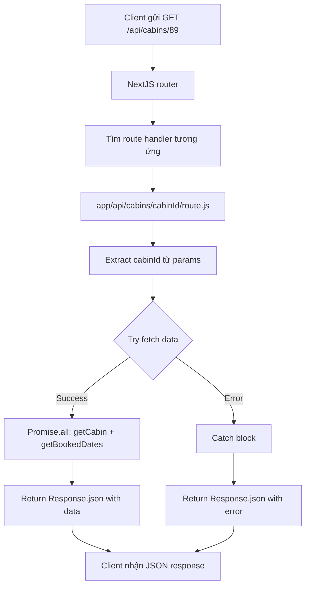

## Route Handlers - Tạo API Endpoints Trong NextJS

### Giới Thiệu Route Handlers

[[Route Handlers]] là tính năng cho phép tạo các [[API endpoint]] tùy chỉnh trực tiếp trong NextJS. Đây là cách để xử lý các HTTP requests và trả về JSON data thay vì HTML.

#### Vai Trò Trong App Router

Trong [[Pages Router]] (phiên bản cũ), API endpoints là cách chính để mutate data. Tuy nhiên, với [[App Router]] hiện tại:

- **Cách chính để mutate data:** [[Server Actions]]
- **Route Handlers:** Vẫn hữu ích cho các trường hợp đặc biệt
- Không còn là phương thức chính nhưng vẫn đáng học

**Use cases cho Route Handlers:**

- Tạo API cho third-party integrations
- Webhooks từ external services
- Expose dữ liệu cho affiliates/partners
- Custom API không cần full server actions


### Tạo Route Handler Cơ Bản

#### Convention File: route.js

Route handler được tạo bằng file `route.js` - một convention file đặc biệt:

```
app/
  api/
    route.js  ← Route handler
```

**Quy tắc quan trọng:** Folder chứa `route.js` KHÔNG được có `page.js` cùng lúc.

**Lý do:**

- `page.js` → trả về HTML
- `route.js` → trả về JSON
- Không thể trả về cả hai cùng lúc từ một URL


#### Cấu Trúc GET Route Handler

```js
// app/api/route.js
export async function GET(request) {
  return Response.json({ test: "test" })
}
```

**Truy cập:** Vào `http://localhost:3000/api` sẽ nhận được JSON response.

### HTTP Verbs Được Hỗ Trợ

Route handlers có thể export nhiều functions tương ứng với các [[HTTP methods]]:

```js
export async function GET(request) {
  // Handle GET request
}

export async function POST(request) {
  // Handle POST request
}

export async function PUT(request) {
  // Handle PUT request
}

export async function PATCH(request) {
  // Handle PATCH request
}

export async function DELETE(request) {
  // Handle DELETE request
}

export async function HEAD(request) {
  // Handle HEAD request
}

export async function OPTIONS(request) {
  // Handle OPTIONS request
}
```

**Lưu ý:** Tên function PHẢI đúng với HTTP verb (viết hoa), không thể đặt tên tùy ý.

### Web Standards: Request và Response

#### Response API

Route handlers sử dụng [[Web Standards]] thay vì API riêng của NextJS:

```js
export async function GET() {
  return Response.json({ 
    message: "Hello World",
    timestamp: new Date().toISOString()
  })
}
```

**Đặc điểm:**

- `Response` là Web API chuẩn (không phải NextJS-specific)
- Có thể tìm hiểu thêm trên [[MDN Web Docs]]
- NextJS cung cấp extended version nhưng cơ bản vẫn dùng web standard


#### Request Object

```js
export async function GET(request) {
  // Truy cập headers
  const userAgent = request.headers.get('user-agent')
  
  // Truy cập URL
  const url = new URL(request.url)
  const searchParams = url.searchParams
  
  return Response.json({ userAgent })
}
```


### Dynamic Route Handlers

#### Tạo API Với Dynamic Segments

Ví dụ: API endpoint cho affiliates lấy thông tin cabin theo ID.

**Cấu trúc folder:**

```
app/
  api/
    cabins/
      [cabinId]/
        route.js
```

**URL examples:**

- `/api/cabins/89` → cabinId = "89"
- `/api/cabins/90` → cabinId = "90"


#### Truy Cập Params

```js
// app/api/cabins/[cabinId]/route.js
export async function GET(request, { params }) {
  const { cabinId } = params
  
  console.log('Request:', request)
  console.log('Cabin ID:', cabinId)
  
  return Response.json({ cabinId })
}
```

**Parameters:**

- **request**: HTTP request object (argument đầu tiên)
- **params**: Object chứa dynamic segments (argument thứ hai)


### Use Case Thực Tế: API Cho Affiliates

#### Mục Tiêu

Tạo API endpoint cung cấp thông tin cabin và ngày đã đặt cho partners/affiliates:

- Không expose Supabase API trực tiếp
- Aggregate data từ nhiều nguồn
- Giữ API keys an toàn
- Tạo abstraction dễ sử dụng cho bên thứ ba


#### Implementation Đầy Đủ

```js
// app/api/cabins/[cabinId]/route.js
import { getCabin } from '@/app/_lib/data-service'
import { getBookedDatesByCabinId } from '@/app/_lib/data-service'

export async function GET(request, { params }) {
  const { cabinId } = params
  
  try {
    // Fetch cả hai data sources song song
    const [cabin, bookedDates] = await Promise.all([
      getCabin(cabinId),
      getBookedDatesByCabinId(cabinId)
    ])
    
    // Trả về aggregated data
    return Response.json({ 
      cabin, 
      bookedDates 
    })
    
  } catch (error) {
    // Error handling
    return Response.json(
      { message: "Cabin not found" },
      { status: 404 }
    )
  }
}
```


### Error Handling Trong Route Handlers

#### Vấn Đề Với Error Boundaries

[[Error boundaries]] của NextJS (error.js) KHÔNG hoạt động cho route handlers vì:

- Error boundaries chỉ catch lỗi trong React component tree
- Route handlers không render React components
- Trả về JSON thay vì HTML


#### Giải Pháp: Try-Catch

```js
export async function GET(request, { params }) {
  try {
    // Logic xử lý
    const data = await fetchData(params.id)
    return Response.json(data)
    
  } catch (error) {
    // Manual error handling
    console.error('API Error:', error)
    
    return Response.json(
      { 
        error: error.message,
        message: "Something went wrong" 
      },
      { status: 500 }
    )
  }
}
```

**Best practices:**

- Luôn wrap logic trong try-catch
- Trả về appropriate HTTP status codes
- Cung cấp error messages hữu ích
- Log errors để debugging


### Response với Status Codes

#### Cú Pháp Response.json

```js
// Success (200 - default)
return Response.json({ data })

// Created (201)
return Response.json({ data }, { status: 201 })

// Bad Request (400)
return Response.json(
  { error: "Invalid input" },
  { status: 400 }
)

// Not Found (404)
return Response.json(
  { error: "Resource not found" },
  { status: 404 }
)

// Server Error (500)
return Response.json(
  { error: "Internal server error" },
  { status: 500 }
)
```


### Luồng Xử Lý Request



**Giải thích luồng:**

1. Client thực hiện GET request đến `/api/cabins/89`
2. NextJS router match với dynamic route `[cabinId]`
3. Route handler được execute với params chứa `cabinId: "89"`
4. Extract cabinId từ params object
5. Fetch dữ liệu song song với Promise.all
6. Nếu thành công: aggregate và return JSON với cabin + bookedDates
7. Nếu có lỗi: catch và return error response với status 404
8. Client nhận JSON response (data hoặc error)

### Testing Route Handler

#### Truy Cập Qua Browser

```
GET http://localhost:3000/api/cabins/90
```

**Response thành công:**

```json
{
  "cabin": {
    "id": 90,
    "name": "Cabin 001",
    "maxCapacity": 4,
    "regularPrice": 250
  },
  "bookedDates": [
    { "from": "2025-12-20", "to": "2025-12-25" },
    { "from": "2025-12-28", "to": "2025-12-31" }
  ]
}
```

**Response lỗi (ID không tồn tại):**

```json
{
  "message": "Cabin not found"
}
```


#### Testing Với Tools

Có thể test với:

- Postman
- Insomnia
- cURL command
- Browser DevTools
- Fetch API trong console

```bash
# cURL example
curl http://localhost:3000/api/cabins/90
```


### So Sánh: Route Handlers vs Server Actions

| Đặc điểm | Route Handlers | Server Actions |
| :-- | :-- | :-- |
| **Mục đích chính** | Custom API endpoints | Form submissions, mutations |
| **Return type** | JSON response | Redirect hoặc revalidate |
| **Error handling** | Manual try-catch | Error boundaries work |
| **Use case** | Third-party integrations | Internal app mutations |
| **File convention** | route.js | Server component functions |
| **Popularity hiện nay** | Ít dùng hơn | Preferred method |

### Advanced Features

#### Custom Headers

```js
export async function GET() {
  return Response.json(
    { data: "..." },
    {
      status: 200,
      headers: {
        'Content-Type': 'application/json',
        'Cache-Control': 'public, s-maxage=60',
        'X-Custom-Header': 'value'
      }
    }
  )
}
```


#### Reading Request Body

```js
export async function POST(request) {
  const body = await request.json()
  
  // Validate and process body
  if (!body.name) {
    return Response.json(
      { error: "Name is required" },
      { status: 400 }
    )
  }
  
  // Create resource
  const result = await createResource(body)
  
  return Response.json(result, { status: 201 })
}
```


#### CORS Headers

```js
export async function GET() {
  return Response.json(
    { data: "..." },
    {
      headers: {
        'Access-Control-Allow-Origin': '*',
        'Access-Control-Allow-Methods': 'GET, POST, OPTIONS',
        'Access-Control-Allow-Headers': 'Content-Type'
      }
    }
  )
}
```


### Best Practices

#### Đặt Tên Routes Hợp Lý

```
✅ Tốt:
/api/cabins
/api/cabins/[id]
/api/users/[userId]/bookings

❌ Tránh:
/api/data
/api/get-stuff
/api/route1
```


#### Versioning API

```
app/
  api/
    v1/
      cabins/
        route.js
    v2/
      cabins/
        route.js
```


#### Validation và Security

```js
export async function GET(request, { params }) {
  // Validate ID format
  const id = parseInt(params.cabinId)
  if (isNaN(id) || id < 1) {
    return Response.json(
      { error: "Invalid cabin ID" },
      { status: 400 }
    )
  }
  
  // Check authentication nếu cần
  const authHeader = request.headers.get('authorization')
  if (!authHeader) {
    return Response.json(
      { error: "Unauthorized" },
      { status: 401 }
    )
  }
  
  // Proceed with logic
}
```


### Ghi Chú Quan Trọng

- Route handlers KHÔNG thể coexist với page.js trong cùng folder
- Tên function PHẢI match với HTTP verb (GET, POST, PUT, DELETE, etc.)
- Sử dụng [[Web Standards]] (Request/Response API) thay vì NextJS-specific APIs
- Error boundaries không hoạt động - phải dùng try-catch manual
- Ít phổ biến hơn [[Server Actions]] trong App Router hiện đại
- Hữu ích cho third-party integrations, webhooks, custom APIs
- Có thể aggregate data từ nhiều sources và hide implementation details
- Dynamic segments hoạt động giống như dynamic routes cho pages

**Liên kết:** [[Route Handlers]], [[API Endpoint]], [[Server Actions]], [[HTTP Methods]], [[Web Standards]], [[Dynamic Segments]], [[Error Handling]], [[Response API]], [[Request API]], [[MDN Web Docs]], [[Promise.all]], [[Try-Catch]], [[Status Codes]], [[NextJS]], [[App Router]], [[Pages Router]]

