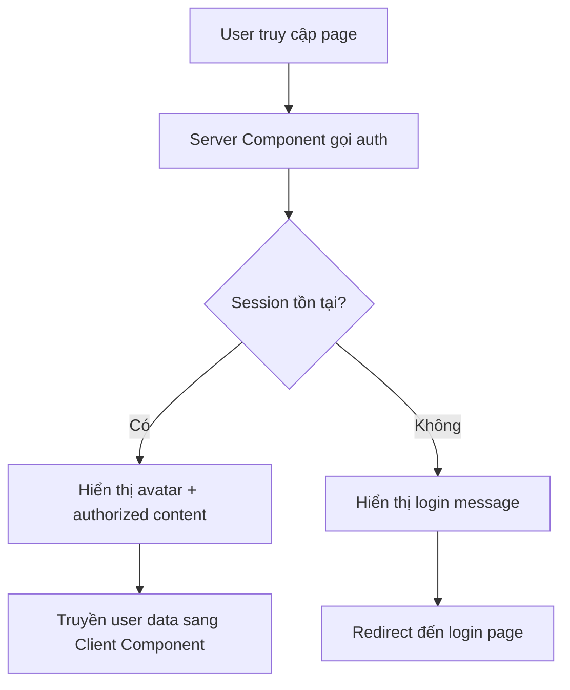

## Tùy chỉnh Website theo User đã đăng nhập

### Lấy thông tin Session trong Server Component

Sử dụng function `auth()` từ Auth.js để lấy thông tin người dùng hiện tại trong bất kỳ server component nào:

```javascript
import { auth } from "@/app/_lib/auth";

export default async function Navigation() {
  const session = await auth();
  console.log(session); // { user: { name, email, image } }
  
  // Component code...
}
```

**Dữ liệu session trả về:**

- `session.user.name`: Tên người dùng
- `session.user.email`: Email
- `session.user.image`: URL avatar từ Google


### Hiển thị Avatar người dùng

**Cập nhật Navigation component để hiển thị avatar:**

```javascript
export default async function Navigation() {
  const session = await auth();

  return (
    <nav>
      {/* Other nav items */}
      
      {session?.user?.image ? (
        <Link href="/account">
          <span className="flex items-center gap-4">
            
          </span>
        </Link>
      ) : (
        <Link href="/account">Guest area</Link>
      )}
    </nav>
  );
}
```

**Lưu ý quan trọng:**

- Sử dụng optional chaining (`?.`) để tránh lỗi khi `session` là null
- Thuộc tính `referrerPolicy="no-referrer"` cần thiết để hiển thị ảnh từ Google đúng cách
- Các class Tailwind: `h-8` (chiều cao), `rounded-full` (bo tròn thành hình tròn)

**Test đăng xuất:**

- Truy cập: `http://localhost:3000/api/auth/signout`
- Avatar sẽ biến mất, `session` trở thành `null`


### Render có điều kiện dựa trên trạng thái đăng nhập

**Tạo component LoginMessage (`LoginMessage.jsx`):**

```javascript
import Link from "next/link";

export default function LoginMessage() {
  return (
    <div>
      <p>
        Please <Link href="/login">log in</Link> to reserve this cabin right now.
      </p>
    </div>
  );
}
```

**Cập nhật Reservation component:**

```javascript
import { auth } from "@/app/_lib/auth";
import ReservationForm from "./ReservationForm";
import LoginMessage from "./LoginMessage";

export default async function Reservation({ cabin }) {
  const session = await auth();

  return (
    <div>
      {/* Calendar display */}
      
      {session?.user ? (
        <ReservationForm cabin={cabin} user={session.user} />
      ) : (
        <LoginMessage />
      )}
    </div>
  );
}
```

**Truyền user data qua server-client boundary:**

```javascript
// ReservationForm.jsx (Client Component)
"use client";

export default function ReservationForm({ cabin, user }) {
  return (
    <form>
      <div>
        
        <span>{user.name}</span>
      </div>
      {/* Form fields */}
    </form>
  );
}
```


### Dynamic Rendering với Auth

**Tác động quan trọng:**

Khi gọi `auth()` trong component, route đó sẽ tự động chuyển sang [[Dynamic Rendering]] vì:

- Auth.js đọc cookies và headers từ incoming request
- Cookies chỉ được biết tại runtime, không thể biết tại build time
- Next.js không thể statically render routes cần đọc cookies

**Ảnh hưởng toàn ứng dụng:**

Nếu gọi `auth()` trong Navigation (nằm trong Layout):

- Navigation xuất hiện trên mọi route
- **Toàn bộ website trở thành dynamic**
- Không còn route nào được static rendering

**Giải pháp nếu muốn giữ static rendering:**

- Tránh gọi `auth()` trong Layout hoặc shared components
- Chỉ gọi trong các route cụ thể cần authentication
- Cân nhắc trade-off giữa DX và performance


### Authentication vs Authorization

**[[Authentication]] (Xác thực):**

- Xác định người dùng là ai
- Đảm bảo người dùng đúng với danh tính họ tuyên bố
- Ví dụ: Đăng nhập bằng Google để xác minh identity

**[[Authorization]] (Phân quyền):**

- Kiểm soát quyền truy cập vào các phần của ứng dụng
- Chỉ cho phép người dùng có đặc quyền truy cập route/resource cụ thể
- Ví dụ: Chỉ cho phép user đã đăng nhập truy cập `/account`

**Vấn đề hiện tại:**

- Người dùng chưa đăng nhập vẫn có thể truy cập `/account` (guest area)
- Cần bảo vệ route này bằng authorization
- Giải pháp: Sử dụng [[Next.js Middleware]] (sẽ học ở bài tiếp theo)


### Checklist triển khai

- Gọi `auth()` trong server components để lấy session
- Sử dụng optional chaining (`?.`) khi truy cập session properties
- Render có điều kiện dựa trên `session?.user`
- Truyền user data từ server sang client components khi cần
- Thêm `referrerPolicy="no-referrer"` cho images từ OAuth providers
- Hiểu rõ tác động của dynamic rendering khi sử dụng auth
- Chuẩn bị triển khai middleware cho authorization


### Tóm tắt luồng xử lý



**Giải thích sơ đồ:**

1. Khi user truy cập trang, server component gọi `auth()` để kiểm tra session
2. Nếu session tồn tại (user đã đăng nhập), hiển thị avatar và nội dung được phép truy cập
3. User data được truyền từ server sang client component khi cần thiết
4. Nếu không có session, hiển thị message yêu cầu đăng nhập và chuyển hướng đến login page
5. Authorization middleware (bài tiếp theo) sẽ ngăn chặn truy cập trái phép vào protected routes

**Liên kết:** [[Auth.js]], [[Session]], [[Authentication]], [[Authorization]], [[Server Component]], [[Client Component]], [[Dynamic Rendering]], [[Cookies]], [[Middleware]], [[Protected Routes]], [[Optional Chaining]], [[Conditional Rendering]]

