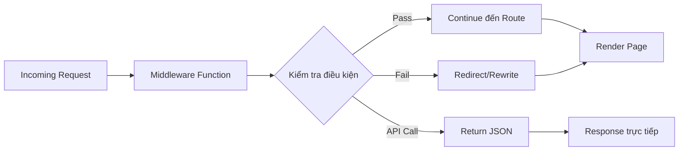

## Next.js Middleware

### Khái niệm

[[Middleware]] là một chương trình nằm giữa hai thứ khác. Trong Next.js, middleware là một function nằm giữa **incoming request** và **response**.

Middleware cho phép chạy code dựa trên incoming request **trước khi response được hoàn thành**.

### Cách hoạt động

**Vị trí trong luồng xử lý:**

Middleware chạy sau request nhưng trước khi route được render và gửi về client. Về cơ bản, middleware giống như một đoạn code được "paste" vào mọi route (mọi `page.js` component), nhưng thay vì lặp lại ở nhiều nơi, code này được đặt ở một vị trí trung tâm duy nhất.

**Quy tắc thực thi:**

- Mặc định, middleware chạy trước **mọi route** trong Next.js app
- Có thể sử dụng [[Matcher]] để chỉ định routes cụ thể cho middleware
- Giữ components sạch sẽ bằng cách tập trung logic chung ở một nơi


### Cấu trúc file

**Vị trí file:**

- Tên file: `middleware.js` (hoặc `middleware.ts` với TypeScript)
- Đặt ở **root folder** của project (không phải trong `app` folder)
- Chỉ được có **duy nhất một** middleware function

**Cấu trúc cơ bản:**

```javascript
// middleware.js (ở root folder)
export function middleware(request) {
  // Logic xử lý
}

// Tùy chọn: Chỉ định routes cụ thể
export const config = {
  matcher: ['/account/:path*', '/reservations/:path*']
};
```


### Chức năng chính

Middleware có khả năng:

- Đọc incoming cookies và headers
- Set cookies và headers trên response
- Redirect hoặc rewrite requests
- Bypass routes và trả về response trực tiếp


### Các use cases phổ biến

- **[[Authentication]] và [[Authorization]]**: Kiểm tra trạng thái đăng nhập, bảo vệ routes
- **Server-side analytics**: Thu thập dữ liệu truy cập
- **[[Geolocation]] redirects**: Chuyển hướng dựa trên vị trí địa lý (internationalization)
- **A/B testing**: Phân phối traffic cho các biến thể khác nhau
- **Request logging**: Ghi log các requests
- **Rate limiting**: Giới hạn số lượng requests


### Hai cách tạo Response

Middleware phải luôn tạo ra một response, có thể bằng hai cách:

**Cách 1: Redirect/Rewrite đến route (Phổ biến)**

Middleware chạy trước khi route được render, sau đó:

- Redirect người dùng đến route khác
- Rewrite URL nội bộ
- Cho phép request tiếp tục đến route đích

```javascript
export function middleware(request) {
  // Kiểm tra authentication
  if (!isAuthenticated) {
    return NextResponse.redirect(new URL('/login', request.url));
  }
  
  // Cho phép request tiếp tục
  return NextResponse.next();
}
```

**Cách 2: Trả về JSON response trực tiếp**

Bypass route hoàn toàn, route không bao giờ được render:

- Gửi data dưới dạng JSON trực tiếp
- Vẫn có thể đọc/set cookies và headers
- Hữu ích khi chỉ cần trả về data như một API

```javascript
export function middleware(request) {
  return NextResponse.json(
    { message: 'Access denied' },
    { status: 403 }
  );
}
```

**Lưu ý:** Cách 2 ít được sử dụng vì Next.js đã có [[Route Handlers]] cho mục đích API.

### Luồng xử lý Middleware



**Giải thích sơ đồ:**

1. Request đến từ client
2. Middleware function được thực thi đầu tiên
3. Kiểm tra các điều kiện (authentication, authorization, etc.)
4. Nếu pass: Request tiếp tục đến route và page được render
5. Nếu fail: Redirect hoặc rewrite đến route khác
6. Hoặc trả về JSON response trực tiếp, bypass route hoàn toàn

### Ưu điểm của Middleware

- **Tập trung logic**: Không cần lặp lại code ở nhiều routes
- **Hiệu năng**: Chạy trước khi render, tránh xử lý không cần thiết
- **Bảo mật**: Kiểm tra authentication/authorization trước khi truy cập route
- **Linh hoạt**: Dễ dàng áp dụng cho nhiều routes bằng matcher
- **Maintainable**: Dễ bảo trì và cập nhật logic chung


### Lưu ý khi sử dụng

- Chỉ có một middleware function duy nhất cho toàn bộ app
- Middleware chạy trên Edge Runtime (giới hạn một số APIs)
- Không thể import modules sử dụng Node.js APIs
- Logic nên đơn giản và nhanh để tránh ảnh hưởng performance
- Sử dụng matcher để hạn chế chỉ chạy trên routes cần thiết

**Liên kết:** [[Middleware]], [[Authentication]], [[Authorization]], [[Request]], [[Response]], [[Cookies]], [[Headers]], [[Redirect]], [[Rewrite]], [[Route Handlers]], [[Matcher]], [[Edge Runtime]], [[Geolocation]], [[A/B Testing]]

