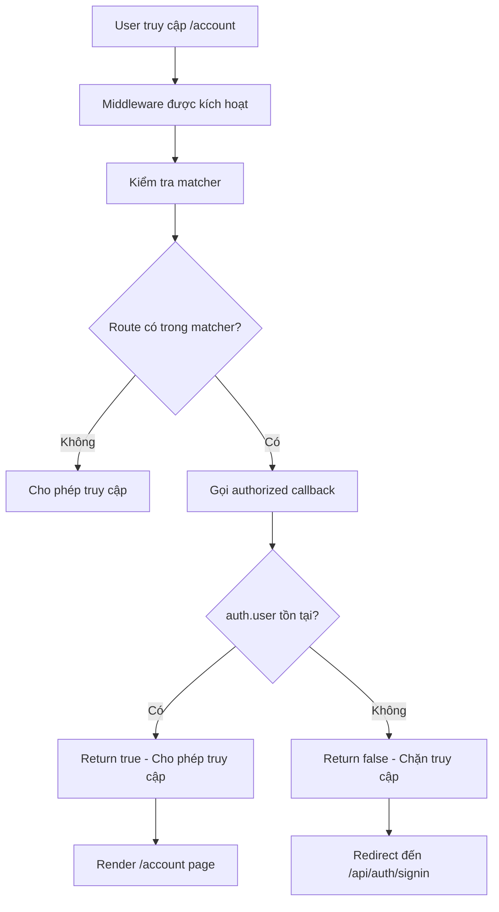

## Triển khai Authorization với Middleware

### Tạo file Middleware

**Vị trí file:**

- Tên file: `middleware.js`
- Đặt ở **root folder** (cùng cấp với `package.json`, `next.config.js`)
- **Không** đặt trong folder `app`

```javascript
// middleware.js (ở root folder)
export function middleware(request) {
  console.log(request); // In thông tin request
}
```

**Request object chứa:**

- Cookies
- Geolocation data
- URL, origin
- Headers và các thông tin request khác


### Thử nghiệm Redirect cơ bản

```javascript
import { NextResponse } from "next/server";

export function middleware(request) {
  return NextResponse.redirect(new URL('/about', request.url));
}
```

**Vấn đề:** Redirect vô hạn (infinite loop)

- Middleware mặc định chạy trên **mọi route**
- Khi ở `/account` → redirect đến `/about`
- Khi ở `/about` → lại redirect đến `/about`
- Tạo vòng lặp vô hạn


### Sử dụng Matcher để giới hạn Routes

**Cấu hình matcher:**

```javascript
export const config = {
  matcher: ['/account', '/cabins']
};
```

**Cách hoạt động:**

- Middleware chỉ chạy trên các routes được chỉ định
- Routes khác không bị ảnh hưởng
- Ngăn chặn redirect vô hạn

**Ví dụ với matcher:**

- Truy cập `/` hoặc `/about` → Không redirect
- Truy cập `/account` hoặc `/cabins` → Redirect đến `/about`


### Triển khai Authorization với Auth.js

**Bước 1: Import và export auth function**

```javascript
// middleware.js
import { auth } from "@/app/_lib/auth";

export const middleware = auth;

export const config = {
  matcher: ['/account']
};
```

**Lưu ý:**

- Function `auth` từ Auth.js có thể hoạt động như middleware
- Chỉ bảo vệ route `/account` bằng matcher
- Cách viết ngắn gọn và rõ ràng

**Bước 2: Cấu hình Authorized Callback**

Cập nhật file `app/_lib/auth.js`:

```javascript
import NextAuth from "next-auth";
import Google from "next-auth/providers/google";

const authConfig = {
  providers: [
    Google({
      clientId: process.env.AUTH_GOOGLE_ID,
      clientSecret: process.env.AUTH_GOOGLE_SECRET,
    }),
  ],
  callbacks: {
    authorized({ auth, request }) {
      // Trả về true nếu user đã đăng nhập
      // Trả về false nếu chưa đăng nhập
      return !!auth?.user;
    },
  },
};

export const {
  auth,
  handlers: { GET, POST },
} = NextAuth(authConfig);
```

**Giải thích authorized callback:**

- **Tham số:**
    - `auth`: Session hiện tại (chứa user data nếu đã đăng nhập)
    - `request`: Request object (có thể dùng để kiểm tra thêm)
- **Return value:**
    - `true`: User được phép truy cập route
    - `false`: User bị chặn, redirect đến sign-in page
- **Trick chuyển đổi Boolean:**
    - `!!auth?.user`: Chuyển đổi giá trị thành `true`/`false`
    - Nếu `auth.user` tồn tại → `true`
    - Nếu không tồn tại → `false`

**Cách viết tương đương:**

```javascript
authorized({ auth, request }) {
  if (auth?.user) {
    return true;
  } else {
    return false;
  }
}
```


### Luồng xử lý Authorization



**Giải thích sơ đồ:**

1. User cố gắng truy cập route `/account`
2. Middleware được kích hoạt và kiểm tra matcher
3. Nếu route nằm trong matcher, gọi `authorized` callback
4. Callback kiểm tra xem `auth.user` có tồn tại không
5. Nếu có user (đã đăng nhập), cho phép truy cập và render page
6. Nếu không có user (chưa đăng nhập), chặn truy cập và redirect đến sign-in page
7. Routes không trong matcher được phép truy cập trực tiếp

### Test Authorization

**Kịch bản 1: User chưa đăng nhập**

- Truy cập `/account`
- Tự động redirect đến `/api/auth/signin`
- Hiển thị "Sign in with Google" button

**Kịch bản 2: User đã đăng nhập**

- Truy cập `/account`
- `authorized` callback return `true`
- Được phép truy cập, hiển thị nội dung guest area
- Avatar và thông tin user xuất hiện

**Kịch bản 3: User đăng xuất**

- Truy cập `/api/auth/signout` để đăng xuất
- Thử truy cập `/account` lại
- Bị redirect về sign-in page


### Code hoàn chỉnh

**File `middleware.js`:**

```javascript
import { auth } from "@/app/_lib/auth";

export const middleware = auth;

export const config = {
  matcher: ['/account']
};
```

**File `app/_lib/auth.js`:**

```javascript
import NextAuth from "next-auth";
import Google from "next-auth/providers/google";

const authConfig = {
  providers: [
    Google({
      clientId: process.env.AUTH_GOOGLE_ID,
      clientSecret: process.env.AUTH_GOOGLE_SECRET,
    }),
  ],
  callbacks: {
    authorized({ auth, request }) {
      return !!auth?.user;
    },
  },
};

export const {
  auth,
  handlers: { GET, POST },
} = NextAuth(authConfig);
```


### Tùy chỉnh nâng cao

**Bảo vệ nhiều routes:**

```javascript
export const config = {
  matcher: ['/account/:path*', '/reservations/:path*']
};
```

- `/account/:path*`: Bảo vệ `/account` và tất cả sub-routes
- Ví dụ: `/account/profile`, `/account/reservations`

**Authorization phức tạp hơn:**

```javascript
callbacks: {
  authorized({ auth, request }) {
    const { pathname } = request.nextUrl;
    
    // Route yêu cầu đăng nhập
    if (pathname.startsWith('/account')) {
      return !!auth?.user;
    }
    
    // Route yêu cầu role admin
    if (pathname.startsWith('/admin')) {
      return auth?.user?.role === 'admin';
    }
    
    return true;
  }
}
```


### Bước tiếp theo

Trong các bài học tiếp theo sẽ tùy chỉnh:

- Custom sign-in page (không dùng default blue page)
- Custom sign-out button (không cần truy cập `/api/auth/signout` thủ công)
- Tích hợp UI với styling của ứng dụng


### Lưu ý quan trọng

- Middleware chỉ có **một file duy nhất** cho toàn bộ app
- Đặt file ở **root folder**, không phải `app` folder
- Sử dụng matcher để tối ưu performance (chỉ chạy khi cần)
- Callback `authorized` nên đơn giản và nhanh
- Có thể sử dụng `request` để kiểm tra thêm (URL, headers, cookies)
- Auth.js tự động xử lý redirect đến sign-in page khi return `false`

**Liên kết:** [[Middleware]], [[Authorization]], [[Auth.js]], [[NextResponse]], [[Matcher]], [[Callbacks]], [[Protected Routes]], [[Redirect]], [[Session]], [[Request Object]], [[Boolean Conversion]], [[Infinite Loop]]

