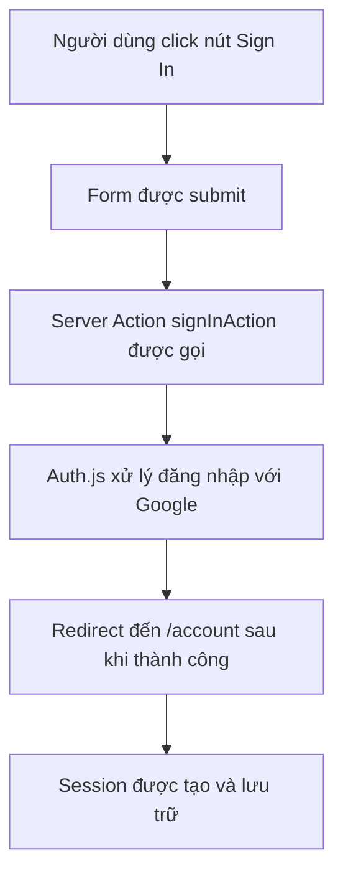

## Xây Dựng Trang Đăng Nhập Tùy Chỉnh (Custom Login Page)

Bài học này hướng dẫn cách thay thế trang đăng nhập mặc định của [[Auth.js]] bằng một trang đăng nhập tùy chỉnh và triển khai luồng xác thực hoàn toàn trên [[Server Side]].

### Tạo Route và Page cho Đăng Nhập

Đầu tiên, tạo một route mới cho trang đăng nhập:

- Tạo thư mục `/login` trong thư mục `app`
- Thêm file `page.js` vào thư mục này
- Đưa component `SignInButton` vào trang này

```jsx
// app/login/page.js
import SignInButton from '@/components/SignInButton';

export const metadata = {
  title: "Login"
};

export default function Page() {
  return (
    <div>
      <h2>Login to your account</h2>
      <SignInButton />
    </div>
  );
}
```


### Cấu Hình Auth.js Sử Dụng Trang Tùy Chỉnh

Để Auth.js sử dụng trang đăng nhập tùy chỉnh thay vì trang mặc định, thêm thuộc tính `pages` vào cấu hình:

```javascript
// auth.js
export const { handlers: { GET, POST }, auth, signIn, signOut } = NextAuth({
  providers: [
    Google({
      clientId: process.env.AUTH_GOOGLE_ID,
      clientSecret: process.env.AUTH_GOOGLE_SECRET,
    })
  ],
  pages: {
    signIn: '/login',  // Chỉ định route tùy chỉnh
  }
});
```

Lưu ý cần export thêm hai hàm `signIn` và `signOut` để sử dụng trong các [[Server Action]].

### Triển Khai Server Action cho Đăng Nhập

Do component là [[Server Component]], không thể sử dụng event handler như `onClick`. Thay vào đó, sử dụng [[Server Action]] thông qua form:

**Tạo file actions.js:**

```javascript
// app/_lib/actions.js
"use server";

import { signIn } from "@/auth";

export async function signInAction() {
  await signIn("google", { 
    redirectTo: "/account" 
  });
}
```

Giải thích các tham số:

- Tham số đầu tiên: Tên provider (`"google"`) - phải khớp với tên trong cấu hình Auth.js
- `redirectTo`: Đường dẫn chuyển hướng sau khi đăng nhập thành công


### Kết Nối Server Action với Form

Trong `SignInButton`, sử dụng form với `action` prop thay vì button với `onClick`:

```jsx
// components/SignInButton.js
import { signInAction } from '@/app/_lib/actions';

export default function SignInButton() {
  return (
    <form action={signInAction}>
      <button>Sign in with Google</button>
    </form>
  );
}
```


### Cơ Chế Hoạt Động



**Luồng xử lý:**

1. Khi người dùng click nút đăng nhập, form tự động submit
2. Server Action `signInAction` được kích hoạt (chỉ chạy trên server)
3. Hàm `signIn` từ Auth.js xử lý OAuth flow với Google
4. Sau khi xác thực thành công, redirect về trang `/account`
5. [[Session]] được tạo và người dùng đã đăng nhập

### Lợi Ích của Phương Pháp Này

- **Bảo mật cao hơn**: Toàn bộ logic xác thực chạy trên server, không lộ ra client
- **Trải nghiệm tốt hơn**: Không cần JavaScript phía client để xác thực
- **Progressive Enhancement**: Vẫn hoạt động ngay cả khi JavaScript bị tắt
- **SEO-friendly**: Giữ component là [[Server Component]]


### Ghi Chú Bổ Sung

**Sử dụng directive "use server"**: Đặt ở đầu file chứa [[Server Action]] để đảm bảo các hàm luôn chỉ chạy trên server và không bao giờ bị leak sang client.

**Lấy danh sách providers động**: Có thể truy cập `/api/auth/providers` để xem tất cả providers đã cấu hình, hữu ích khi có nhiều phương thức đăng nhập.

**Liên kết:** [[Auth.js]], [[Server Action]], [[Server Component]], [[OAuth]], [[Session]], [[NextAuth]], [[Google OAuth]], [[Server Side Authentication]]

	