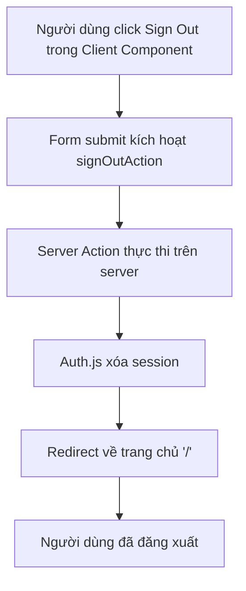

## Xây Dựng Nút Đăng Xuất Tùy Chỉnh (Custom Sign Out Button)

Bài học này hướng dẫn cách triển khai chức năng đăng xuất sử dụng [[Server Action]], bao gồm cả việc gọi server action từ [[Client Component]].

### Tạo Server Action cho Đăng Xuất

Tương tự như `signInAction`, tạo một server action mới trong file `actions.js`:

```javascript
// app/_lib/actions.js
"use server";

import { signIn, signOut } from "@/auth";

export async function signInAction() {
  await signIn("google", { 
    redirectTo: "/account" 
  });
}

export async function signOutAction() {
  await signOut({ 
    redirectTo: "/" 
  });
}
```

**Giải thích:**

- Hàm `signOut` từ [[Auth.js]] xử lý việc xóa session
- Thuộc tính `redirectTo: "/"` chuyển hướng người dùng về trang chủ sau khi đăng xuất thành công


### Kết Nối với Sign Out Button

Mặc dù `SignOutButton` nằm trong `SideNavigation` - một [[Client Component]], vẫn sử dụng form với action thay vì `onClick`:

```jsx
// components/SignOutButton.js (trong Client Component)
'use client';

import { signOutAction } from '@/app/_lib/actions';

export default function SignOutButton() {
  return (
    <form action={signOutAction}>
      <button>Sign out</button>
    </form>
  );
}
```


### Đặc Điểm Quan Trọng của Server Actions

**Server Actions có thể được gọi từ Client Components nhưng vẫn chỉ thực thi trên server.** Đây là một tính năng đặc biệt và quan trọng:

- Code của server action không bao giờ được gửi đến client
- Dữ liệu nhạy cảm và logic nghiệp vụ được bảo vệ
- Client chỉ cần gọi action thông qua form submission


### Luồng Hoạt Động



**Chi tiết luồng xử lý:**

1. Button nằm trong client component nhưng kết nối với server action qua form
2. Khi form submit, request được gửi đến server
3. Server action `signOutAction` được thực thi trên server
4. Auth.js xử lý việc xóa session và cookies
5. Người dùng được chuyển hướng về trang chủ
6. Trạng thái đăng nhập được cập nhật trên toàn bộ ứng dụng

### Kiểm Tra Chức Năng

Sau khi triển khai, kiểm tra các tình huống:

- Click nút Sign Out → Ảnh đại diện biến mất, quay về trang chủ
- Truy cập `/account` → Được redirect đến `/login`
- Truy cập các trang yêu cầu đăng nhập (như đặt phòng) → Hiển thị prompt yêu cầu đăng nhập


### Lợi Ích của Phương Pháp Này

- **Bảo mật tối ưu**: Logic đăng xuất hoàn toàn trên server, không thể bị can thiệp từ client
- **Tính nhất quán**: Session được xóa đúng cách ở cả client và server
- **Trải nghiệm tốt**: Người dùng được redirect tự động sau khi đăng xuất
- **Linh hoạt**: Server action có thể được gọi từ cả server và client components


### Ghi Chú Bổ Sung

**Server Actions và Client Components**: Một trong những điểm đặc biệt của [[Next.js]] là server actions có thể được import và sử dụng trong client components. Mặc dù component chạy trên client, action vẫn luôn thực thi trên server, đảm bảo tính bảo mật.

**Progressive Enhancement**: Phương pháp này hoạt động ngay cả khi JavaScript bị tắt trên browser, vì form submission là tính năng native của HTML.

**Liên kết:** [[Server Action]], [[Auth.js]], [[Client Component]], [[Session Management]], [[NextAuth]], [[Form Action]], [[Server Side]], [[Authentication Flow]]

