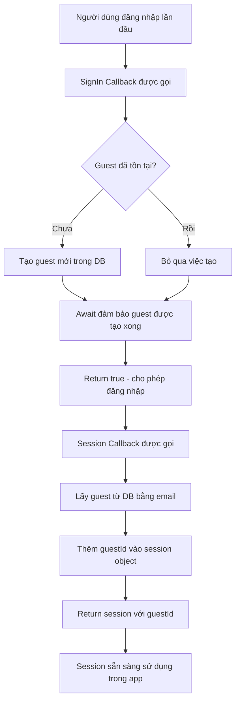

## Kết Nối Người Dùng với Guest Profile trong Database

Bài học này hướng dẫn cách liên kết người dùng đã đăng nhập thông qua [[Auth.js]] với hồ sơ khách (guest profile) trong [[Supabase]] database, sử dụng các callback của NextAuth.

### Vấn Đề Cần Giải Quyết

Hiện tại, người dùng có thể đăng nhập/đăng xuất thành công, nhưng thông tin của họ chưa được lưu trữ trong database. Điều này gây ra các vấn đề:

- Không thể xác định ai đã tạo một booking (đặt phòng)
- Không thể cho phép người dùng cập nhật thông tin cá nhân (National ID, quốc tịch...)
- Không thể liên kết các reservation với từng user cụ thể

**Giải pháp:** Sử dụng bảng `guests` trong Supabase để lưu trữ thông tin người dùng, với mỗi guest được xác định duy nhất bằng email.

### Cấu Trúc Bảng Guests

Bảng `guests` chứa các trường:

- `id`: Primary key
- `email`: Email người dùng (unique)
- `fullName`: Tên đầy đủ
- `nationalID`: Số chứng minh thư
- `nationality`: Quốc tịch
- `countryFlag`: Cờ quốc gia


### Triển Khai SignIn Callback

Callback `signIn` chạy trước khi quá trình đăng nhập hoàn tất, cho phép thực hiện các thao tác kiểm tra và tạo dữ liệu.

```javascript
// auth.js
import { getGuest, createGuest } from '@/app/_lib/data-service';

export const { handlers: { GET, POST }, auth, signIn, signOut } = NextAuth({
  providers: [
    Google({
      clientId: process.env.AUTH_GOOGLE_ID,
      clientSecret: process.env.AUTH_GOOGLE_SECRET,
    })
  ],
  callbacks: {
    authorized({ auth, request }) {
      return !!auth?.user;
    },
    
    async signIn({ user, account, profile }) {
      try {
        // Kiểm tra guest đã tồn tại chưa
        const existingGuest = await getGuest(user.email);
        
        // Nếu chưa có, tạo guest mới
        if (!existingGuest) {
          await createGuest({
            email: user.email,
            fullName: user.name,
          });
        }
        
        return true; // Cho phép đăng nhập
      } catch {
        return false; // Chặn đăng nhập nếu có lỗi
      }
    },
  },
  pages: {
    signIn: '/login',
  }
});
```

**Các hàm data service cần thiết:**

```javascript
// app/_lib/data-service.js
export async function getGuest(email) {
  const { data, error } = await supabase
    .from('guests')
    .select('*')
    .eq('email', email)
    .single();
  
  // Trả về null nếu không tìm thấy
  return data;
}

export async function createGuest(newGuest) {
  const { data, error } = await supabase
    .from('guests')
    .insert([newGuest])
    .select();
  
  if (error) throw new Error('Guest could not be created');
  return data;
}
```


### Giải Thích SignIn Callback

**Tham số nhận được:**

- `user`: Thông tin người dùng từ provider (Google)
- `account`: Thông tin tài khoản OAuth
- `profile`: Profile từ provider

**Luồng xử lý:**

1. Kiểm tra xem guest với email này đã tồn tại chưa
2. Nếu chưa có → Tạo guest mới trong database
3. Nếu đã có → Không làm gì cả
4. Trả về `true` để cho phép đăng nhập, `false` để chặn

**Lưu ý quan trọng:** Phải `await createGuest()` để đảm bảo guest được tạo xong trước khi chuyển sang callback tiếp theo.

### Triển Khai Session Callback

Callback `session` chạy sau `signIn` và mỗi khi session được kiểm tra (khi gọi hàm `auth()`). Đây là nơi lý tưởng để thêm `guestId` vào session.

```javascript
// auth.js
export const { handlers: { GET, POST }, auth, signIn, signOut } = NextAuth({
  providers: [...],
  callbacks: {
    authorized({ auth, request }) {
      return !!auth?.user;
    },
    
    async signIn({ user, account, profile }) {
      // ... code từ phần trên
    },
    
    async session({ session, user }) {
      // Lấy guest từ database
      const guest = await getGuest(session.user.email);
      
      // Thêm guestId vào session
      session.user.guestId = guest.id;
      
      // Phải return session
      return session;
    },
  },
  pages: {
    signIn: '/login',
  }
});
```

**Kết quả:** Sau khi thêm session callback, mỗi khi gọi `auth()`, object session sẽ chứa thêm `guestId`:

```javascript
// app/account/page.js
export default async function Page() {
  const session = await auth();
  console.log(session);
  // {
  //   user: {
  //     name: "John Doe",
  //     email: "john@example.com",
  //     image: "...",
  //     guestId: 544  // ← ID này giờ có sẵn
  //   }
  // }
}
```


### Luồng Hoạt Động Toàn Bộ



**Chi tiết từng bước:**

1. **SignIn Callback** (chạy trước khi đăng nhập hoàn tất):
    - Nhận thông tin user từ Google OAuth
    - Kiểm tra guest có tồn tại trong database không
    - Nếu chưa có → Tạo guest mới với email và fullName
    - **Quan trọng:** Phải `await createGuest()` để đợi hoàn thành
    - Return `true` để cho phép tiếp tục
2. **Session Callback** (chạy sau signIn và mỗi lần check session):
    - Nhận session object hiện tại
    - Query database để lấy guest theo email
    - Thêm `guestId` vào `session.user`
    - Return session đã được bổ sung

### Sử Dụng Guest ID trong Ứng Dụng

Sau khi setup xong, `guestId` có sẵn ở bất cứ đâu có session:

```javascript
// Ví dụ: Lấy reservations của guest hiện tại
export default async function ReservationsPage() {
  const session = await auth();
  const guestId = session.user.guestId;
  
  const bookings = await getBookings(guestId);
  // ...
}

// Ví dụ: Tạo booking mới
export async function createBooking(bookingData) {
  const session = await auth();
  
  const newBooking = {
    ...bookingData,
    guestId: session.user.guestId, // Liên kết với guest
  };
  
  // Insert vào database
}
```


### Các Trường Hợp Sử Dụng Guest ID

**Quản lý Reservations:**

- Lấy tất cả bookings của một guest cụ thể
- Tạo booking mới và gán cho guest đúng
- Cập nhật hoặc hủy booking

**Cập nhật Profile:**

- Cho phép guest cập nhật National ID
- Thay đổi nationality và country flag
- Lưu preferences cá nhân

**Liên kết dữ liệu:**

- Mối quan hệ giữa `bookings.guestId` và `guests.id`
- Đảm bảo data integrity trong database


### Các Lỗi Thường Gặp và Cách Khắc Phục

**Lỗi 1: Guest ID bị undefined**

```javascript
// ❌ SAI: Quên await createGuest
async signIn({ user }) {
  const existingGuest = await getGuest(user.email);
  if (!existingGuest) {
    createGuest({ email: user.email, fullName: user.name }); // Thiếu await
  }
  return true;
}

// ✅ ĐÚNG: Phải await
async signIn({ user }) {
  const existingGuest = await getGuest(user.email);
  if (!existingGuest) {
    await createGuest({ email: user.email, fullName: user.name }); // Có await
  }
  return true;
}
```

**Lý do:** Nếu không `await`, Auth.js sẽ chuyển ngay sang session callback trước khi guest được tạo xong, dẫn đến `guestId` bị `null`.

**Lỗi 2: Không return session**

```javascript
// ❌ SAI
async session({ session }) {
  const guest = await getGuest(session.user.email);
  session.user.guestId = guest.id;
  // Thiếu return
}

// ✅ ĐÚNG
async session({ session }) {
  const guest = await getGuest(session.user.email);
  session.user.guestId = guest.id;
  return session; // Bắt buộc phải return
}
```


### Tại Sao Cần Hai Callbacks Riêng Biệt?

**Không thể làm tất cả trong signIn callback** vì:

- Session chưa được tạo tại thời điểm signIn callback chạy
- Auth.js cần hoàn tất quá trình tạo session trước khi có thể modify nó
- Session callback là nơi chính thức để thêm custom fields vào session

**Không thể làm tất cả trong session callback** vì:

- Cần đảm bảo guest đã tồn tại trong database trước
- Việc tạo guest nên xảy ra một lần duy nhất khi đăng nhập lần đầu
- Session callback chạy nhiều lần (mỗi lần check session), không phù hợp để tạo records


### Ghi Chú Bổ Sung

**Error Handling:** Trong callback `signIn`, nếu có lỗi xảy ra (network issue, database error...), return `false` sẽ ngăn người dùng đăng nhập, bảo vệ tính toàn vẹn dữ liệu.

**Session vs User parameter:** Callback `session` nhận cả `session` và `user` parameters, nhưng thông tin user đã có sẵn trong `session.user`, nên thường chỉ cần dùng `session`.

**Kiểm tra kết quả:** Có thể log session để xác minh `guestId` đã được thêm thành công:

```javascript
const session = await auth();
console.log(session); // Kiểm tra guestId có trong session.user không
```

**Liên kết:** [[Auth.js]], [[NextAuth Callbacks]], [[Supabase]], [[Session Management]], [[Database Integration]], [[Guest Profile]], [[OAuth Flow]], [[Server Side Authentication]], [[Data Persistence]]

