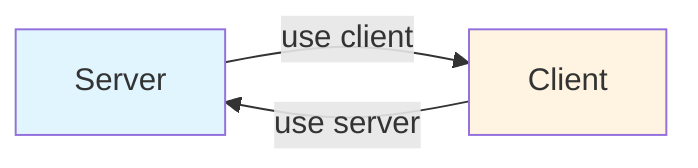

## Server Actions trong Next.js

### Khái niệm Server Actions

**Server Actions** là các hàm bất đồng bộ (asynchronous functions) chạy hoàn toàn trên server, được thiết kế để xử lý các thao tác thay đổi dữ liệu (data mutations) trong kiến trúc [[React Server Components]].

Server Actions là mảnh ghép còn thiếu để xây dựng ứng dụng Full-Stack tương tác với React:

- [[Server Components]] đảm nhiệm việc lấy dữ liệu (data fetching)
- [[Server Actions]] đảm nhiệm việc thay đổi dữ liệu (data mutations)


### Vai trò của Server Actions

Cho phép người dùng tương tác với dữ liệu thông qua các thao tác:

- Tạo dữ liệu mới (create)
- Cập nhật dữ liệu (update)
- Xóa dữ liệu (delete)

Các thao tác này được gọi chung là **Mutations** (thay đổi dữ liệu).

### Cách tạo Server Actions

#### Cách 1: Định nghĩa trong Server Component

Thêm directive `use server` vào đầu hàm trong một Server Component:

```javascript
// Trong Server Component
async function createReservation() {
  'use server'
  // Logic xử lý
}
```

Server Action này có thể:

- Được sử dụng trực tiếp trong Server Component
- Được truyền như prop sang Client Component (ngoại lệ cho quy tắc không truyền hàm)


#### Cách 2: Module riêng biệt (khuyến nghị)

Tạo file chuyên dụng với `use server` ở đầu file:

```javascript
// app/actions.js
'use server'

export async function createReservation() {
  // Logic xử lý
}

export async function updateProfile() {
  // Logic xử lý
}
```

Các hàm export từ file này tự động trở thành Server Actions và có thể import vào bất kỳ Server hoặc Client Component nào.

**Lợi ích:** Tập trung tất cả mutations ở một nơi, dễ quản lý và bảo trì.

### So sánh Use Server vs Use Client



**Use Client Directive:**

- Cầu nối từ server sang client
- Tương tự như thêm thẻ `<script>` trong HTML để load code từ server

**Use Server Directive:**

- Cầu nối từ client sang server
- Tương tự như API endpoint cho phép frontend gọi backend
- Chỉ dùng cho Server Actions, KHÔNG dùng cho Server Components

**Lưu ý quan trọng:** Server Components là mặc định và không cần directive nào. Đừng nhầm lẫn sử dụng `use server` cho Server Components.

### Cơ chế hoạt động

#### Behind the scenes

Next.js tự động tạo API endpoint cho mỗi Server Action:

- Mỗi Server Action nhận một URL riêng
- Chỉ URL được gửi đến client, không phải code hàm
- Code luôn ở trên server, an toàn cho các thao tác nhạy cảm


#### Quy trình thực thi

1. Người dùng thực hiện hành động (submit form, click button)
2. POST request được gửi đến endpoint tự động
3. Dữ liệu input được serialize và gửi kèm
4. Server Action xử lý request
5. Trả về response (nếu cần)

**Quan trọng:** Developer không cần tạo hoặc quản lý API endpoint thủ công - tất cả được abstract hóa bởi Next.js.

### Yêu cầu kỹ thuật

Server Actions cần **web server đang chạy** vì:

- Khác với Server Components có thể chạy tại build time
- Server Actions chạy runtime để xử lý tương tác của người dùng
- Không thể hoạt động trong static export


### Cách sử dụng Server Actions

#### Với HTML Forms

Sử dụng Server Action làm thuộc tính `action` của form:

```javascript
<form action={createReservation}>
  <input name="cabinId" />
  <button>Submit</button>
</form>
```

Hoạt động trong cả Server và Client Components:

- Form tự động thu thập dữ liệu
- Gửi dữ liệu đến Server Action qua API endpoint
- Không cần code frontend bổ sung


#### Trong Event Handlers và useEffect

Gọi như hàm thông thường trong Client Components:

```javascript
// Trong Client Component
import { updateProfile } from '@/actions'

function ProfileButton() {
  const handleClick = () => {
    updateProfile(data)
  }
  
  return <button onClick={handleClick}>Update</button>
}
```


### Nội dung xử lý trong Server Actions

#### Data Mutations

Mục đích chính:

- Tạo dữ liệu mới
- Cập nhật dữ liệu
- Xóa dữ liệu


#### Revalidation và Caching

Sau khi thay đổi dữ liệu, cần revalidate cache để UI cập nhật:

```javascript
'use server'

import { revalidatePath, revalidateTag } from 'next/cache'

export async function createReservation(data) {
  // Thao tác database
  await db.insert(data)
  
  // Revalidate cache
  revalidatePath('/reservations')
  // hoặc
  revalidateTag('reservations')
}
```

**Lý do:** Vì dữ liệu không được lưu dưới dạng state trên client, phải revalidate cache thủ công để UI phản ánh thay đổi.

#### Các thao tác khác

- Làm việc với cookies
- Xử lý logic nghiệp vụ
- Gọi API bên thứ ba
- Kết nối database


### Bảo mật và Best Practices

Code trong Server Actions chạy trên backend, cần đảm bảo:

**Xác thực và phân quyền:**

- Kiểm tra user có quyền thực hiện hành động
- Validate session và authentication

**Xử lý input:**

- Coi tất cả input là không an toàn
- Validate và sanitize dữ liệu đầu vào
- Bảo vệ chống SQL injection, XSS

**Bảo mật thông tin:**

- An toàn khi sử dụng API keys, database credentials
- Code không bao giờ leak ra browser


### Tổng kết

Server Actions là tính năng mạnh mẽ trong kiến trúc RSC:

- Đơn giản hóa việc xây dựng Full-Stack apps
- Không cần tạo API riêng
- Tích hợp chặt chẽ với forms và caching system
- Bảo mật và hiệu quả

***

**Liên kết:** [[Server Actions]], [[Server Components]], [[React Server Components]], [[Data Mutations]], [[Revalidation]], [[Next.js Cache]], [[use server]], [[use client]], [[API Endpoints]], [[Form Handling]]

