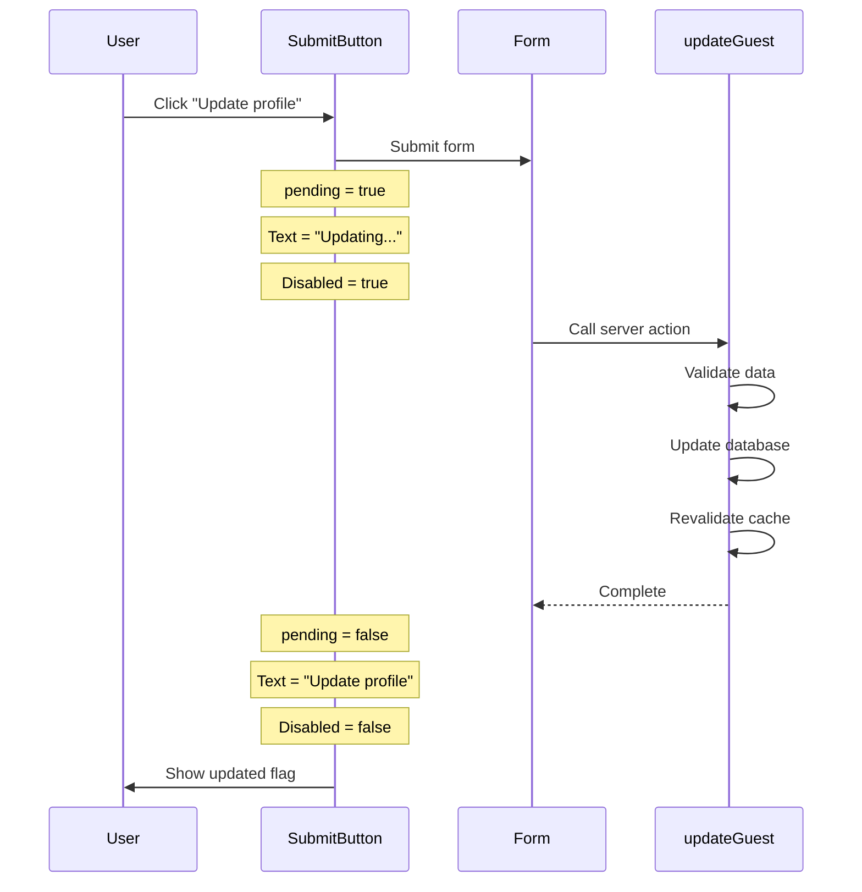

## Thêm Loading Indicator cho Form Submit

### Vấn Đề Cần Giải Quyết

**Thiếu phản hồi trực quan khi submit form**

Hiện tại khi user click nút "Update Profile", dữ liệu được cập nhật ở background nhưng không có bất kỳ dấu hiệu nào cho biết:

- Form đang được xử lý
- Khi nào quá trình hoàn tất
- Liệu có thành công hay không

**Mục tiêu cải thiện UX**

- Thay đổi text của button khi đang submit
- Disable button để tránh multiple submissions
- Làm mờ (gray out) button để báo hiệu trạng thái


### Hook useFormStatus

**Giới thiệu**

React cung cấp hook mới tên `useFormStatus` để theo dõi trạng thái submit của form. Đây là tính năng còn experimental nhưng NextJS đã tích hợp sẵn.

**Đặc điểm quan trọng**

```javascript
import { useFormStatus } from 'react-dom';
```

- Là hook của ReactDOM, không phải React thuần
- Vẫn đang ở trạng thái experimental (sẽ official trong React 19)
- NextJS đã hỗ trợ sử dụng hook này

**Hạn chế đặc biệt của hook này**

Hook `useFormStatus` **PHẢI** được sử dụng trong component được render **BÊN TRONG** form, không thể dùng trong component chứa form.

```javascript
// ❌ SAI - Hook trong component chứa form
function UpdateProfileForm() {
  const { pending } = useFormStatus(); // Không hoạt động!
  
  return (
    <form action={updateGuest}>
      <button>Update</button>
    </form>
  );
}

// ✅ ĐÚNG - Hook trong component render bên trong form
function UpdateProfileForm() {
  return (
    <form action={updateGuest}>
      <SubmitButton /> {/* Component này dùng useFormStatus */}
    </form>
  );
}

function SubmitButton() {
  const { pending } = useFormStatus(); // Hoạt động!
  return <button disabled={pending}>Update</button>;
}
```


### Tạo Submit Button Component

**Tách button thành component riêng**

```javascript
'use client'

import { useFormStatus } from 'react-dom';

function SubmitButton() {
  const { pending } = useFormStatus();
  
  return (
    <button 
      disabled={pending}
      className="bg-accent-500 px-8 py-4 text-primary-800 
                 font-semibold hover:bg-accent-600 
                 transition-all disabled:cursor-not-allowed 
                 disabled:bg-gray-500 disabled:text-gray-300"
    >
      {pending ? 'Updating...' : 'Update profile'}
    </button>
  );
}
```

**Sử dụng trong form**

```javascript
function UpdateProfileForm({ guest, children }) {
  return (
    <form action={updateGuest} className="space-y-6">
      {/* Form fields */}
      <input name="fullName" defaultValue={guest.fullName} disabled />
      <input name="email" defaultValue={guest.email} disabled />
      <input name="nationalID" defaultValue={guest.nationalID} />
      {children}
      
      {/* Submit button component */}
      <SubmitButton />
    </form>
  );
}
```


### Giá Trị Trả Về của useFormStatus

**Destructure object returned**

```javascript
const { pending, data, method, action } = useFormStatus();
```

**Các giá trị có sẵn**

- **`pending`**: Boolean cho biết form đang submit hay không (quan trọng nhất)
- **`data`**: FormData object chứa dữ liệu form
- **`method`**: HTTP method của form (GET/POST)
- **`action`**: Server action function được gán cho form

**Trong thực tế**

Chỉ có `pending` là thực sự hữu ích trong hầu hết trường hợp. Ba giá trị còn lại hiếm khi được sử dụng.

### Implement Loading State

**Conditional rendering cho button text**

```javascript
{pending ? 'Updating...' : 'Update profile'}
```

- Khi `pending = true`: Hiển thị "Updating..."
- Khi `pending = false`: Hiển thị "Update profile"

**Disable button khi đang submit**

```javascript
<button disabled={pending}>
```

**Tailwind classes cho disabled state**

```javascript
className="... disabled:cursor-not-allowed 
           disabled:bg-gray-500 disabled:text-gray-300"
```

- `disabled:cursor-not-allowed`: Đổi con trỏ chuột
- `disabled:bg-gray-500`: Màu nền xám khi disabled
- `disabled:text-gray-300`: Màu chữ nhạt khi disabled


### Luồng Hoạt Động



**Giải thích luồng**

1. User click button
2. `useFormStatus` detect form đang submit → `pending = true`
3. Button text đổi thành "Updating...", button bị disable
4. [[Server Actions]] chạy (validate, update DB, revalidate)
5. Khi hoàn tất → `pending = false`
6. Button về trạng thái ban đầu
7. UI tự động update với dữ liệu mới (do revalidation)

### Yêu Cầu Client Component

**Lưu ý quan trọng**

Do `useFormStatus` là React hook, component sử dụng nó **BẮT BUỘC** phải là [[Client Component]].

**Trường hợp 1: Parent đã là client component**

```javascript
'use client' // Directive ở parent

function UpdateProfileForm({ guest, children }) {
  return (
    <form action={updateGuest}>
      <SubmitButton /> {/* Tự động là client component */}
    </form>
  );
}

function SubmitButton() {
  const { pending } = useFormStatus();
  // ...
}
```

Vì `UpdateProfileForm` đã có `'use client'`, mọi component con (bao gồm `SubmitButton`) đều là client components.

**Trường hợp 2: Parent là server component**

```javascript
// UpdateProfileForm.js (Server Component)
function UpdateProfileForm({ guest, children }) {
  return (
    <form action={updateGuest}>
      <SubmitButton /> {/* Import từ file riêng */}
    </form>
  );
}

// SubmitButton.js (Client Component)
'use client' // Phải có directive này

import { useFormStatus } from 'react-dom';

export default function SubmitButton() {
  const { pending } = useFormStatus();
  return <button disabled={pending}>...</button>;
}
```

Nếu parent là server component, phải:

- Tách `SubmitButton` ra file riêng
- Thêm `'use client'` directive ở đầu file đó


### Kết Quả

**Trải nghiệm người dùng được cải thiện**

- User thấy rõ form đang được xử lý
- Không thể submit nhiều lần (button disabled)
- Feedback trực quan với text "Updating..."
- Sau khi hoàn tất, flag và dữ liệu cập nhật ngay lập tức
- Navigate đi rồi quay lại vẫn thấy dữ liệu mới (nhờ [[Cache Revalidation]])


### Best Practices

**Khi sử dụng useFormStatus**

- Luôn tạo component riêng cho submit button
- Component đó phải render BÊN TRONG form element
- Đảm bảo component là client component
- Chỉ sử dụng `pending` value, bỏ qua các giá trị khác

**Pattern chuẩn**

```javascript
// Parent form (có thể là server hoặc client component)
<form action={serverAction}>
  <FormFields />
  <SubmitButton /> {/* Riêng biệt */}
</form>

// SubmitButton (bắt buộc client component)
'use client'
function SubmitButton() {
  const { pending } = useFormStatus();
  return (
    <button disabled={pending}>
      {pending ? 'Loading...' : 'Submit'}
    </button>
  );
}
```


### Ghi Chú Thêm

**Tại sao phải render bên trong form?**

Hook `useFormStatus` hoạt động dựa trên React Context được tạo bởi `<form>` element. Chỉ các components render bên trong form mới access được context này.

**Tương lai của hook**

Hook này đang experimental nhưng sẽ chính thức trong React 19. NextJS đã adopt sớm để cải thiện developer experience với [[Server Actions]].

**Alternative approach**

Nếu không muốn dùng `useFormStatus`, có thể:

- Quản lý loading state thủ công với `useState`
- Sử dụng `useTransition` hook
- Nhưng `useFormStatus` là cách đơn giản và được khuyến nghị nhất

**Liên kết:** [[Server Actions]], [[Client Component]], [[useFormStatus]], [[React Hooks]], [[Form Submission]], [[Loading States]], [[Cache Revalidation]], [[UX Optimization]], [[ReactDOM]]

