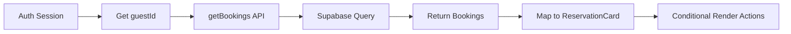

## Xây Dựng Trang Danh Sách Reservations

### Tổng Quan

Bài học này hướng dẫn xây dựng trang hiển thị tất cả reservations (đặt phòng) của guest, bao gồm các đặt phòng trong quá khứ và tương lai. Trang này sẽ sử dụng [[Server Component]] để fetch dữ liệu và hiển thị danh sách.

### Phân Biệt Bookings vs Reservations

**Terminology trong hệ thống**

- **Database/Backend**: Gọi là "bookings" (tên table trong Supabase)
- **UI/Frontend**: Gọi là "reservations" để dễ hiểu với người dùng

**Lý do khác biệt**

Trong hệ thống này, reservations là bookings chưa được xác nhận (unconfirmed):

- Guest đặt phòng online → Tạo "reservation"
- Không thể thanh toán online
- Khi đến khách sạn → Thanh toán → Trở thành "booking" thực sự

Mặc dù có sự khác biệt về mặt concept, nhưng trong code ta vẫn dùng cùng một table "bookings" và chỉ thay đổi cách gọi tên ở UI.

### Fetch Bookings Data

**Sử dụng getBookings từ data service**

```javascript
// app/account/reservations/page.js
import { auth } from '@/app/_lib/auth';
import { getBookings } from '@/app/_lib/data-service';

export default async function Page() {
  const session = await auth();
  const bookings = await getBookings(session.user.guestId);
  
  return (
    <div>
      <h2 className="font-semibold text-2xl text-accent-400 mb-7">
        Your reservations
      </h2>
      
      {bookings.length === 0 ? (
        <p className="text-lg">
          You have no reservations yet. Check out our{" "}
          <a className="underline text-accent-500" href="/cabins">
            luxury cabins &rarr;
          </a>
        </p>
      ) : (
        <ul className="space-y-6">
          {bookings.map((booking) => (
            <ReservationCard 
              key={booking.id} 
              booking={booking} 
            />
          ))}
        </ul>
      )}
    </div>
  );
}
```

**Lấy guestId từ session**

```javascript
const session = await auth();
const guestId = session.user.guestId;
```

Đây là lý do quan trọng tại sao phải thêm `guestId` vào session trong `auth.js` - để dễ dàng truy cập trong nhiều trang khác nhau.

**Function getBookings**

```javascript
// app/_lib/data-service.js
export async function getBookings(guestId) {
  const { data, error } = await supabase
    .from('bookings')
    .select('*')
    .eq('guestId', guestId)
    .order('startDate');
    
  if (error) {
    console.error(error);
    throw new Error('Bookings could not get loaded');
  }
  
  return data;
}
```


### ReservationCard Component

**Cấu trúc component**

```javascript
import Image from 'next/image';
import Link from 'next/link';
import { isPast } from 'date-fns';

function ReservationCard({ booking }) {
  const { 
    id, 
    startDate, 
    endDate, 
    numNights, 
    totalPrice, 
    numGuests,
    cabins: { name, image } 
  } = booking;
  
  return (
    <div className="flex border border-primary-800">
      {/* Image section */}
      <div className="relative h-32 aspect-square">
        <Image 
          src={image} 
          alt={`Cabin ${name}`}
          fill
          className="object-cover border-r border-primary-800"
        />
      </div>
      
      {/* Booking details */}
      <div className="flex-grow px-6 py-3 flex flex-col">
        <div className="flex items-center justify-between">
          <h3 className="text-xl font-semibold">
            {numNights} nights in Cabin {name}
          </h3>
        </div>
        
        {/* Action buttons - chỉ hiển thị nếu chưa quá hạn */}
        {!isPast(new Date(startDate)) && (
          <>
            <Link 
              href={`/account/reservations/edit/${id}`}
              className="border border-primary-800 py-3 px-6 text-xs"
            >
              Edit reservation
            </Link>
            <button className="border border-primary-800 py-3 px-6 text-xs">
              Delete reservation
            </button>
          </>
        )}
      </div>
    </div>
  );
}

export default ReservationCard;
```


### Responsive Images với Next.js

**Pattern cho responsive images**

Khi sử dụng Next.js [[Image Component]], cần tuân theo pattern sau cho responsive images:

```javascript
<div className="relative h-32 aspect-square">
  <Image 
    src={image} 
    alt={description}
    fill
    className="object-cover"
  />
</div>
```

**Các bước thực hiện**

1. Tạo parent element với position `relative`
2. Set kích thước cho parent (height, width hoặc aspect-ratio)
3. Sử dụng prop `fill` trên Image component
4. Thêm `object-cover` để image fill container

**Ví dụ với aspect ratio**

```javascript
// aspect-square = aspect ratio 1:1 (vuông)
className="relative h-32 aspect-square"

// aspect-video = aspect ratio 16:9
className="relative h-48 aspect-video"

// Custom aspect ratio
className="relative h-64 aspect-[4/3]"
```


### Conditional Rendering với isPast

**Import từ date-fns**

```javascript
import { isPast } from 'date-fns';
```

**Ẩn actions cho past reservations**

```javascript
{!isPast(new Date(startDate)) && (
  <>
    <Link href={`/account/reservations/edit/${id}`}>
      Edit reservation
    </Link>
    <button>Delete reservation</button>
  </>
)}
```

**Lý do ẩn actions**

- Không cho phép edit/delete reservations đã qua
- Improve UX - chỉ hiển thị actions có ý nghĩa
- Prevent invalid operations

**Cách hoạt động**

```javascript
isPast(new Date(startDate))
// true nếu startDate < ngày hiện tại
// false nếu startDate >= ngày hiện tại

!isPast(new Date(startDate))
// true → hiển thị buttons (reservation chưa diễn ra)
// false → ẩn buttons (reservation đã qua)
```


### Tạo Fake Data trong Supabase

**Bước thực hiện để test**

1. Lấy `guestId` của bạn từ table `guests`
2. Vào table `bookings` trong Supabase dashboard
3. Chọn một số bookings có sẵn
4. Thêm filter: `guestId = <your-guest-id>`
5. Update để gán bookings cho guest của bạn
6. Điều chỉnh dates nếu cần (đảm bảo có cả past và future)

**Ví dụ cập nhật**

```sql
-- Trong Supabase SQL Editor
UPDATE bookings 
SET guestId = 544, 
    startDate = '2024-12-20',
    endDate = '2024-12-23'
WHERE id IN (1, 2, 3);
```

**Lưu ý**

- Dùng `guestId` của chính bạn, không phải ví dụ
- Tạo ít nhất 2-3 bookings để test
- Đặt một số bookings trong quá khứ để test conditional rendering


### Empty State Handling

**Khi không có bookings**

```javascript
{bookings.length === 0 ? (
  <p className="text-lg">
    You have no reservations yet. Check out our{" "}
    <a className="underline text-accent-500" href="/cabins">
      luxury cabins &rarr;
    </a>
  </p>
) : (
  <ul className="space-y-6">
    {bookings.map((booking) => (
      <ReservationCard key={booking.id} booking={booking} />
    ))}
  </ul>
)}
```

**Best practice cho empty states**

- Hiển thị message rõ ràng
- Cung cấp call-to-action (link đến cabins)
- Giữ UI friendly và helpful


### Link Component vs Anchor Tag

**Thay thế `<a>` bằng `<Link>`**

```javascript
// ❌ Không nên dùng
<a href={`/account/reservations/edit/${id}`}>
  Edit reservation
</a>

// ✅ Nên dùng
import Link from 'next/link';

<Link href={`/account/reservations/edit/${id}`}>
  Edit reservation
</Link>
```

**Lợi ích của Link component**

- Client-side navigation (không reload page)
- Prefetching tự động
- Tối ưu performance
- Maintain scroll position
- Tích hợp tốt với [[Router Cache]]


### Cấu Trúc Route

**Route hierarchy**

```
app/
├── account/
│   ├── reservations/
│   │   ├── page.js          # Danh sách reservations
│   │   ├── edit/
│   │   │   └── [bookingId]/
│   │   │       └── page.js  # Edit reservation
```

**Dynamic routes**

Link đến edit page sử dụng [[Dynamic Routes]]:

```javascript
href={`/account/reservations/edit/${id}`}
// Ví dụ: /account/reservations/edit/123
```


### Async Server Component Pattern

**Component structure**

```javascript
export default async function Page() {
  // 1. Get authentication
  const session = await auth();
  
  // 2. Fetch data
  const bookings = await getBookings(session.user.guestId);
  
  // 3. Render với data
  return (
    <div>
      {/* UI */}
    </div>
  );
}
```

**Ưu điểm**

- Fetch data trực tiếp trong component
- Không cần useEffect hoặc loading states
- Data sẵn sàng khi component render
- Tận dụng server-side rendering


### Styling với Tailwind

**Layout classes quan trọng**

```javascript
// Container
className="flex border border-primary-800"

// Image wrapper
className="relative h-32 aspect-square"

// Content area
className="flex-grow px-6 py-3 flex flex-col"

// Spacing
className="space-y-6"  // Khoảng cách giữa items
```

**Responsive considerations**

Tất cả styles đã được thiết kế responsive, hoạt động tốt trên mobile và desktop.

### Ghi Chú Thêm

**Preparing for next steps**

Trang reservations này là nền tảng cho các tính năng tiếp theo:

- Edit reservation (sẽ dùng [[Server Actions]])
- Delete reservation (cũng dùng Server Actions)
- Cancel reservation
- View booking details

**Data flow summary**



**Dependencies used**

- `date-fns`: Utility library để xử lý dates
- `next/image`: Optimized image component
- `next/link`: Client-side navigation

**Liên kết:** [[Server Component]], [[Image Component]], [[Dynamic Routes]], [[Supabase]], [[Session Management]], [[Router Cache]], [[date-fns]], [[Conditional Rendering]], [[Empty States]], [[Responsive Images]]

