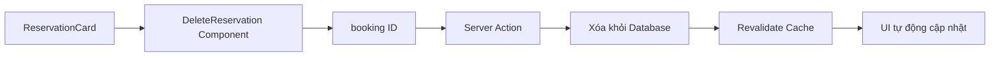
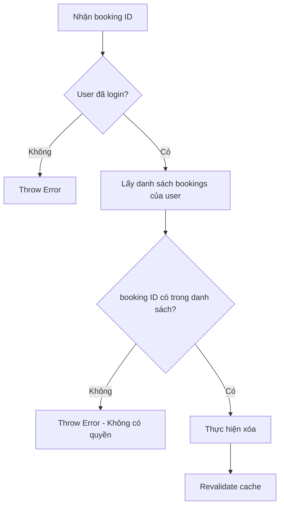

## Xóa Đặt Phòng (Delete Reservation) Với Server Actions

### Giới thiệu tính năng

Bài học này hướng dẫn cách cho phép khách hàng xóa các đặt phòng sắp tới của họ. Tính năng được kích hoạt khi người dùng nhấn nút "Delete" trên từng thẻ đặt phòng (reservation card).

**Luồng dữ liệu cơ bản:**




### Cấu trúc Component

Component `DeleteReservation` nhận prop `bookingId` được truyền từ:

- Trang chính render nhiều `ReservationCard`
- Mỗi card nhận object `booking` và destructure để lấy `id`
- ID này được đổi tên thành `bookingId` khi truyền vào component xóa


### Tạo Server Action

**Hai cách định nghĩa Server Action:**

- **Cách 1 - Trong component (không khuyến khích):**

```javascript
function deleteReservation() {
  'use server'
  // code xử lý
}
```

    - Cần thêm `'use server'` bên trong function
    - Quan trọng vì component có thể trở thành client component nếu được import bởi client component
- **Cách 2 - File riêng biệt (khuyến khích):**

```javascript
export async function deleteReservation(bookingId) {
  'use server'
  
  // 1. Kiểm tra xác thực
  const session = await auth()
  if (!session) throw new Error('You must be logged in')
  
  // 2. Xóa booking
  const { error } = await supabase
    .from('bookings')
    .delete()
    .eq('id', bookingId)
  
  if (error) throw new Error('Booking could not be deleted')
  
  // 3. Revalidate cache
  revalidatePath('/account/reservations')
}
```


### Gọi Server Action từ onClick

Khác với form action, lần này gọi trực tiếp từ button:

```javascript
'use client'

export default function DeleteReservation({ bookingId }) {
  return (
    <button onClick={() => deleteReservation(bookingId)}>
      Delete
    </button>
  )
}
```

**Lưu ý quan trọng:**

- Cần thêm `'use client'` directive vì xử lý onClick yêu cầu JavaScript phía client
- Truyền tham số thủ công vào server action (khác với form tự động truyền formData)


### Cập nhật UI với Revalidation

Sau khi xóa, UI không tự động cập nhật. Cần sử dụng `revalidatePath()`:

```javascript
revalidatePath('/account/reservations')
```

**Cơ chế hoạt động:**

- Không dùng state như React thông thường
- Xóa cache và fetch lại dữ liệu mới
- Dữ liệu mới (không còn booking đã xóa) được render tự động
- Tất cả data liên quan đến route này đều được revalidate

**Phương pháp thay thế:**

- `revalidateTag()` - revalidate theo tag cụ thể
- Khó áp dụng hơn khi dùng Supabase thay vì fetch


### Bảo mật - Authorization Check

**Vấn đề nghiêm trọng:**

Nếu không kiểm tra, user có thể xóa bất kỳ booking nào bằng cách:

1. Copy cURL request từ DevTools Network tab
2. Thay đổi booking ID trong request
3. Thực thi command để xóa booking của người khác

**Giải pháp - Kiểm tra quyền sở hữu:**

```javascript
// Lấy tất cả bookings của user hiện tại
const guestBookings = await getBookings(session.user.guestId)
const guestBookingIds = guestBookings.map(booking => booking.id)

// Kiểm tra booking ID có thuộc về user không
if (!guestBookingIds.includes(bookingId)) {
  throw new Error('You are not allowed to delete this booking')
}
```

**Luồng bảo mật:**




### So sánh Form Action vs onClick Handler

| Đặc điểm | Form Action | onClick Handler |
| :-- | :-- | :-- |
| Cách truyền action | `<form action={serverAction}>` | `onClick={() => serverAction(data)}` |
| Truyền dữ liệu | Tự động qua formData | Thủ công qua tham số |
| Yêu cầu 'use client' | Không | Có |
| Use case | Cập nhật profile, form phức tạp | Thao tác đơn giản như xóa |

### Các khái niệm quan trọng cần nhớ

- Server Actions luôn cần directive `'use server'` khi định nghĩa trong component
- Revalidation là cách chính để cập nhật UI sau server action, không dùng state
- Authorization check là bắt buộc để bảo vệ dữ liệu
- Backend development yêu cầu luôn xác minh quyền truy cập
- Cookie trong request chứa thông tin authentication


### Ghi chú thêm

RSC Payload (React Server Component Payload) được trả về sau mỗi server action, có thể nhận diện qua các số ở đầu response.

**Liên kết:** [[Server Actions]], [[Revalidation]], [[Authorization]], [[Next.js]], [[Supabase]], [[Client Component]], [[Server Component]], [[Cache Management]], [[Security Best Practices]]

