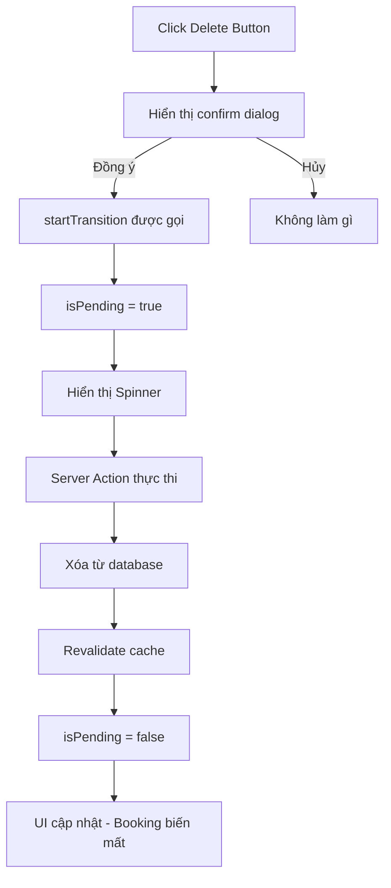

## Hiển thị Loading Indicator với useTransition Hook

### Khái niệm useTransition

`useTransition` là một hook được giới thiệu trong React 18 như một tính năng concurrent (đồng thời). Hook này cho phép đánh dấu một state update (cập nhật trạng thái) là một transition (chuyển đổi).

**Đặc điểm chính:**

- State update không chặn UI (non-blocking)
- UI vẫn responsive trong quá trình re-render
- Cung cấp chỉ báo trực quan về quá trình transition đang diễn ra
- Trong Next.js, có thể đánh dấu server action là một transition


### So sánh useFormStatus vs useTransition

| Đặc điểm | useFormStatus | useTransition |
| :-- | :-- | :-- |
| Sử dụng với | Form action | Button onClick |
| Yêu cầu | Form element | Không cần form |
| Use case | Cập nhật profile, submit form | Thao tác trực tiếp (delete, toggle) |
| Cách dùng | Chỉ lấy status | Bọc action trong startTransition |

### Cú pháp và cách sử dụng

**Khởi tạo hook:**

```javascript
const [isPending, startTransition] = useTransition()
```

**Hai phần trả về:**

- `isPending`: Boolean cho biết transition có đang diễn ra không
- `startTransition`: Function để bọc state update nặng

**Triển khai trong component:**

```javascript
'use client'
import { useTransition } from 'react'

export default function DeleteReservation({ bookingId }) {
  const [isPending, startTransition] = useTransition()
  
  function handleDelete() {
    const confirmed = confirm(
      'Are you sure you want to delete this reservation?'
    )
    
    if (confirmed) {
      startTransition(() => {
        deleteReservation(bookingId)
      })
    }
  }
  
  return (
    <button onClick={handleDelete}>
      {isPending ? (
        <span className="mx-auto">
          <SpinnerMini />
        </span>
      ) : (
        <>Delete</>
      )}
    </button>
  )
}
```


### Luồng hoạt động




### Các bước triển khai chi tiết

**Bước 1 - Tách function xử lý:**

```javascript
function handleDelete() {
  deleteReservation(bookingId)
}
```

**Bước 2 - Bọc trong startTransition:**

```javascript
function handleDelete() {
  startTransition(() => {
    deleteReservation(bookingId)
  })
}
```

**Bước 3 - Thêm confirm dialog:**

```javascript
function handleDelete() {
  const confirmed = confirm('Are you sure?')
  if (confirmed) {
    startTransition(() => {
      deleteReservation(bookingId)
    })
  }
}
```

**Bước 4 - Render UI dựa trên isPending:**

```javascript
{isPending ? <SpinnerMini /> : 'Delete'}
```


### Cơ chế hoạt động trong Next.js

**Suspense Boundaries:**

- Next.js sử dụng Suspense boundaries để quản lý transitions
- Tất cả navigations trong Next.js tự động được bọc trong transitions
- Transitions là phần quan trọng của modern React

**Tại sao hữu ích:**

- Cải thiện trải nghiệm người dùng với feedback trực quan
- UI không bị đóng băng khi thực hiện server action
- Người dùng biết rằng thao tác đang được xử lý


### Ứng dụng thực tế

**Các trường hợp sử dụng useTransition:**

- Xóa items không cần form
- Toggle trạng thái (favorite, bookmark)
- State updates nặng có thể block UI
- Bất kỳ server action nào được gọi từ button/click handler

**Vanilla React:**

- Sử dụng cho state updates rất nặng
- Giữ UI responsive trong khi xử lý
- Cập nhật danh sách lớn, filtering, sorting


### Ghi chú quan trọng

**Styling spinner:**

- Sử dụng `mx-auto` để căn giữa spinner
- Component `SpinnerMini` có sẵn trong project
- Có thể thay thế bằng bất kỳ loading indicator nào

**Best practices:**

- Luôn có confirm dialog cho thao tác xóa
- Cung cấp feedback trực quan cho mọi server action
- Kết hợp với error handling để xử lý trường hợp thất bại

**Concurrent Features trong React 18:**

- useTransition là một trong những concurrent features chính
- Cho phép React xử lý nhiều state updates với độ ưu tiên khác nhau
- Cải thiện performance và user experience đáng kể

**Liên kết:** [[useTransition]], [[useFormStatus]], [[Server Actions]], [[React 18]], [[Concurrent Features]], [[Loading States]], [[Next.js]], [[Suspense]], [[User Experience]], [[State Management]]

