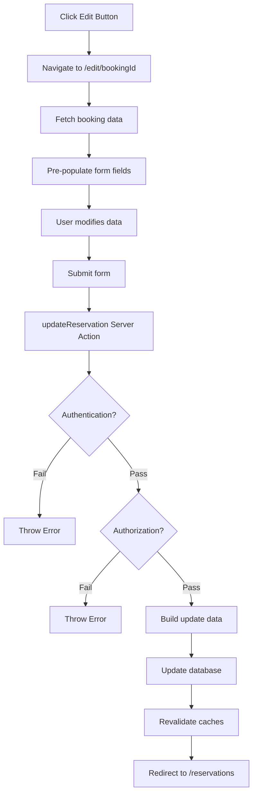

## Cập Nhật Đặt Phòng (Update Reservation) - Challenge

### Giới thiệu Challenge

Đây là một thử thách khá khó, cho phép người dùng cập nhật thông tin đặt phòng của họ. Challenge này kết hợp nhiều khái niệm đã học để xây dựng một tính năng hoàn chỉnh.

**Cấp độ:** Nâng cao - Có thể thực hiện như challenge hoặc theo dõi video thông thường

### Các bước triển khai chính

**Bước 1 - Tạo Route và Page:**

```
app/
  account/
    reservations/
      edit/
        [bookingId]/
          page.js
```

**Đọc params từ URL:**

```javascript
export default async function Page({ params }) {
  const { bookingId } = params
  
  // Lấy booking hiện tại để edit
  const booking = await getBooking(bookingId)
  const { numGuests, observations, cabinId } = booking
  
  // Lấy max capacity của cabin
  const { maxCapacity } = await getCabin(cabinId)
  
  return (
    <form action={updateReservation}>
      {/* Form fields */}
    </form>
  )
}
```

**Bước 2 - Sử dụng Hidden Field:**

Hidden field (trường ẩn) cho phép truyền booking ID vào server action:

```javascript
<input 
  type="hidden" 
  name="bookingId" 
  value={bookingId} 
/>
```

**Lý do cần hidden field:**

- Server actions không có quyền truy cập vào URL params
- Chúng hoạt động như API endpoints độc lập
- Hidden field đưa data vào formData một cách tự động

**Bước 3 - Tạo Server Action:**

```javascript
export async function updateReservation(formData) {
  // 1. Authentication
  const session = await auth()
  if (!session) throw new Error('You must be logged in')
  
  // 2. Authorization
  const guestBookings = await getBookings(session.user.guestId)
  const guestBookingIds = guestBookings.map(booking => booking.id)
  
  const bookingId = Number(formData.get('bookingId'))
  
  if (!guestBookingIds.includes(bookingId)) {
    throw new Error('You are not allowed to update this booking')
  }
  
  // 3. Build update data
  const updateData = {
    numGuests: Number(formData.get('numGuests')),
    observations: formData.get('observations').slice(0, 1000)
  }
  
  // 4. Mutation
  const { error } = await supabase
    .from('bookings')
    .update(updateData)
    .eq('id', bookingId)
  
  if (error) throw new Error('Booking could not be updated')
  
  // 5. Error handling (already done above)
  
  // 6. Revalidation
  revalidatePath('/account/reservations')
  revalidatePath(`/account/reservations/edit/${bookingId}`)
  
  // 7. Redirecting
  redirect('/account/reservations')
}
```


### Luồng xử lý hoàn chỉnh




### Xử lý Form Data

**Chuyển đổi kiểu dữ liệu:**

FormData lưu tất cả giá trị dưới dạng string, cần convert:

```javascript
// Từ formData (string) sang number
const numGuests = Number(formData.get('numGuests'))
const bookingId = Number(formData.get('bookingId'))

// Giới hạn độ dài string để bảo vệ database
const observations = formData.get('observations').slice(0, 1000)
```


### Pre-populate Form Fields

**Hiển thị dữ liệu hiện tại:**

```javascript
<input
  type="number"
  name="numGuests"
  defaultValue={numGuests}
  min="1"
  max={maxCapacity}
/>

<textarea
  name="observations"
  defaultValue={observations}
/>
```

**Lưu ý:** Sử dụng `defaultValue` không phải `value` để tránh tạo controlled component

### Revalidation Strategy

**Cần revalidate nhiều paths:**

```javascript
// Revalidate trang danh sách
revalidatePath('/account/reservations')

// Revalidate trang edit hiện tại
revalidatePath(`/account/reservations/edit/${bookingId}`)
```

**Thứ tự quan trọng:**

1. Revalidation phải xảy ra TRƯỚC redirect
2. Redirect sẽ chuyển hướng người dùng sau khi cache đã được làm mới

### Tái sử dụng SubmitButton Component

**Tách thành Client Component riêng:**

```javascript
'use client'
import { useFormStatus } from 'react-dom'

export default function SubmitButton({ children, pendingLabel }) {
  const { pending } = useFormStatus()
  
  return (
    <button 
      disabled={pending}
      className={pending ? 'bg-accent-400' : 'bg-accent-500'}
    >
      {pending ? pendingLabel : children}
    </button>
  )
}
```

**Sử dụng trong nhiều forms:**

```javascript
// Update Profile Form
<SubmitButton pendingLabel="Updating...">
  Update profile
</SubmitButton>

// Update Reservation Form
<SubmitButton pendingLabel="Updating...">
  Update reservation
</SubmitButton>
```

**Lợi ích của refactoring:**

- Code reusability (tái sử dụng mã)
- Separation of concerns (tách biệt mối quan tâm)
- Dễ bảo trì và mở rộng


### Redirect Function

`redirect()` từ `next/navigation` cho phép chuyển hướng sau server action:

```javascript
import { redirect } from 'next/navigation'

// Trong server action
redirect('/account/reservations')
```

**Đặc điểm:**

- Phải import từ `next/navigation`
- Chỉ hoạt động trong server actions và server components
- Tự động dừng thực thi code phía sau


### Bảo vệ và Validation

**Các lớp bảo vệ:**

- **Authentication:** Kiểm tra user đã đăng nhập chưa
- **Authorization:** Kiểm tra user có quyền cập nhật booking này không
- **Input validation:** Giới hạn độ dài observations, convert số
- **Supabase protection:** Tự động bảo vệ khỏi SQL injection

**Bảo vệ database khỏi spam:**

```javascript
observations: formData.get('observations').slice(0, 1000)
```


### Xử lý Dynamic Max Capacity

**Fetch thông tin cabin để giới hạn số khách:**

```javascript
const { maxCapacity } = await getCabin(cabinId)

// Generate options động
{Array.from({ length: maxCapacity }, (_, i) => i + 1).map(x => (
  <option key={x} value={x}>{x} guests</option>
))}
```


### Common Issues và Giải pháp

**Issue 1 - "Cannot access before initialization":**

- Nguyên nhân: Sử dụng biến trước khi khai báo
- Giải pháp: Đặt `bookingId` ở đầu function

**Issue 2 - Stale data sau redirect:**

- Nguyên nhân: Chưa revalidate đúng paths
- Giải pháp: Revalidate cả parent và child routes

**Issue 3 - Data không nhất quán giữa các trang:**

- Nguyên nhân: Thiếu revalidation cho một số routes
- Giải pháp: Revalidate tất cả routes liên quan


### Best Practices

**Organization:**

- Giữ tất cả server actions trong file `actions.js` tập trung
- Comment các bước xử lý rõ ràng
- Tách client components khi cần hooks

**Security:**

- Luôn verify ownership trước khi update
- Validate và sanitize input data
- Giới hạn độ dài string inputs

**Performance:**

- Chỉ revalidate paths thực sự cần thiết
- Sử dụng dynamic imports khi có thể
- Tối ưu số lượng database queries


### Giá trị giáo dục của Challenge

Challenge này kết hợp nhiều khái niệm quan trọng:

- Server actions và form handling
- Authentication và authorization patterns
- Cache revalidation strategies
- Component composition và reusability
- Error handling và validation
- Next.js routing với dynamic segments

Ngay cả khi chỉ hoàn thành một phần, đây vẫn là bài tập rất hữu ích để củng cố kiến thức Next.js.

**Liên kết:** [[Server Actions]], [[Form Handling]], [[Hidden Fields]], [[Revalidation]], [[Redirect]], [[useFormStatus]], [[Authentication]], [[Authorization]], [[Component Reusability]], [[Next.js Routing]], [[Dynamic Segments]], [[Cache Management]], [[Supabase]]

