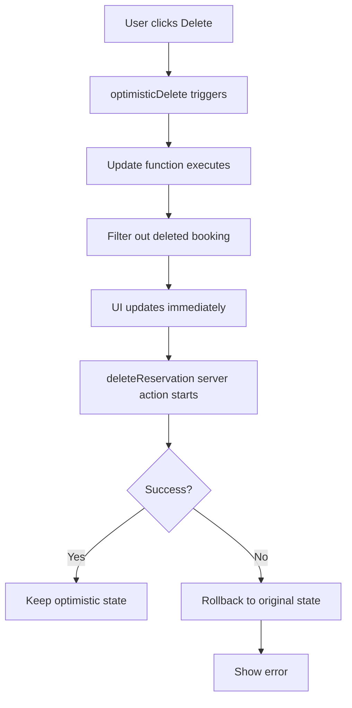

## Xóa Reservation với Optimistic UI

### Optimistic UI là gì?

Optimistic UI là một kỹ thuật giúp cải thiện hiệu suất cảm nhận (perceived performance) của giao diện người dùng. Kỹ thuật này được gọi là "optimistic" (lạc quan) vì chúng ta giả định rằng một thao tác bất đồng bộ (asynchronous operation) sẽ thành công trước khi nó thực sự hoàn thành.

Trong trường hợp này, khi người dùng nhấn nút xóa reservation, booking sẽ bị xóa khỏi giao diện ngay lập tức, trong khi thao tác xóa vẫn đang chạy ở background. Nếu thao tác không thành công, trạng thái sẽ được khôi phục lại như ban đầu.

**Lợi ích:**

- Làm cho ứng dụng cảm giác nhanh hơn và responsive hơn
- Giảm thiểu loading spinner
- Cải thiện trải nghiệm người dùng đáng kể, đặc biệt với các ứng dụng có nhiều dữ liệu


### Hook useOptimistic

React cung cấp hook `useOptimistic` để implement pattern này. Hook này cho phép hiển thị một trạng thái khác trong khi một async action đang thực hiện.

**Cú pháp:**

```javascript
import { useOptimistic } from 'react';

const [optimisticState, setOptimisticState] = useOptimistic(
  currentState,
  updateFunction
);
```

**Tham số:**

- `currentState`: Trạng thái hiện tại (state ban đầu)
- `updateFunction`: Hàm xác định trạng thái optimistic tiếp theo

**Giá trị trả về:**

- `optimisticState`: Trạng thái sẽ được render
- `setOptimisticState`: Hàm setter để trigger optimistic operation


### Triển khai Optimistic Delete

#### Bước 1: Chuyển sang Client Component

Vì sử dụng hook, cần tạo client component mới. Di chuyển danh sách reservations từ server component sang `ReservationList.js`:

```javascript
'use client';

import { useOptimistic } from 'react';
import ReservationCard from './ReservationCard';

export default function ReservationList({ bookings }) {
  // Component logic
  return (
    <ul className="space-y-6">
      {optimisticBookings.map((booking) => (
        <ReservationCard 
          booking={booking} 
          key={booking.id}
          onDelete={handleDelete}
        />
      ))}
    </ul>
  );
}
```


#### Bước 2: Cấu hình useOptimistic Hook

```javascript
const [optimisticBookings, optimisticDelete] = useOptimistic(
  bookings,
  (currentBookings, bookingId) => {
    return currentBookings.filter((booking) => booking.id !== bookingId);
  }
);
```

**Giải thích:**

- `bookings`: State ban đầu được truyền từ server component
- Update function nhận `currentBookings` và `bookingId`
- Hàm filter loại bỏ booking có id trùng với `bookingId`
- Trả về mảng bookings mới không chứa booking bị xóa


#### Bước 3: Tạo Handle Delete Function

```javascript
function handleDelete(bookingId) {
  // 1. Xóa optimistic (UI update ngay lập tức)
  optimisticDelete(bookingId);
  
  // 2. Xóa thực sự trên server (async operation)
  deleteReservation(bookingId);
}
```


#### Bước 4: Prop Drilling

Truyền `handleDelete` xuống các component con:

```javascript
// ReservationList.js
<ReservationCard onDelete={handleDelete} />

// ReservationCard.js  
<DeleteReservation onDelete={onDelete} />

// DeleteReservation.js
<button onClick={() => onDelete(bookingId)}>Delete</button>
```


### Luồng Xử Lý Optimistic Delete



**Giải thích luồng:**

1. Người dùng click nút Delete
2. `optimisticDelete(bookingId)` được gọi
3. Update function filter booking ra khỏi state
4. UI cập nhật ngay lập tức (booking biến mất)
5. Server action `deleteReservation` chạy ở background
6. Nếu thành công: giữ nguyên optimistic state
7. Nếu thất bại: rollback về state ban đầu (booking xuất hiện lại)

### Testing với Artificial Delay

Để test behavior, thêm delay vào server action:

```javascript
async function deleteReservation(bookingId) {
  // Artificial delay for testing
  await new Promise(resolve => setTimeout(resolve, 2000));
  
  // Delete from database
  await supabase.from('bookings').delete().eq('id', bookingId);
}
```

**Test case thành công:**

- Click Delete → Booking biến mất ngay lập tức
- Sau 2 giây → Booking vẫn biến mất (xóa thành công)

**Test case thất bại:**

```javascript
async function deleteReservation(bookingId) {
  await new Promise(resolve => setTimeout(resolve, 2000));
  throw new Error('Delete failed'); // Simulate error
}
```

- Click Delete → Booking biến mất ngay
- Sau 2 giây → Booking xuất hiện lại (rollback)
- Error 500 hiển thị


### Pattern cho Add Operation

Nếu thực hiện optimistic add thay vì delete:

```javascript
const [optimisticBookings, optimisticAdd] = useOptimistic(
  bookings,
  (currentBookings, newBooking) => {
    return [...currentBookings, newBooking];
  }
);
```


### Thêm Loading Indicator

Copy `loading.js` vào route `/account` để hiển thị loading spinner khi navigate:

```javascript
// app/account/loading.js
export default function Loading() {
  return <Spinner />;
}
```

Loading file này sẽ tự động hiển thị khi page đang được stream.

### Ghi Chú Quan Trọng

- `useOptimistic` chỉ hoạt động trong client component (cần `'use client'` directive)
- Pass data từ server component sang client component qua props
- Update function tương tự reducer function trong `useReducer`
- Hook tự động handle rollback nếu async operation fail
- Render `optimisticState` thay vì state gốc trong JSX


### So Sánh useOptimistic với useReducer

| useOptimistic | useReducer |
| :-- | :-- |
| Dùng cho optimistic updates | Dùng cho state management phức tạp |
| Update function | Reducer function |
| optimisticDelete (setter) | dispatch function |
| Auto rollback on error | Không có rollback tự động |


***

**Liên kết:** [[useOptimistic]], [[Client Component]], [[Server Component]], [[Server Action]], [[Optimistic UI]], [[React Hooks]], [[Async Operations]], [[State Management]], [[Next.js]], [[Prop Drilling]]

