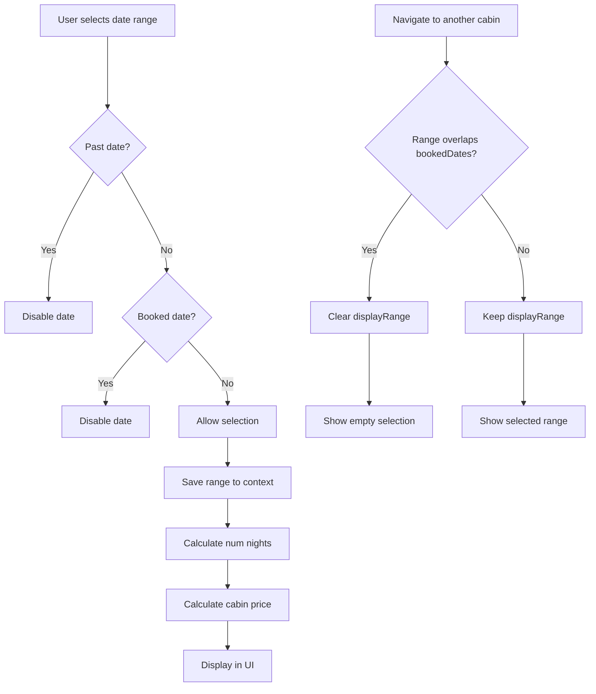

## Hoàn Thiện Date Selector Component

### Tổng Quan

Phần này tập trung vào việc hoàn thiện component date selector (bộ chọn ngày) để cho phép khách đặt phòng cabin. Date selector nằm ở bên trái trang chi tiết cabin, bên cạnh reservation form (form đặt phòng).

### Tính Toán Dữ Liệu Động

#### Lấy Thông Tin từ Cabin Data

Thay vì sử dụng giá trị hardcode (23), cần lấy dữ liệu thực tế từ props:

```javascript
// DateSelector.js
export default function DateSelector({ settings, cabin, bookedDates }) {
  const { regularPrice, discount } = cabin;
  
  // Các tính toán khác...
}
```


#### Tính Số Đêm (Number of Nights)

Sử dụng hàm `differenceInDays` từ thư viện date-fns:

```javascript
import { differenceInDays } from 'date-fns';

const numNights = differenceInDays(range.to, range.from);
```

**Giải thích:**

- `range.to`: Ngày kết thúc được chọn
- `range.from`: Ngày bắt đầu được chọn
- Trả về số ngày chênh lệch giữa hai ngày


#### Tính Tổng Giá Cabin

```javascript
const cabinPrice = numNights * (regularPrice - discount);
```

Công thức: `Số đêm × (Giá thường - Giảm giá)`

### Chia Sẻ Dữ Liệu với Context

#### Reservation Context

Range data (dữ liệu khoảng ngày) được chia sẻ giữa Date Selector và Reservation Form thông qua Context API:

```javascript
// ReservationContext.js
const ReservationContext = createContext();

export function ReservationProvider({ children }) {
  const [range, setRange] = useState({ from: null, to: null });
  
  return (
    <ReservationContext.Provider value={{ range, setRange }}>
      {children}
    </ReservationContext.Provider>
  );
}

export function useReservation() {
  return useContext(ReservationContext);
}
```

**Lợi ích:**

- Tránh prop drilling
- Đồng bộ dữ liệu giữa các component
- Range data được giữ nguyên khi chuyển giữa các cabin


### Vô Hiệu Hóa Ngày Đã Đặt

#### Disable Past Dates (Ngày Quá Khứ)

Sử dụng prop `disabled` của date picker component với callback function:

```javascript
import { isPast, isSameDay } from 'date-fns';

<DatePicker
  disabled={(date) => {
    // Vô hiệu hóa ngày trong quá khứ
    if (isPast(date)) return true;
    
    return false;
  }}
/>
```

**Hàm `isPast`:**

- Nhận vào một date object
- Trả về `true` nếu ngày đó đã qua (bao gồm cả hôm nay)
- Trả về `false` nếu là ngày trong tương lai


#### Disable Booked Dates (Ngày Đã Được Đặt)

Kết hợp với mảng `bookedDates` để vô hiệu hóa các ngày đã có booking:

```javascript
<DatePicker
  disabled={(date) => {
    // Ngày quá khứ
    if (isPast(date)) return true;
    
    // Ngày đã được đặt
    return bookedDates.some((bookedDate) => 
      isSameDay(date, bookedDate)
    );
  }}
/>
```

**Giải thích logic:**

- `bookedDates.some()`: Lặp qua mảng các ngày đã đặt
- `isSameDay(date, bookedDate)`: So sánh ngày hiện tại với từng ngày đã đặt
- Nếu tìm thấy ngày trùng khớp, `some()` trả về `true` → ngày bị vô hiệu hóa

**Ví dụ:** Nếu có booking từ 6-9/5, các ngày này sẽ không thể chọn được.

### Xử Lý Overlap (Trùng Lặp) Booking

#### Vấn Đề

Khi chuyển giữa các cabin, range được giữ nguyên trong context. Nếu range chứa ngày đã được đặt ở cabin mới, cần clear range đó.

#### Giải Pháp: Display Range

Tạo một range mới để hiển thị, kiểm tra xem có overlap với booked dates không:

```javascript
// Helper function (đã được cung cấp sẵn)
function isAlreadyBooked(range, bookedDates) {
  return (
    range.from &&
    range.to &&
    bookedDates.some(
      (date) =>
        (date >= range.from && date <= range.to) ||
        (range.from >= date && range.from <= date)
    )
  );
}

// Trong component
const displayRange = isAlreadyBooked(range, bookedDates) 
  ? { from: null, to: null }  // Empty range
  : range;                     // Keep original range
```

**Sử dụng Display Range:**

```javascript
// Thay vì dùng 'range', dùng 'displayRange'
const numNights = differenceInDays(displayRange.to, displayRange.from);

<DatePicker
  selected={displayRange}
  // ...
/>
```


### Luồng Xử Lý Date Selection



**Giải thích luồng:**

1. User chọn khoảng ngày
2. Kiểm tra từng ngày: quá khứ hoặc đã đặt → disable
3. Ngày hợp lệ → lưu vào context
4. Tính số đêm và giá tiền
5. Hiển thị trên UI
6. Khi chuyển cabin: kiểm tra overlap → clear hoặc giữ range

### Xử Lý Range Selection với Disabled Dates

Date picker tự động xử lý trường hợp user chọn range có ngày disabled ở giữa:

**Behavior:**

- Chọn từ trái sang phải qua ngày disabled: Range bị reset
- Chọn theo hướng ngược lại: Vẫn hoạt động bình thường
- Chọn range kết thúc tại ngày disabled: Tự động dừng trước ngày đó

**Ví dụ:**

```
Ngày: [1] [2] [X] [4] [5]
      ✓   ✓   ✗   ✓   ✓

Chọn 1 → 5: Không thành công (có X ở giữa)
Chọn 1 → 2: Thành công
Chọn 4 → 5: Thành công
```


### Minimum Booking Length

Settings từ database quy định độ dài tối thiểu của booking:

```javascript
const { minBookingLength } = settings;

// Các ngày xung quanh selection cũng bị grayed out
// nếu không đủ minBookingLength
```

Khi user chọn một ngày, các ngày xung quanh sẽ bị grayed out nếu việc chọn chúng sẽ tạo ra booking ngắn hơn minBookingLength.

### Code Hoàn Chỉnh

```javascript
'use client';

import { differenceInDays, isPast, isSameDay } from 'date-fns';
import { DatePicker } from './DatePicker';
import { useReservation } from './ReservationContext';
import { isAlreadyBooked } from '@/utils/helpers';

export default function DateSelector({ settings, cabin, bookedDates }) {
  const { regularPrice, discount } = cabin;
  const { range } = useReservation();
  
  // Kiểm tra overlap và tạo displayRange
  const displayRange = isAlreadyBooked(range, bookedDates)
    ? { from: null, to: null }
    : range;
  
  // Tính toán
  const numNights = differenceInDays(displayRange.to, displayRange.from);
  const cabinPrice = numNights * (regularPrice - discount);
  
  return (
    <div>
      <DatePicker
        selected={displayRange}
        disabled={(date) => {
          // Disable past dates
          if (isPast(date)) return true;
          
          // Disable booked dates
          return bookedDates.some((bookedDate) =>
            isSameDay(date, bookedDate)
          );
        }}
        minBookingLength={settings.minBookingLength}
      />
      
      <div className="price-display">
        <p>{numNights} nights</p>
        <p>${cabinPrice}</p>
        {discount > 0 && <p>Discount: ${discount}</p>}
      </div>
    </div>
  );
}
```


### Ghi Chú Quan Trọng

- Date handling (xử lý ngày tháng) luôn phức tạp - sử dụng thư viện date-fns để đơn giản hóa
- `some()` method dừng ngay khi tìm thấy điều kiện đầu tiên trả về `true` - hiệu quả cho performance
- Range data trong context được persist khi navigate giữa các cabin
- Display range khác với actual range - một cái để hiển thị, một cái lưu trong context
- Date picker component tự động handle invalid selections


### Date-fns Functions Sử Dụng

- `differenceInDays(dateLeft, dateRight)`: Tính số ngày chênh lệch
- `isPast(date)`: Kiểm tra ngày có trong quá khứ không
- `isSameDay(dateLeft, dateRight)`: So sánh hai ngày có giống nhau không
- `differenceInBusinessDays`: Tính số ngày làm việc (nếu cần)
- `differenceInCalendarDays`: Tính số ngày theo lịch (nếu cần)

***

**Liên kết:** [[Date Selector]], [[Context API]], [[date-fns]], [[Date Picker]], [[Booking System]], [[Client Component]], [[React Hooks]], [[Next.js]], [[Form Validation]], [[Conditional Rendering]]

