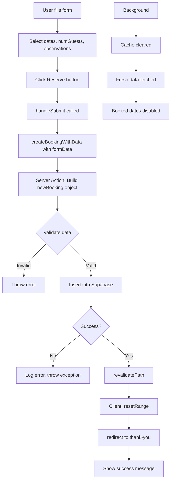

## Tạo Reservation Mới - Hoàn Thiện Dự Án

### Tổng Quan Dữ Liệu Booking

Kiểm tra các trường dữ liệu cần thiết trong bảng bookings của Supabase:

**Dữ liệu bắt buộc:**

- `startDate`, `endDate`: Ngày bắt đầu và kết thúc
- `numNights`: Số đêm
- `numGuests`: Số khách
- `cabinPrice`: Giá cabin
- `extrasPrice`: Giá dịch vụ thêm
- `totalPrice`: Tổng giá
- `status`: Trạng thái booking (unconfirmed, confirmed, checked-in)
- `hasBreakfast`: Có bữa sáng không
- `isPaid`: Đã thanh toán chưa
- `observations`: Ghi chú từ khách
- `cabinId`, `guestId`: Foreign keys


### Chuẩn Bị Dữ Liệu trong ReservationForm

#### Lấy Dữ Liệu từ Props và Context

```javascript
'use client';

import { differenceInDays } from 'date-fns';
import { useReservation } from './ReservationContext';

export default function ReservationForm({ cabin }) {
  const { regularPrice, discount, cabinId } = cabin;
  const { range, resetRange } = useReservation();
  
  // Tính toán dates
  const startDate = range.from;
  const endDate = range.to;
  
  // Tính số đêm
  const numNights = differenceInDays(endDate, startDate);
  
  // Tính giá cabin
  const cabinPrice = numNights * (regularPrice - discount);
  
  // ...
}
```


#### Kiểm Tra Form Fields

Đảm bảo các input field có `name` attribute trùng với tên field trong database:

```javascript
<select name="numGuests">
  <option value="1">1 guest</option>
  <option value="2">2 guests</option>
  {/* ... */}
</select>

<textarea 
  name="observations"
  placeholder="Anything we should know about your stay?"
/>
```


### Tạo Server Action createBooking

#### Vấn Đề: Pass Additional Data

Form data chỉ chứa `numGuests` và `observations`. Cần pass thêm: `startDate`, `endDate`, `numNights`, `cabinPrice`, `cabinId`.

**Giải pháp 1 - Hidden Fields:** Phù hợp khi có 1-2 fields
**Giải pháp 2 - bind() Method:** Phù hợp khi có nhiều fields (sử dụng trong trường hợp này)

#### Sử dụng bind() Method

```javascript
// ReservationForm.js
const bookingData = {
  startDate,
  endDate,
  numNights,
  cabinPrice,
  cabinId,
};

const createBookingWithData = createBooking.bind(null, bookingData);

return (
  <form action={createBookingWithData}>
    {/* form fields */}
  </form>
);
```

**Cách hoạt động của bind():**

- `bind(thisArg, ...args)`: Tạo function mới với `this` và arguments được pre-set
- Argument đầu tiên: giá trị cho `this` keyword (pass `null` nếu không cần)
- Các arguments tiếp theo: được bind vào function parameters theo thứ tự


#### Cấu Trúc Server Action

```javascript
// actions.js
export async function createBooking(bookingData, formData) {
  // bookingData: từ bind()
  // formData: tự động pass vào khi submit form
  
  console.log(bookingData); // { startDate, endDate, ... }
  console.log(formData); // FormData { numGuests, observations }
}
```

**Lưu ý quan trọng:** Khi dùng `bind()`, parameter thứ nhất của function sẽ nhận bound data, `formData` trở thành parameter thứ hai.

### Xây Dựng Booking Object

```javascript
export async function createBooking(bookingData, formData) {
  const session = await auth();
  if (!session) throw new Error('You must be logged in');
  
  // Xây dựng object hoàn chỉnh
  const newBooking = {
    ...bookingData,  // startDate, endDate, numNights, cabinPrice, cabinId
    
    // Từ session
    guestId: session.user.guestId,
    
    // Từ form
    numGuests: Number(formData.get('numGuests')),
    observations: formData.get('observations').slice(0, 1000), // Giới hạn 1000 ký tự
    
    // Giá trị mặc định
    extrasPrice: 0,
    totalPrice: bookingData.cabinPrice,
    status: 'unconfirmed',
    hasBreakfast: false,
    isPaid: false,
  };
  
  console.log(newBooking);
}
```

**Lưu ý về validation:**

- Luôn validate và sanitize dữ liệu từ form
- Sử dụng `slice(0, 1000)` để giới hạn độ dài string
- Convert `numGuests` sang number với `Number()`
- Có thể dùng library Zod cho validation phức tạp


### Insert Booking vào Database

```javascript
export async function createBooking(bookingData, formData) {
  // ... build newBooking object
  
  const { error } = await supabase
    .from('bookings')
    .insert([newBooking]); // Lưu ý: phải là array
  
  if (error) {
    console.error(error);
    throw new Error('Booking could not be created');
  }
}
```

**Không cần select() sau insert** vì không cần data trả về - chỉ cần insert thành công.

### Reset Range sau khi Booking

#### Vấn Đề

Server action không có access đến client context. Cần gọi `resetRange()` từ client sau khi server action hoàn thành.

#### Giải Pháp: Wrapper Function

```javascript
// ReservationForm.js
const createBookingWithData = createBooking.bind(null, bookingData);

async function handleSubmit(formData) {
  // Gọi server action
  await createBookingWithData(formData);
  
  // Sau khi hoàn thành, reset range
  resetRange();
}

return (
  <form action={handleSubmit}>
    {/* ... */}
  </form>
);
```

**Luồng xử lý:**

1. User submit form
2. `handleSubmit` được gọi với `formData`
3. Pass `formData` vào `createBookingWithData`
4. Server action chạy và hoàn thành
5. `resetRange()` được gọi để clear selected dates

### Revalidate Path

Sau khi tạo booking, cần revalidate để:

- Disable các ngày vừa được đặt
- Clear browser cache (Router cache)
- Refetch fresh data

```javascript
export async function createBooking(bookingData, formData) {
  // ... insert booking
  
  revalidatePath(`/cabins/${bookingData.cabinId}`);
}
```

**Hiệu ứng:**

- Dates vừa book sẽ tự động bị disabled
- Có độ trễ vài giây vì data được refetch ở background
- Browser cache được làm mới


### Thêm Loading State

Sử dụng `SubmitButton` component đã tạo trước đó với `useFormStatus` hook:

```javascript
// ReservationForm.js
import SubmitButton from './SubmitButton';

return (
  <form action={handleSubmit}>
    {/* form fields */}
    
    {startDate && endDate ? (
      <SubmitButton pendingLabel="Reserving...">
        Reserve now
      </SubmitButton>
    ) : (
      <p className="text-primary-300 text-lg">
        Start by selecting dates
      </p>
    )}
  </form>
);
```

**Conditional rendering:**

- Chỉ hiển thị button khi đã chọn dates
- Tránh UI jump bằng cách placeholder text có chiều cao tương đương
- Button tự động disabled khi pending


### Redirect đến Thank You Page

#### Tạo Thank You Route

```javascript
// app/cabins/thank-you/page.js
import Link from 'next/link';

export default function ThankYouPage() {
  return (
    <div>
      <h1>Thank you for your reservation!</h1>
      <p>
        <Link href="/account/reservations">
          Manage your reservations →
        </Link>
      </p>
    </div>
  );
}
```


#### Thêm Redirect vào Server Action

```javascript
import { redirect } from 'next/navigation';

export async function createBooking(bookingData, formData) {
  // ... insert booking
  revalidatePath(`/cabins/${bookingData.cabinId}`);
  
  // Redirect sau khi hoàn thành
  redirect('/cabins/thank-you');
}
```

**Lưu ý:** Revalidate phải được gọi TRƯỚC redirect, nếu không data sẽ không được refresh.

### Luồng Hoàn Chỉnh Create Booking



**Giải thích luồng:**

1. User điền form và chọn dates
2. Click Reserve → `handleSubmit` trigger
3. `createBookingWithData` nhận `formData`
4. Server action build `newBooking` object từ nhiều nguồn
5. Validate data (số ký tự, số khách...)
6. Insert vào Supabase
7. Nếu thành công: revalidate path
8. Client: reset range để clear selected dates
9. Redirect đến thank you page
10. Background: cache cleared, data refetched, dates disabled

### Code Hoàn Chỉnh

#### Server Action

```javascript
// actions.js
'use server';

import { auth } from '@/auth';
import { supabase } from '@/lib/supabase';
import { revalidatePath } from 'next/cache';
import { redirect } from 'next/navigation';

export async function createBooking(bookingData, formData) {
  // Authentication
  const session = await auth();
  if (!session) throw new Error('You must be logged in');
  
  // Build booking object
  const newBooking = {
    ...bookingData,
    guestId: session.user.guestId,
    numGuests: Number(formData.get('numGuests')),
    observations: formData.get('observations').slice(0, 1000),
    extrasPrice: 0,
    totalPrice: bookingData.cabinPrice,
    status: 'unconfirmed',
    hasBreakfast: false,
    isPaid: false,
  };
  
  // Insert into database
  const { error } = await supabase
    .from('bookings')
    .insert([newBooking]);
  
  if (error) throw new Error('Booking could not be created');
  
  // Revalidate and redirect
  revalidatePath(`/cabins/${bookingData.cabinId}`);
  redirect('/cabins/thank-you');
}
```


#### Client Component

```javascript
// ReservationForm.js
'use client';

import { differenceInDays } from 'date-fns';
import { useReservation } from './ReservationContext';
import { createBooking } from '@/app/_lib/actions';
import SubmitButton from './SubmitButton';

export default function ReservationForm({ cabin }) {
  const { regularPrice, discount, cabinId } = cabin;
  const { range, resetRange } = useReservation();
  
  const startDate = range.from;
  const endDate = range.to;
  const numNights = differenceInDays(endDate, startDate);
  const cabinPrice = numNights * (regularPrice - discount);
  
  const bookingData = { startDate, endDate, numNights, cabinPrice, cabinId };
  const createBookingWithData = createBooking.bind(null, bookingData);
  
  async function handleSubmit(formData) {
    await createBookingWithData(formData);
    resetRange();
  }
  
  return (
    <form action={handleSubmit} className="space-y-4">
      <select name="numGuests" required>
        <option value="">Select number of guests</option>
        <option value="1">1 guest</option>
        <option value="2">2 guests</option>
      </select>
      
      <textarea 
        name="observations"
        placeholder="Anything we should know?"
      />
      
      {startDate && endDate ? (
        <SubmitButton pendingLabel="Reserving...">
          Reserve now
        </SubmitButton>
      ) : (
        <p>Start by selecting dates</p>
      )}
    </form>
  );
}
```


### Alternative: Convert FormData thành Object

Nếu có nhiều fields, thay vì gọi `formData.get()` nhiều lần:

```javascript
const formDataObj = Object.fromEntries(formData.entries());
// { numGuests: '2', observations: 'Some text' }

const newBooking = {
  ...bookingData,
  guestId: session.user.guestId,
  numGuests: Number(formDataObj.numGuests),
  observations: formDataObj.observations.slice(0, 1000),
  // ...
};
```


### Validation Nâng Cao với Zod

Cho projects lớn, nên sử dụng schema validation:

```javascript
import { z } from 'zod';

const bookingSchema = z.object({
  numGuests: z.number().min(1).max(10),
  observations: z.string().max(1000),
  startDate: z.date(),
  endDate: z.date(),
  // ...
});

// Trong server action
const validatedData = bookingSchema.parse(newBooking);
```


### Security Considerations

**Các vấn đề cần lưu ý:**

- Client-side validation có thể bị bypass (remove `disabled` attribute)
- Nên validate lại trên server: check dates không overlap với bookings hiện tại
- Sanitize user input (đặc biệt `observations` field)
- Rate limiting để tránh spam bookings
- Check authentication trước mọi operation

**Example validation dates trên server:**

```javascript
// Trong createBooking
const existingBookings = await supabase
  .from('bookings')
  .select('startDate, endDate')
  .eq('cabinId', bookingData.cabinId);

const hasOverlap = existingBookings.data.some(booking => 
  (startDate >= booking.startDate && startDate <= booking.endDate) ||
  (endDate >= booking.startDate && endDate <= booking.endDate)
);

if (hasOverlap) {
  throw new Error('These dates are already booked');
}
```


### Features Có Thể Thêm

**Challenge ideas:**

- Checkbox cho breakfast option (cập nhật `hasBreakfast` và `extrasPrice`)
- Stripe payment integration
- Email confirmation sau booking
- Calendar view cho available dates
- Multi-step booking form
- Coupon code system
- Guest reviews và ratings


### Kết Luận Dự Án

Dự án Wild Oasis Website hoàn thành với đầy đủ tính năng:

- Authentication với NextAuth
- Server và Client Components
- Server Actions cho mutations
- Optimistic UI updates
- Form handling và validation
- Database operations với Supabase
- Routing và navigation
- Loading states và error handling

**Next steps:** Deploy to production để share với thế giới!

***

**Liên kết:** [[Server Actions]], [[bind Method]], [[FormData]], [[Revalidation]], [[Redirect]], [[SubmitButton]], [[useFormStatus]], [[Supabase]], [[Authentication]], [[Form Validation]], [[Next.js]], [[Error Handling]], [[User Experience]]

