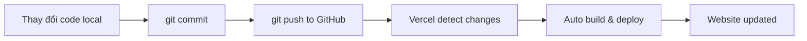

## Khắc Phục Lỗi Authentication và Hoàn Thiện Deployment

### Tổng quan

Sau khi deploy, cần cập nhật environment variables (biến môi trường) và OAuth credentials (thông tin xác thực OAuth) trong Google Developer Console để authentication (xác thực) hoạt động chính xác trên môi trường production.

### Cập nhật NextAuth URL

#### 1. Thay đổi environment variables trên Vercel

Truy cập **Settings → Environment Variables** và cập nhật biến `NEXTAUTH_URL`:

- **Giá trị cũ**: `http://localhost:3000`
- **Giá trị mới**: URL production của dự án (ví dụ: `https://demo.vercel.app`)

**Lưu ý quan trọng**:

- Không thêm dấu `/` ở cuối URL
- Sau khi lưu, cần **redeploy** ứng dụng để thay đổi có hiệu lực
- Environment variables chỉ được load khi ứng dụng được deploy


#### 2. Redeploy ứng dụng

Truy cập **Deployments** và click **Redeploy**. Vercel sẽ:

- Lấy code từ branch hiện tại
- Deploy lại toàn bộ dự án
- Load các environment variables mới


### Cập nhật Google Developer Console

#### Truy cập Google Developer Console

- Google tìm "Google Developer Console"
- Chọn project của bạn từ danh sách
- Navigate đến **APIs → Credentials**


#### Cập nhật Authorized Redirect URIs

**Thêm URL production vào danh sách Authorized redirect URIs:**

Giữ nguyên URL localhost để vẫn hoạt động ở môi trường local:

```
http://localhost:3000/api/auth/callback/google
```

Thêm URL production mới:

```
https://[tên-dự-án].vercel.app/api/auth/callback/google
```

**Lưu ý:**

- Đảm bảo không có dấu `/` thừa ở cuối
- Không có double slash `//` trong URL
- Click **Save** để lưu thay đổi
- Có thể mất đến 5 phút để setting có hiệu lực


### Xử lý lỗi thường gặp

#### Lỗi "Access Blocked"

**Nguyên nhân**: Sự không khớp giữa `NEXTAUTH_URL` và Authorized Redirect URI

**Giải pháp**: Kiểm tra trailing slash (dấu `/` ở cuối)

**Ví dụ lỗi phổ biến:**

- Environment variable: `https://demo.vercel.app/` (có dấu `/`)
- Redirect URI: `https://demo.vercel.app/api/auth/callback/google` (không có dấu `/` ở base URL)

**Cách khắc phục:**

1. Quay lại Vercel Settings → Environment Variables
2. Xóa trailing slash khỏi `NEXTAUTH_URL`
3. Lưu lại và redeploy

### Kiểm tra kết quả

Sau khi hoàn tất các bước trên:

- Truy cập guest area của website
- Click nút đăng nhập
- Nếu đã đăng nhập trước đó ở local, có thể không cần đăng nhập lại
- Authentication hoạt động bình thường trên production URL


### Tính năng bổ sung của Vercel

#### Analytics (Phân tích)

- Enable analytics để theo dõi traffic và hiệu suất
- Cần thêm code vào project
- Push code lên GitHub để tự động redeploy


#### Speed Insights

- Công cụ đo lường hiệu suất website
- Cung cấp metrics về tốc độ tải trang


#### Logs (Nhật ký)

Xem chi tiết các request đến website:

- Tất cả URL đã được truy cập
- Thời gian request
- Response status

**Giới hạn trên Free Plan:**

- Các tính năng bị giới hạn nhưng vẫn đủ dùng cho nhiều trường hợp


### Continuous Deployment

**Cách hoạt động:**

Mỗi khi push code mới lên GitHub repository, Vercel tự động:

1. Phát hiện thay đổi
2. Trigger build process mới
3. Deploy phiên bản mới
4. Website luôn đồng bộ với code trên repository

**Workflow thực tế:**



Quy trình này giúp đồng bộ tự động giữa code repository và production website, đảm bảo website luôn chạy phiên bản code mới nhất.

### Ghi chú cuối cùng

**Favicon detection:**
Vercel tự động đọc và hiển thị favicon của dự án trong dashboard - một chi tiết nhỏ nhưng tinh tế.

**Không phải sponsored content:**
Vercel không tài trợ cho khóa học này. Công cụ được giới thiệu vì chất lượng và trải nghiệm sử dụng thực tế tốt.

**Kết quả đạt được:**

- Website hoạt động hoàn chỉnh trên production
- Authentication hoạt động chính xác
- Sẵn sàng chia sẻ với mọi người

***

**Liên kết:** [[Vercel]], [[NextAuth]], [[Environment Variables]], [[Google Developer Console]], [[OAuth]], [[Authentication]], [[Redirect URI]], [[Deployment]], [[Continuous Deployment]], [[GitHub]], [[Analytics]], [[Logs]], [[Speed Insights]], [[Production]], [[Trailing Slash]]

